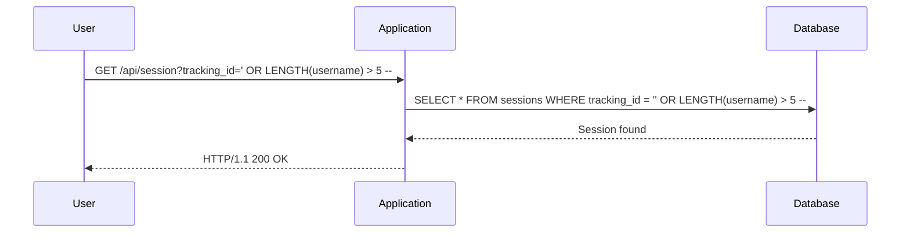

## Blind SQL Injection with Conditional Responses

Blind SQL Injection is a technique where the attacker cannot see the output of the SQL query directly. Instead, they must rely on indirect feedback from the application. One common method is to use conditional responses, where the application behaves differently based on the result of the SQL query.

### Understanding the Vulnerability

The vulnerability described in the lecture involves a tracking cookie used for analytics. The application performs a SQL query containing the value of the submitted cookie. The results of the SQL query are not returned, and no error messages are displayed. This makes it a perfect candidate for Blind SQL Injection.

#### Example Scenario

Let's assume the application has a cookie named `tracking_id` that is used in a SQL query. The query might look something like this:

```sql
SELECT * FROM sessions WHERE tracking_id = 'cookie_value';
```

If the `tracking_id` is not properly sanitized, an attacker can inject SQL code to manipulate the query.

### Exploiting the Vulnerability

To exploit this vulnerability, the attacker needs to craft a payload that will cause the application to behave differently based on the result of the SQL query. This can be done using conditional statements in SQL.

#### Crafting the Payload

Suppose the attacker wants to determine the length of the `username` field in the `sessions` table. They can use a payload like this:

```
tracking_id=' OR LENGTH(username) > 5 -- 
```

This payload changes the SQL query to:

```sql
SELECT * FROM sessions WHERE tracking_id = '' OR LENGTH(username) > 5 -- 
```

The `--` at the end comments out the rest of the query, ensuring that the injected SQL is valid.

### Conditional Responses

The key to Blind SQL Injection is to observe the application's behavior based on the result of the SQL query. In this case, the application might behave differently if the condition is true or false. For example, the application might display a different page or return a different HTTP status code.

#### Example HTTP Request and Response

Let's consider a full HTTP request and response for the payload:

```http
GET /api/session?tracking_id=' OR LENGTH(username) > 5 -- HTTP/1.1
Host: vulnerable-app.com
Cookie: tracking_id=' OR LENGTH(username) > 5 --
```

Response:

```http
HTTP/1.1 200 OK
Content-Type: application/json
Content-Length: 123

{
  "message": "Session found"
}
```

If the condition is false, the response might be different:

```http
HTTP/1.1 404 Not Found
Content-Type: application/json
Content-Length: 123

{
  "message": "Session not found"
}
```

By observing these differences, the attacker can infer the result of the SQL query.

### Step-by-Step Exploitation

Here is a step-by-step guide to exploiting the Blind SQL Injection vulnerability:

1. **Identify the Vulnerable Parameter**: Determine which parameter is vulnerable to SQL Injection. In this case, it is the `tracking_id` cookie.
2. **Craft the Initial Payload**: Start with a simple payload to test the behavior of the application. For example, use `tracking_id=' OR '1'='1`.
3. **Observe the Response**: Send the payload and observe the response. Note any differences in the HTTP status code, response body, or other indicators.
4. **Refine the Payload**: Based on the initial response, refine the payload to extract specific information. For example, use `tracking_id=' OR LENGTH(username) > 5 --` to determine the length of the `username` field.
5. **Iterate and Extract Data**: Continue refining the payload to extract more information. For example, use binary search to determine the exact length of the `username` field.

### Mermaid Diagrams

To visualize the process, we can use a sequence diagram:



### Common Pitfalls

When exploiting Blind SQL Injection, there are several common pitfalls to avoid:

1. **Incorrect Payloads**: Ensure that the payloads are correctly formatted and do not contain syntax errors.
2. **Timing Attacks**: Some applications may introduce delays that can affect the timing of responses. Use consistent timing intervals to avoid false positives.
3. **Rate Limiting**: Some applications may implement rate limiting to prevent abuse. Be cautious to avoid triggering rate limits.

### How to Prevent / Defend

Preventing SQL Injection requires a combination of secure coding practices, proper validation, and robust security measures.

#### Secure Coding Practices

1. **Use Prepared Statements**: Prepared statements ensure that user input is treated as data rather than executable code.
2. **Parameterized Queries**: Use parameterized queries to separate user input from the SQL query structure.
3. **Input Validation**: Validate and sanitize all user input to ensure it meets expected formats and constraints.

#### Example of Secure Code

Here is an example of secure code using prepared statements in Python:

```python
import sqlite3

def get_session(tracking_id):
    conn = sqlite3.connect('database.db')
    cursor = conn.cursor()
    cursor.execute("SELECT * FROM sessions WHERE tracking_id = ?", (tracking_id,))
    session = cursor.fetchone()
    conn.close()
    return session
```

#### Configuration Hardening

1. **Disable Error Messages**: Disable detailed error messages in production environments to prevent attackers from gaining valuable information.
2. **Least Privilege Principle**: Ensure that the application runs with the least privileges necessary to perform its tasks.
3. **Web Application Firewalls (WAF)**: Implement WAFs to filter out malicious traffic and protect against SQL Injection attacks.

#### Detection and Monitoring

1. **Logging and Monitoring**: Implement logging and monitoring to detect unusual patterns of activity that may indicate an SQL Injection attempt.
2. **Security Scanners**: Use automated security scanners to identify potential SQL Injection vulnerabilities in your application.

### Practice Labs

For hands-on practice, you can use the following labs:

- **PortSwigger Web Security Academy**: Offers a comprehensive set of labs covering various types of SQL Injection, including Blind SQL Injection.
- **OWASP Juice Shop**: Provides a vulnerable web application for practicing various security techniques, including SQL Injection.
- **DVWA (Damn Vulnerable Web Application)**: A deliberately insecure web application for practicing penetration testing and security assessments.

### Conclusion

Blind SQL Injection with conditional responses is a sophisticated technique that requires careful observation and inference. By understanding the underlying principles and following secure coding practices, you can prevent and defend against such attacks. Always stay vigilant and keep your applications secure.

---

This chapter provides a comprehensive overview of Blind SQL Injection with conditional responses, including background theory, real-world examples, complete code, mermaid diagrams, pitfalls, and a clear 'How to Prevent / Defend' section.

---
<!-- nav -->
[[Web Security (PortSwigger)/02-SQL Injection/12-Lab 11 Blind SQL injection with conditional responses/01-Introduction to SQL Injection|Introduction to SQL Injection]] | [[Web Security (PortSwigger)/02-SQL Injection/12-Lab 11 Blind SQL injection with conditional responses/00-Overview|Overview]] | [[03-Understanding Blind SQL Injection|Understanding Blind SQL Injection]]
