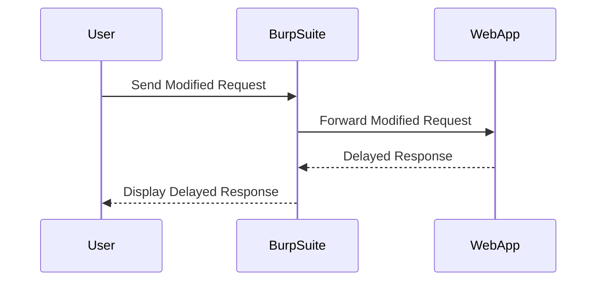

## Exploiting the Vulnerability

The goal is to exploit the SQL Injection vulnerability to cause a 10-second delay. This will confirm that the `trackingID` parameter is vulnerable to time-based Blind SQL Injection.

### Crafting the SQL Injection Payload

To cause a time delay, we can use SQL functions that force the database to wait for a specified duration. For example, in MySQL, we can use the `SLEEP()` function.

#### Vulnerable Code Example

```sql
SELECT * FROM users WHERE id = '1' OR SLEEP(10)
```

This SQL statement will cause the database to wait for 10 seconds before returning the result.

### Injecting the Payload

Modify the `trackingID` parameter to include the `SLEEP()` function.

```http
GET /api/tracking?trackingID=1' OR SLEEP(10) -- HTTP/1.1
Host: vulnerablewebapp.com
```

### Observing the Response

Send the modified request and observe the response time. If the response takes approximately 10 seconds longer than usual, it confirms that the `trackingID` parameter is vulnerable to time-based Blind SQL Injection.



---
<!-- nav -->
[[Web Security (PortSwigger)/02-SQL Injection/14-Lab 13 Blind SQL injection with time delays/03-Blind SQL Injection|Blind SQL Injection]] | [[Web Security (PortSwigger)/02-SQL Injection/14-Lab 13 Blind SQL injection with time delays/00-Overview|Overview]] | [[05-Extracting Data Using Time-Based Blind SQL Injection|Extracting Data Using Time-Based Blind SQL Injection]]
