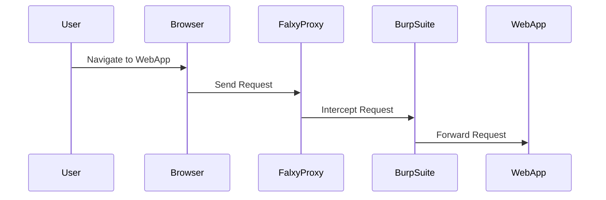
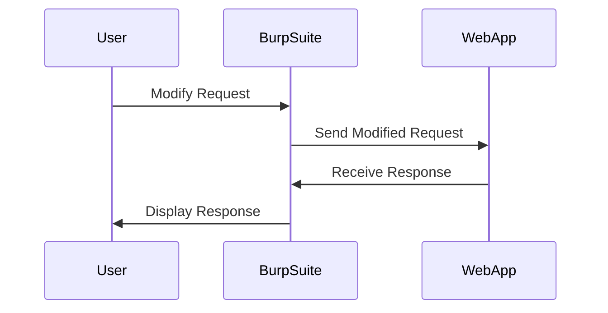

## Lab Setup and Initial Analysis

To understand and practice Blind SQL Injection with time delays, we will use a lab environment. The lab setup involves accessing a vulnerable web application and using tools like Burp Suite to intercept and modify HTTP requests.

### Accessing the Lab Environment

1. **Access the Lab**: Navigate to the lab environment provided by your course or instructor.
2. **Open Burp Suite**: Start Burp Suite and configure it to intercept HTTP traffic.
3. **Configure Proxy**: Set up Falxy Proxy to send requests to Burp Suite.



### Identifying the Vulnerable Parameter

Once you have set up the lab environment, identify the vulnerable parameter. In this case, the `trackingID` parameter is suspected to be vulnerable.

```http
GET /api/tracking?trackingID=12345 HTTP/1.1
Host: vulnerablewebapp.com
```

### Using Burp Suite Repeater

Use Burp Suite Repeater to intercept and modify the HTTP request.



---
<!-- nav -->
[[06-How to Prevent  Defend Against Blind SQL Injection|How to Prevent  Defend Against Blind SQL Injection]] | [[Web Security (PortSwigger)/02-SQL Injection/14-Lab 13 Blind SQL injection with time delays/00-Overview|Overview]] | [[Web Security (PortSwigger)/02-SQL Injection/14-Lab 13 Blind SQL injection with time delays/08-Conclusion|Conclusion]]
