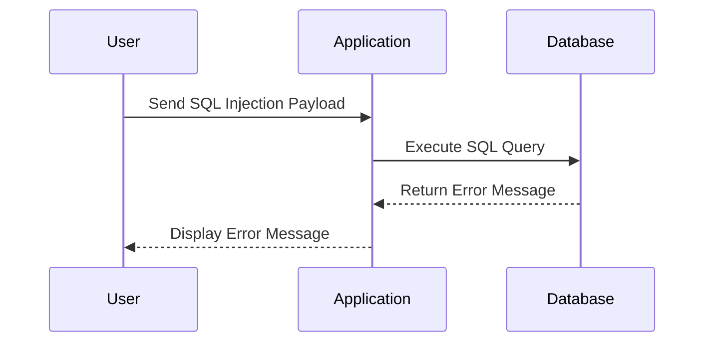

## Understanding Error-Based SQL Injection

Error-based SQL Injection is a specific type of SQL Injection attack where the attacker relies on error messages generated by the database to infer information about the underlying database structure. This technique is particularly useful when the application does not provide direct feedback about the success or failure of the injected SQL code.

### Background Theory

In error-based SQL Injection, the attacker crafts SQL queries that cause the database to generate error messages. These error messages often contain valuable information about the database schema, such as table names, column names, and data types. By analyzing these error messages, the attacker can piece together the structure of the database and extract sensitive data.

### Example Scenario

Let's revisit the scenario from the lecture transcript. The application returns a 200 OK status when the injected SQL query is syntactically correct, but it generates a 500 Internal Server Error when the query is incorrect. This behavior indicates that the application is vulnerable to error-based SQL Injection.

#### Step-by-Step Mechanics

1. **Initial Query**: The attacker starts with a simple query that is likely to be syntactically correct, such as `select 1`.
    ```sql
    SELECT 1;
    ```

2. **Injecting Malicious Code**: The attacker then tries to inject more complex SQL code to extract information from the database. For example, the attacker might try to retrieve the `username` column from the `users` table.
    ```sql
    SELECT username FROM users;
    ```

3. **URL Encoding**: Since the input is typically passed through a URL, the attacker needs to URL-encode the query.
    ```plaintext
    SELECT%20username%20FROM%20users;
    ```

4. **Sending the Request**: The attacker sends the URL-encoded query to the application.
    ```http
    POST /login HTTP/1.1
    Host: example.com
    Content-Type: application/x-www-form-urlencoded

    username=SELECT%20username%20FROM%20users&password=password
    ```

5. **Analyzing the Response**: The application responds with a 500 Internal Server Error, indicating that the query caused an error. The error message provides valuable information about the structure of the query.
    ```http
    HTTP/1.1 500 Internal Server Error
    Content-Type: text/html

    <html>
    <body>
    <h1>500 Internal Server Error</h1>
    <p>An unexpected error occurred.</p>
    <pre>Unterminated string literal started at position 95. Cast(select username from users as ...</pre>
    </body>
    </html>
    ```

### Mermaid Diagram: SQL Injection Attack Flow



### Pitfalls and Common Mistakes

1. **Improper Input Validation**: Failing to validate user inputs can lead to SQL Injection vulnerabilities.
2. **Verbose Error Messages**: Applications that display detailed error messages can provide attackers with valuable information.
3. **Use of Dynamic SQL**: Constructing SQL queries dynamically based on user input increases the risk of SQL Injection.

### How to Prevent / Defend Against SQL Injection

#### Detection

1. **Logging and Monitoring**: Implement logging and monitoring to detect unusual patterns of SQL queries.
2. **Web Application Firewalls (WAF)**: Use WAFs to filter out malicious SQL queries.

#### Prevention

1. **Parameterized Queries**: Use parameterized queries to ensure that user inputs are treated as data rather than executable code.
    ```sql
    SELECT * FROM users WHERE username = ? AND password = ?
    ```

2. **Stored Procedures**: Use stored procedures to encapsulate SQL logic and reduce the risk of SQL Injection.

3. **Input Validation**: Validate and sanitize all user inputs to ensure they conform to expected formats.

#### Secure Coding Fixes

**Vulnerable Code**
```python
import sqlite3

def login(username, password):
    conn = sqlite3.connect('database.db')
    cursor = conn.cursor()
    query = f"SELECT * FROM users WHERE username = '{username}' AND password = '{password}'"
    cursor.execute(query)
    result = cursor.fetchone()
    conn.close()
    return result
```

**Secure Code**
```python
import sqlite3

def login(username, password):
    conn = sqlite3.connect('database.db')
    cursor = conn.cursor()
    query = "SELECT * FROM users WHERE username = ? AND password = ?"
    cursor.execute(query, (username, password))
    result = cursor.fetchone()
    conn.close()
    return result
```

### Configuration Hardening

1. **Disable Detailed Error Messages**: Configure the application to display generic error messages instead of detailed ones.
2. **Least Privilege Principle**: Ensure that the application runs with the least privileges necessary to perform its tasks.

### Practice Labs

For hands-on practice with SQL Injection, consider the following well-known labs:

- **PortSwigger Web Security Academy**: Offers interactive labs specifically designed to teach and test SQL Injection skills.
- **OWASP Juice Shop**: A deliberately insecure web application that includes several SQL Injection challenges.
- **DVWA (Damn Vulnerable Web Application)**: Provides a variety of SQL Injection vulnerabilities for educational purposes.

By thoroughly understanding the mechanics of SQL Injection and implementing robust defensive measures, organizations can significantly reduce the risk of such attacks.

---
<!-- nav -->
[[Web Security (PortSwigger)/02-SQL Injection/19-Lab 18 Visible error based SQL injection/05-Practice Labs|Practice Labs]] | [[Web Security (PortSwigger)/02-SQL Injection/19-Lab 18 Visible error based SQL injection/00-Overview|Overview]] | [[07-Visible Error-Based SQL Injection|Visible Error-Based SQL Injection]]
