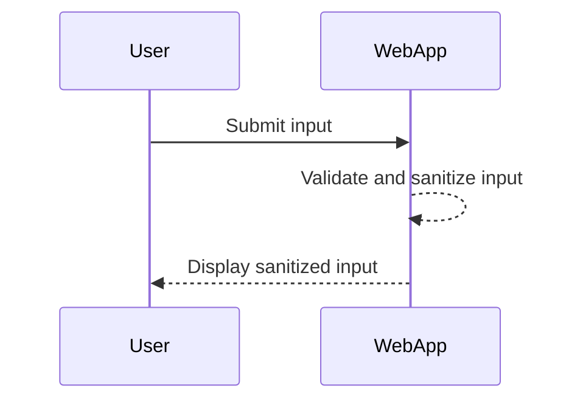
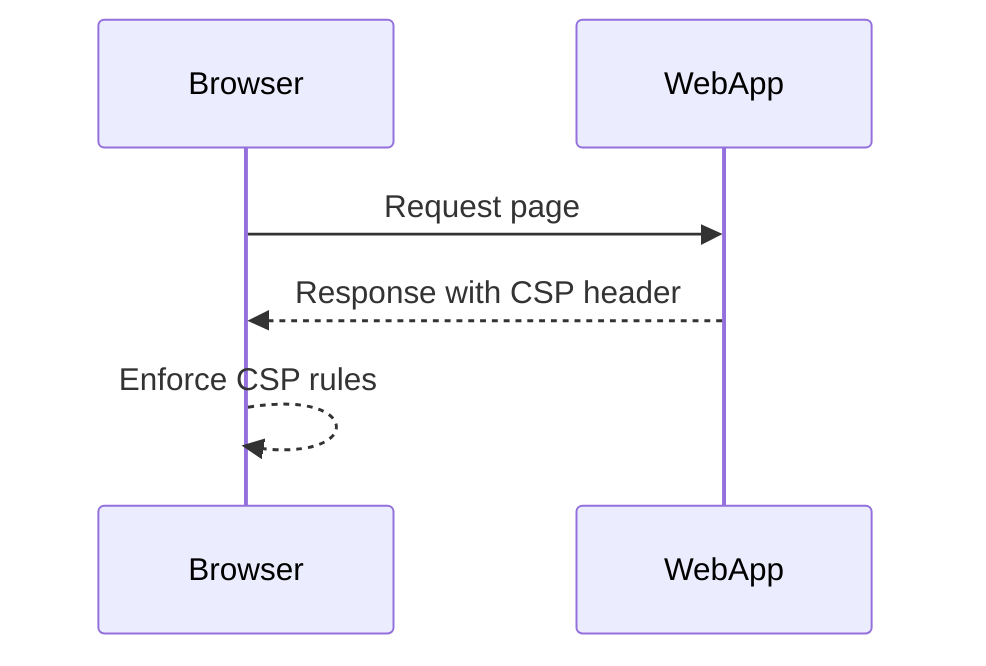
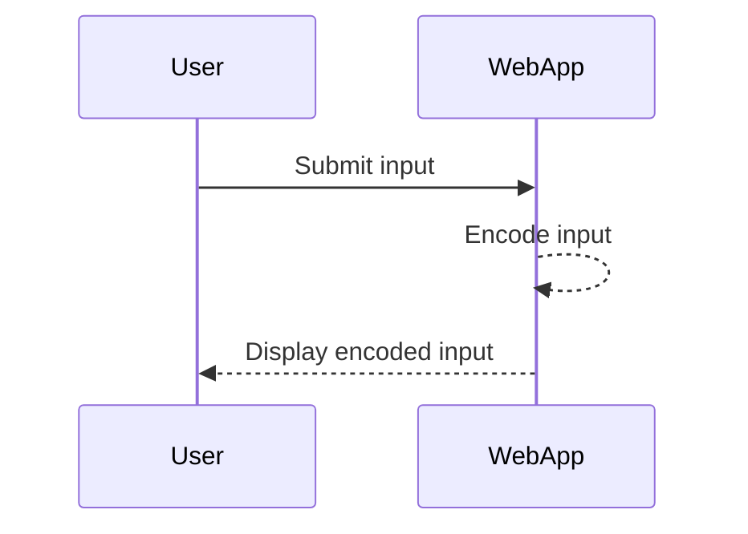

## Detection and Prevention of XSS

Detecting and preventing XSS vulnerabilities is crucial for maintaining the security of web applications. Here are some strategies and tools to help identify and mitigate XSS risks.

### Detection

#### Static Analysis Tools

Static analysis tools can scan the source code of a web application to identify potential XSS vulnerabilities. These tools analyze the code for patterns that may indicate insecure handling of user input.

- **OWASP ZAP**: A popular open-source tool for detecting security vulnerabilities in web applications.
- **SonarQube**: A static code analysis tool that can identify XSS vulnerabilities among other security issues.

#### Dynamic Analysis Tools

Dynamic analysis tools simulate attacks against a running web application to identify vulnerabilities. These tools can help detect XSS vulnerabilities by injecting malicious scripts and observing the application's behavior.

- **Burp Suite**: A comprehensive toolkit for web application security testing.
- **Acunetix**: A commercial web vulnerability scanner that can detect XSS vulnerabilities.

### Prevention

#### Input Validation and Sanitization

Input validation and sanitization are essential practices to prevent XSS vulnerabilities. By ensuring that user input is properly validated and sanitized, you can prevent malicious scripts from being executed.

##### Example: Secure Input Handling

```php
// Vulnerable code
echo $_GET['name'];

// Secure code
$name = htmlspecialchars($_GET['name'], ENT_QUOTES, 'UTF-8');
echo $name;
```

In the secure code, `htmlspecialchars` is used to escape special characters in the input, preventing the execution of malicious scripts.



#### Content Security Policy (CSP)

Content Security Policy (CSP) is a security feature that helps prevent XSS attacks by specifying which sources of content are allowed to be executed within a web page.

##### Example: CSP Header

```http
Content-Security-Policy: default-src 'self'; script-src 'self' https://trusted-cdn.example.com
```

In this example, the `default-src` directive specifies that only resources from the same origin (`'self'`) are allowed, while the `script-src` directive allows scripts from the same origin and a trusted CDN.



#### Output Encoding

Output encoding ensures that user-generated content is properly encoded before being displayed in a web page. This prevents malicious scripts from being executed.

##### Example: Output Encoding

```python
# Vulnerable code
print(request.args.get('name'))

# Secure code
from markupsafe import escape
print(escape(request.args.get('name')))
```

In the secure code, `markupsafe.escape` is used to encode the input, preventing the execution of malicious scripts.



### Secure Coding Practices

Secure coding practices are essential to prevent XSS vulnerabilities. Here are some best practices to follow:

- **Use a Web Application Firewall (WAF)**: A WAF can help detect and block malicious requests before they reach your application.
- **Implement Input Validation**: Always validate user input to ensure it meets expected criteria.
- **Sanitize User Input**: Use appropriate sanitization functions to escape special characters in user input.
- **Use Output Encoding**: Ensure that user-generated content is properly encoded before being displayed in a web page.
- **Enable CSP**: Implement a Content Security Policy to restrict the sources of content that can be executed within a web page.

### Hands-On Labs

To practice and reinforce your understanding of XSS vulnerabilities, consider the following hands-on labs:

- **PortSwigger Web Security Academy**: Offers interactive labs to learn about various web security vulnerabilities, including XSS.
- **OWASP Juice Shop**: A deliberately insecure web application designed for security training and research.
- **DVWA (Damn Vulnerable Web Application)**: A PHP/MySQL web application that demonstrates web application vulnerabilities.

By following these practices and using the recommended tools and labs, you can effectively detect and prevent XSS vulnerabilities in your web applications.

---
<!-- nav -->
[[06-Detailed Explanation of XSS Contexts and Payloads|Detailed Explanation of XSS Contexts and Payloads]] | [[Web Security (PortSwigger)/03-Cross-Site Scripting (XSS)/01-Cross Site Scripting XSS Complete Guide/00-Overview|Overview]] | [[08-How to Find and Exploit XSS Vulnerabilities|How to Find and Exploit XSS Vulnerabilities]]
