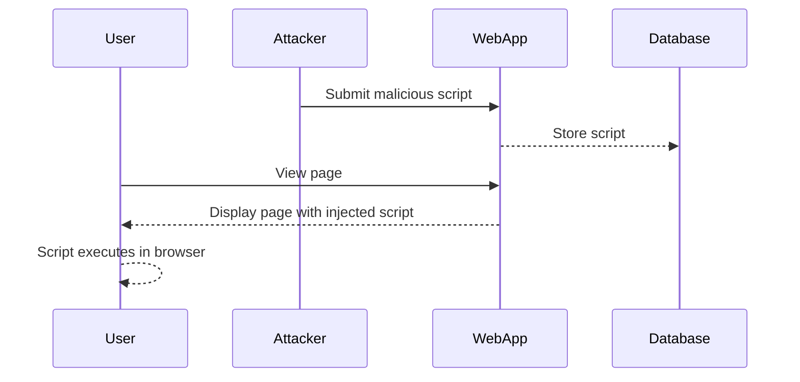
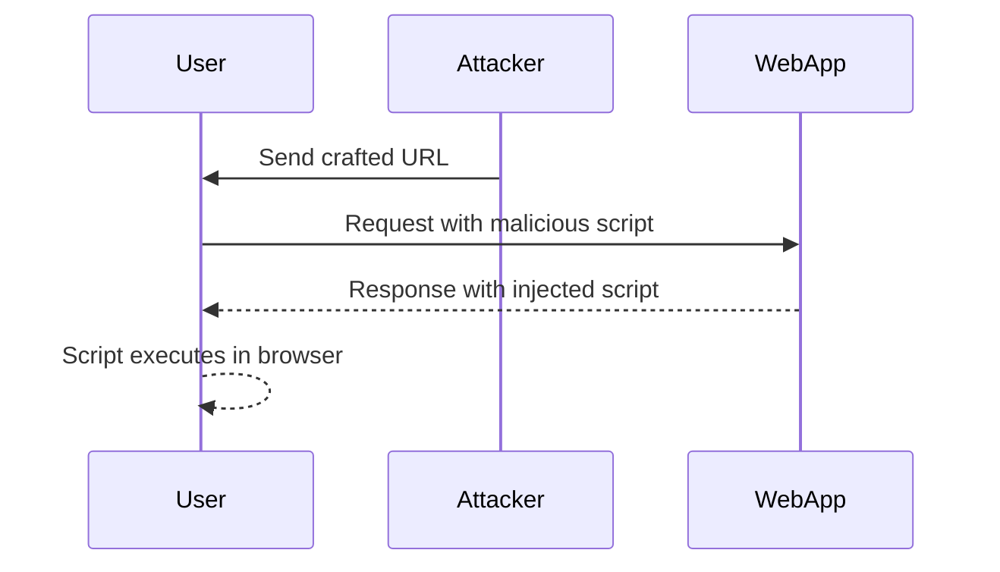
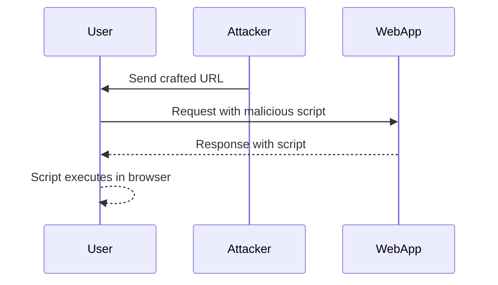

## Types of XSS Vulnerabilities

There are several types of XSS vulnerabilities, each with its own characteristics and potential impacts:

### Stored XSS

Stored XSS occurs when an attacker injects a malicious script into a persistent storage mechanism, such as a database. The script is then served to unsuspecting users when they view the affected page.

#### Example: Stored XSS in a Comment Section

Consider a web application with a comment section where users can post comments. If the application fails to properly sanitize input, an attacker can inject a malicious script into the comment field.

```html
<!-- Vulnerable code -->
<textarea name="comment"></textarea>

<!-- Malicious input -->
<script>alert('XSS');</script>
```

When another user views the page containing the comment, the script executes in their browser.



### Reflected XSS

Reflected XSS occurs when an attacker injects a malicious script into a URL or form parameter that is immediately reflected back to the user. This type of XSS is often exploited through social engineering techniques.

#### Example: Reflected XSS in a Search Function

Consider a search function where the query string is reflected back in the response. If the application fails to sanitize the input, an attacker can craft a URL that includes a malicious script.

```http
GET /search?q=<script>alert('XSS');</script> HTTP/1.1
Host: example.com
```

When the user clicks on the crafted URL, the script executes in their browser.



### DOM-Based XSS

DOM-based XSS occurs when an attacker injects a malicious script into the Document Object Model (DOM) of a web page. Unlike stored and reflected XSS, the script is not sent to the server but is executed directly in the client's browser.

#### Example: DOM-Based XSS in JavaScript

Consider a web application that uses JavaScript to dynamically update the page based on URL parameters. If the application fails to sanitize the input, an attacker can inject a malicious script.

```javascript
// Vulnerable code
var param = window.location.search.substring(1);
document.getElementById("content").innerHTML = decodeURIComponent(param);

// Malicious input
example.com/?param=<script>alert('XSS');</script>
```

When the user visits the crafted URL, the script executes in their browser.



---
<!-- nav -->
[[10-Input Filtering and Allow Lists vs Deny Lists|Input Filtering and Allow Lists vs Deny Lists]] | [[Web Security (PortSwigger)/03-Cross-Site Scripting (XSS)/01-Cross Site Scripting XSS Complete Guide/00-Overview|Overview]] | [[Web Security (PortSwigger)/03-Cross-Site Scripting (XSS)/01-Cross Site Scripting XSS Complete Guide/12-Conclusion|Conclusion]]
