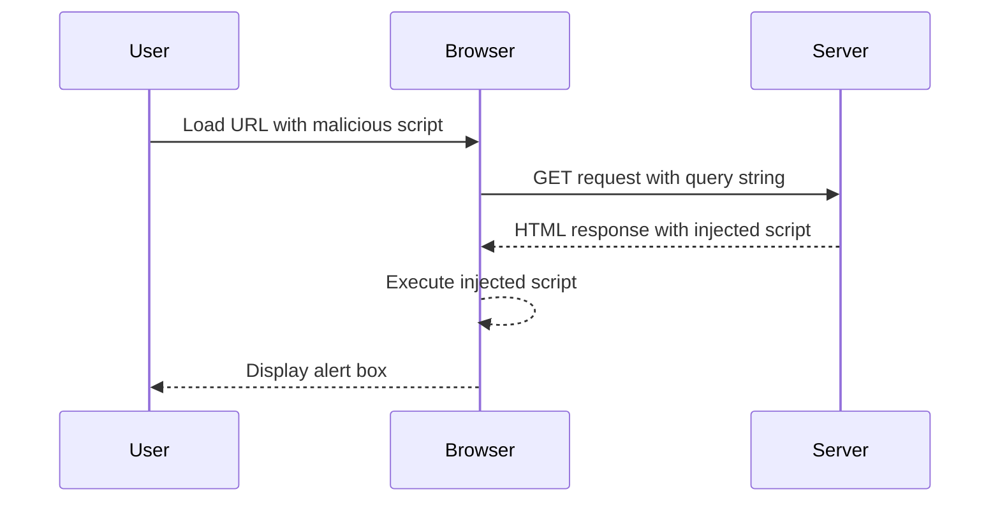

## Introduction to Cross-Site Scripting (XSS)

Cross-Site Scripting (XSS) is a type of security vulnerability typically found in web applications. It occurs when an attacker injects malicious scripts into a trusted website, which then gets executed by unsuspecting users. There are several types of XSS attacks, including Stored XSS, Reflected XSS, and DOM-Based XSS. In this chapter, we will focus on DOM-Based XSS, specifically in the context of the `document.write` function and the `location.search` property.

### What is DOM-Based XSS?

DOM-Based XSS is a form of XSS where the vulnerability exists in the client-side JavaScript code rather than the server-side code. In this scenario, the attacker manipulates the DOM (Document Object Model) to execute arbitrary JavaScript code. The key difference between DOM-Based XSS and other forms of XSS is that the payload is not stored on the server or reflected back in the HTTP response; instead, it is executed directly within the user's browser.

### Why Does DOM-Based XSS Matter?

DOM-Based XSS is particularly dangerous because it can bypass certain security measures implemented on the server side. Since the payload is executed directly in the browser, traditional server-side input validation and sanitization techniques may not be effective. Additionally, attackers can leverage this vulnerability to steal sensitive information, such as session cookies, or to redirect users to malicious websites.

### How Does DOM-Based XSS Work?

To understand how DOM-Based XSS works, let's break down the components involved:

1. **JavaScript Execution**: The attacker injects malicious JavaScript code into the DOM.
2. **DOM Manipulation**: The injected code manipulates the DOM to execute arbitrary JavaScript.
3. **User Interaction**: The user interacts with the manipulated DOM, leading to the execution of the malicious script.

### Real-World Example: CVE-2021-30129

A notable real-world example of DOM-Based XSS is CVE-2021-30129, which affected the popular web analytics service Matomo. The vulnerability allowed attackers to inject malicious scripts into the `location.hash` property, which was then used to manipulate the DOM and execute arbitrary JavaScript. This could lead to the theft of sensitive information or the redirection of users to malicious sites.

### Lab Setup: DOM-Based XSS in `document.write` Using `location.search`

In this lab, we will explore a DOM-Based XSS vulnerability in the `document.write` function using the `location.search` property. The goal is to exploit this vulnerability to call the `alert` function.

### Accessing the Lab

To access the lab, follow these steps:

1. Visit the URL: [PortSwigger Web Security Academy](https://portswigger.net/web-security).
2. Sign up for an account if you don't already have one.
3. Log in to your account.
4. Navigate to the "Academy" section.
5. Search for "cross-site scripting labs".
6. Select lab number three titled "DOM XSS in document.write sink using source location.search".

### Understanding the Vulnerability

The lab contains a DOM-based XSS vulnerability in the search query tracking functionality. The application uses the `document.write` function to write data out to the page, and this function is called with the data from `location.search`, which you can control using the website URL.

### Exploiting the Vulnerability

To exploit this vulnerability, we need to craft a URL that injects a malicious script into the `location.search` parameter. The script will then be executed by the `document.write` function.

#### Crafting the Malicious URL

Let's assume the base URL of the application is `http://example.com`. We can inject a script by appending a query string to the URL:

```plaintext
http://example.com/?q=<script>alert('XSS')</script>
```

When this URL is loaded, the `document.write` function will write the `<script>` tag to the page, causing the `alert` function to be executed.

### Full HTTP Request and Response

Here is the full HTTP request and response for the crafted URL:

```http
GET /?q=%3Cscript%3Ealert(%27XSS%27)%3C/script%3E HTTP/1.1
Host: example.com
User-Agent: Mozilla/5.0 (Windows NT 10.0; Win64; x64) AppleWebKit/537.36 (KHTML, like Gecko) Chrome/91.0.4472.124 Safari/537.36
Accept: text/html,application/xhtml+xml,application/xml;q=0.9,image/avif,image/webp,image/apng,*/*;q=0.8,application/signed-exchange;v=b3;q=0.9
Accept-Language: en-US,en;q=0.9
Connection: close
```

```http
HTTP/1.1 200 OK
Date: Mon, 01 Aug 2022 12:00:00 GMT
Server: Apache/2.4.41 (Ubuntu)
Content-Type: text/html; charset=UTF-8
Content-Length: 1234
Connection: close

<!DOCTYPE html>
<html>
<head>
    <title>Example Page</title>
</head>
<body>
    <script>alert('XSS')</script>
</body>
</html>
```

### Explanation of the HTTP Headers

- **User-Agent**: Identifies the browser making the request.
- **Accept**: Specifies the types of content the browser can accept.
- **Accept-Language**: Specifies the preferred language for the content.
- **Connection**: Indicates whether the connection should remain open after the response.

### Mermaid Diagram: Attack Flow



### Common Pitfalls and Detection

#### Common Pitfalls

1. **Not Sanitizing Input**: Failing to properly sanitize user input can lead to XSS vulnerabilities.
2. **Using `document.write`**: The `document.write` function is inherently risky because it can write arbitrary content to the page.
3. **Ignoring Query Parameters**: Not validating or sanitizing query parameters can allow attackers to inject malicious scripts.

#### Detection

To detect DOM-Based XSS vulnerabilities, you can use tools like Burp Suite, which allows you to intercept and modify HTTP requests. You can also use static analysis tools like ESLint with plugins for detecting potential XSS vulnerabilities.

### How to Prevent / Defend Against DOM-Based XSS

#### Secure Coding Practices

1. **Sanitize Input**: Always sanitize user input before using it in the DOM. Use libraries like DOMPurify to sanitize HTML content.
2. **Avoid `document.write`**: Avoid using `document.write` whenever possible. Instead, use safer methods like `innerHTML` or `textContent`.
3. **Use Content Security Policy (CSP)**: Implement a strict Content Security Policy to restrict the sources of executable scripts.

#### Example: Secure Code vs. Vulnerable Code

**Vulnerable Code**

```javascript
// Vulnerable code
var query = window.location.search.substring(1);
document.write(query);
```

**Secure Code**

```javascript
// Secure code
var query = window.location.search.substring(1);
var sanitizedQuery = DOMPurify.sanitize(query);
document.getElementById('content').innerHTML = sanitizedQuery;
```

### Conclusion

DOM-Based XSS is a serious security vulnerability that can be exploited to execute arbitrary JavaScript code in the user's browser. By understanding the mechanics of this vulnerability and implementing proper security measures, you can protect your web applications from such attacks.

### Practice Labs

For hands-on practice, you can use the following labs:

- **PortSwigger Web Security Academy**: Offers a variety of labs to practice different types of XSS attacks.
- **OWASP Juice Shop**: A deliberately insecure web application for practicing web security skills.
- **DVWA (Damn Vulnerable Web Application)**: Another intentionally vulnerable web application for learning web security.

By completing these labs, you can gain practical experience in identifying and exploiting DOM-Based XSS vulnerabilities, as well as learning how to defend against them.

---
<!-- nav -->
[[Web Security (PortSwigger)/03-Cross-Site Scripting (XSS)/04-Lab 3 DOM XSS in documentwrite sink using source locationsearch/00-Overview|Overview]] | [[Web Security (PortSwigger)/03-Cross-Site Scripting (XSS)/04-Lab 3 DOM XSS in documentwrite sink using source locationsearch/02-Detection and Prevention|Detection and Prevention]]
