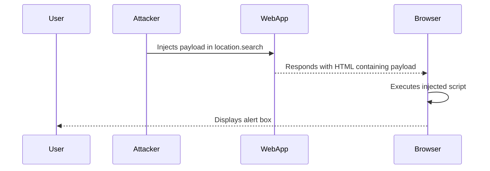

## Understanding Cross-Site Scripting (XSS)

Cross-Site Scripting (XSS) is a type of security vulnerability typically found in web applications. It allows an attacker to inject malicious scripts into web pages viewed by other users. This can lead to various harmful outcomes such as stealing sensitive data, session hijacking, or even taking control of the victim's browser.

### Types of XSS Vulnerabilities

There are three main types of XSS vulnerabilities:

1. **Stored XSS**: Malicious scripts are stored on the server and served to users.
2. **Reflected XSS**: Malicious scripts are reflected off the server and executed in the context of the user's browser.
3. **DOM-Based XSS**: Malicious scripts are executed within the Document Object Model (DOM) of the web page.

In this chapter, we will focus on DOM-Based XSS, specifically using the `document.write` sink and the `location.search` source.

### Background Theory

#### Document Object Model (DOM)

The Document Object Model (DOM) is a programming interface for web documents. It represents the structure of a document as a tree of nodes, where each node represents a part of the document (such as elements, attributes, and text).

#### `document.write`

The `document.write` method is used to write content directly into the HTML document. This method can be dangerous because it can execute arbitrary JavaScript code if the input is not properly sanitized.

#### `location.search`

The `location.search` property returns the query string portion of the URL, starting with the question mark (`?`). This can be used to pass parameters to the web application.

### Real-World Example: CVE-2021-33638

A notable real-world example of a DOM-Based XSS vulnerability is CVE-2021-33638, which affected the WordPress plugin "WP GDPR Compliance." An attacker could inject malicious JavaScript into the `location.search` parameter, which would then be executed by the plugin due to improper sanitization.

### Detailed Explanation of the Lab Exercise

Let's break down the lab exercise step-by-step.

#### Initial Setup

Consider a web application that uses the `location.search` parameter to display an image based on the user's input. The application might have a URL like this:

```
https://example.com/?image=https://example.com/image.jpg
```

The application might use the following JavaScript to display the image:

```javascript
var imageUrl = location.search.substring(1);
var imgTag = '';
document.write(imgTag);
```

#### Exploitation Process

1. **Identify the Sink**: The `document.write` method is the sink where the malicious script will be executed.
2. **Identify the Source**: The `location.search` parameter is the source where the attacker can inject the malicious script.
3. **Craft the Payload**: The attacker crafts a payload that closes the existing string and adds their own malicious script. For example:

    ```
    https://example.com/?image=https://example.com/image.jpg"></img><script>alert('XSS');</script>
    ```

4. **Inject the Payload**: The attacker injects the crafted payload into the `location.search` parameter.

5. **Execution**: When the application processes the `location.search` parameter and writes it to the document using `document.write`, the malicious script is executed.

#### Full HTTP Request and Response

Here is the full HTTP request and response for the exploitation process:

**HTTP Request:**

```http
GET /?image=https://example.com/image.jpg"></img><script>alert('XSS');</script> HTTP/1.1
Host: example.com
User-Agent: Mozilla/5.0 (Windows NT 10.0; Win64; x64) AppleWebKit/537.36 (KHTML, like Gecko) Chrome/91.0.4472.124 Safari/537.36
Accept: text/html,application/xhtml+xml,application/xml;q=0.9,image/webp,*/*;q=0.8
Accept-Language: en-US,en;q=0.5
Connection: keep-alive
```

**HTTP Response:**

```http
HTTP/1.1 200 OK
Date: Mon, 20 Mar 2023 12:00:00 GMT
Server: Apache/2.4.41 (Ubuntu)
Content-Type: text/html; charset=UTF-8
Content-Length: 1024
Connection: keep-alive

<!DOCTYPE html>
<html>
<head>
    <title>XSS Example</title>
</head>
<body>
    </img><script>alert('XSS');</script>
</body>
</html>
```

#### Mermaid Diagram: Attack Chain



### Common Pitfalls and Mistakes

1. **Improper Input Validation**: Not validating or sanitizing user inputs can lead to successful exploitation.
2. **Use of `document.write`**: Using `document.write` to dynamically insert content can be risky if the input is not properly sanitized.
3. **Trust in Query Parameters**: Assuming that query parameters are safe can lead to vulnerabilities.

### How to Prevent / Defend Against DOM-Based XSS

#### Detection

To detect DOM-Based XSS vulnerabilities, you can use automated tools such as:

- **Burp Suite**: A popular tool for web application security testing.
- **OWASP ZAP**: Another widely-used open-source tool for detecting security vulnerabilities.

#### Prevention

1. **Input Validation and Sanitization**: Always validate and sanitize user inputs before using them in your application.
2. **Avoid Using `document.write`**: Instead of using `document.write`, consider using safer methods such as `innerHTML` or DOM manipulation methods.
3. **Content Security Policy (CSP)**: Implement Content Security Policy (CSP) to restrict the sources of executable scripts.

#### Secure Coding Fixes

Here is an example of how to securely handle the `location.search` parameter:

**Vulnerable Code:**

```javascript
var imageUrl = location.search.substring(1);
var imgTag = '';
document.write(imgTag);
```

**Secure Code:**

```javascript
var imageUrl = decodeURIComponent(location.search.substring(1));
var imgTag = '';
document.getElementById('image-container').innerHTML = imgTag;
```

In the secure code, we use `encodeURIComponent` to ensure that the input is properly encoded and `innerHTML` to safely insert the content into the DOM.

### Hands-On Labs

For hands-on practice with DOM-Based XSS vulnerabilities, consider the following labs:

- **PortSwigger Web Security Academy**: Offers interactive labs to practice and understand various types of XSS attacks.
- **OWASP Juice Shop**: A deliberately insecure web application for practicing web security techniques.
- **DVWA (Damn Vulnerable Web Application)**: A PHP/MySQL web application that contains numerous security vulnerabilities.

### Conclusion

Understanding and preventing DOM-Based XSS vulnerabilities is crucial for securing web applications. By following best practices such as input validation, proper encoding, and using safer methods for DOM manipulation, developers can significantly reduce the risk of XSS attacks. Regularly testing and auditing your applications with tools like Burp Suite and OWASP ZAP can help identify and mitigate these vulnerabilities.

---
<!-- nav -->
[[Web Security (PortSwigger)/03-Cross-Site Scripting (XSS)/04-Lab 3 DOM XSS in documentwrite sink using source locationsearch/03-Hands-On Practice|Hands-On Practice]] | [[Web Security (PortSwigger)/03-Cross-Site Scripting (XSS)/04-Lab 3 DOM XSS in documentwrite sink using source locationsearch/00-Overview|Overview]] | [[05-Understanding DOM-Based XSS|Understanding DOM-Based XSS]]
