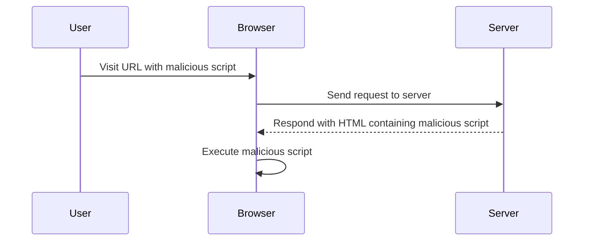
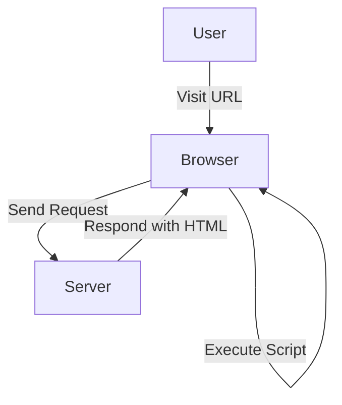

## Cross-Site Scripting (XSS)

Cross-Site Scripting (XSS) is a type of security vulnerability that allows an attacker to inject malicious scripts into web pages viewed by other users. This can lead to various attacks such as stealing cookies, session hijacking, and defacing websites. There are three main types of XSS vulnerabilities: Stored XSS, Reflected XSS, and DOM-based XSS. In this section, we will focus on DOM-based XSS, specifically in the context of jQuery and the `location.search` source.

### Background Theory

#### What is DOM-based XSS?

DOM-based XSS occurs when a web application uses untrusted data to update the Document Object Model (DOM) in a way that introduces a security vulnerability. Unlike Stored and Reflected XSS, which rely on the server to reflect or store the malicious script, DOM-based XSS relies solely on client-side JavaScript.

#### How does DOM-based XSS work?

In DOM-based XSS, the attacker injects malicious JavaScript into a page through a URL parameter or other user-controlled input. This input is then used by the client-side JavaScript to modify the DOM, leading to the execution of the injected script.

### Real-World Examples

#### Recent Breaches and CVEs

One notable example of DOM-based XSS is the vulnerability found in the popular web browser Firefox. In 2021, a researcher discovered a DOM-based XSS vulnerability in Firefox's about:config page. The vulnerability allowed an attacker to inject arbitrary JavaScript into the page, potentially leading to session hijacking or other malicious activities.

Another example is the CVE-2020-14187, which affected the popular web framework AngularJS. The vulnerability allowed attackers to inject malicious scripts via the `$location` service, leading to DOM-based XSS attacks.

### Detailed Example: DOM XSS in jQuery Anchor `href` Attribute Sink Using `location.search` Source

Let's dive into a detailed example of a DOM-based XSS vulnerability involving jQuery and the `location.search` source.

#### Vulnerable Code

Consider the following HTML and JavaScript code:

```html
<!DOCTYPE html>
<html>
<head>
    <title>DOM XSS Example</title>
    <script src="https://code.jquery.com/jquery-3.6.0.min.js"></script>
</head>
<body>
    <div id="content"></div>
    <script>
        $(document).ready(function() {
            var searchParam = window.location.search.substring(1);
            $('#content').html('<a href="' + searchParam + '">Click me</a>');
        });
    </script>
</body>
</html>
```

#### Explanation

1. **HTML Structure**: The HTML contains a `div` element with the ID `content`.
2. **jQuery Initialization**: The jQuery library is included via a CDN link.
3. **JavaScript Execution**: When the document is ready, the JavaScript code extracts the search parameter from the URL (`window.location.search`) and inserts it into the `href` attribute of an anchor tag inside the `#content` div.

#### Exploitation

An attacker can exploit this vulnerability by crafting a URL that includes a malicious script. For example:

```
http://example.com/?javascript:alert('XSS')
```

When a user visits this URL, the JavaScript code within the `searchParam` variable is executed, leading to an alert box displaying "XSS".

#### Full HTTP Request and Response

Here is the full HTTP request and response for the above scenario:

**HTTP Request:**

```http
GET /?javascript:alert('XSS') HTTP/1.1
Host: example.com
User-Agent: Mozilla/5.0 (Windows NT 10.0; Win64; x64) AppleWebKit/537.36 (KHTML, like Gecko) Chrome/91.0.4472.124 Safari/537.36
Accept: text/html,application/xhtml+xml,application/xml;q=0.9,image/webp,*/*;q=0.8
Accept-Language: en-US,en;q=0.5
Connection: keep-alive
Upgrade-Insecure-Requests: 1
```

**HTTP Response:**

```http
HTTP/1.1 200 OK
Date: Mon, 01 Aug 2022 12:00:00 GMT
Server: Apache/2.4.41 (Ubuntu)
Content-Type: text/html; charset=UTF-8
Content-Length: 245
Connection: close

<!DOCTYPE html>
<html>
<head>
    <title>DOM XSS Example</title>
    <script src="https://code.jquery.com/jquery-3.6.0.min.js"></script>
</head>
<body>
    <div id="content"><a href="javascript:alert('XSS')">Click me</a></div>
    <script>
        $(document).ready(function() {
            var searchParam = window.location.search.substring(1);
            $('#content').html('<a href="' + searchParam + '">Click me</a>');
        });
    </script>
</body>
</html>
```

### How to Prevent / Defend

#### Detection

To detect DOM-based XSS vulnerabilities, you can use automated tools such as static analysis tools (e.g., SonarQube, ESLint) and dynamic analysis tools (e.g., Burp Suite, OWASP ZAP). These tools can help identify potential vulnerabilities in your code.

#### Prevention

1. **Input Validation**: Always validate and sanitize user inputs. Ensure that the input does not contain any malicious scripts.
2. **Content Security Policy (CSP)**: Implement a Content Security Policy (CSP) to restrict the sources from which scripts can be loaded. This can help mitigate the impact of XSS attacks.
3. **Escaping User Input**: Use proper escaping mechanisms to ensure that user inputs are treated as plain text rather than executable code. For example, use `encodeURIComponent` to encode the input before inserting it into the DOM.

#### Secure Coding Fix

Here is the corrected version of the code:

```html
<!DOCTYPE html>
<html>
<head>
    <title>DOM XSS Example</title>
    <script src="https://code.jquery.com/jquery-3.6.0.min.js"></script>
</head>
<body>
    <div id="content"></div>
    <script>
        $(document).ready(function() {
            var searchParam = encodeURIComponent(window.location.search.substring(1));
            $('#content').html('<a href="' + searchParam + '">Click me</a>');
        });
    </script>
</body>
</html>
```

#### Comparison: Vulnerable vs. Fixed Code

**Vulnerable Code:**

```html
<script>
    $(document).ready(function() {
        var searchParam = window.location.search.substring(1);
        $('#content').html('<a href="' + searchParam + '">Click me</a>');
    });
</script>
```

**Fixed Code:**

```html
<script>
    $(document).ready(function() {
        var searchParam = encodeURIComponent(window.location.search.substring(1));
        $('#content').html('<a href="' + searchParam + '">Click me</a>');
    });
</script>
```

### Mermaid Diagrams

#### Attack Chain Diagram



#### Network Topology Diagram



### Practice Labs

For hands-on practice with DOM

---
<!-- nav -->
[[Web Security (PortSwigger)/03-Cross-Site Scripting (XSS)/06-Lab 5 DOM XSS in jQuery anchor href attribute sink using locationsearch source/01-Introduction to Cross-Site Scripting (XSS)|Introduction to Cross-Site Scripting (XSS)]] | [[Web Security (PortSwigger)/03-Cross-Site Scripting (XSS)/06-Lab 5 DOM XSS in jQuery anchor href attribute sink using locationsearch source/00-Overview|Overview]] | [[Web Security (PortSwigger)/03-Cross-Site Scripting (XSS)/06-Lab 5 DOM XSS in jQuery anchor href attribute sink using locationsearch source/03-Understanding DOM-based XSS|Understanding DOM-based XSS]]
