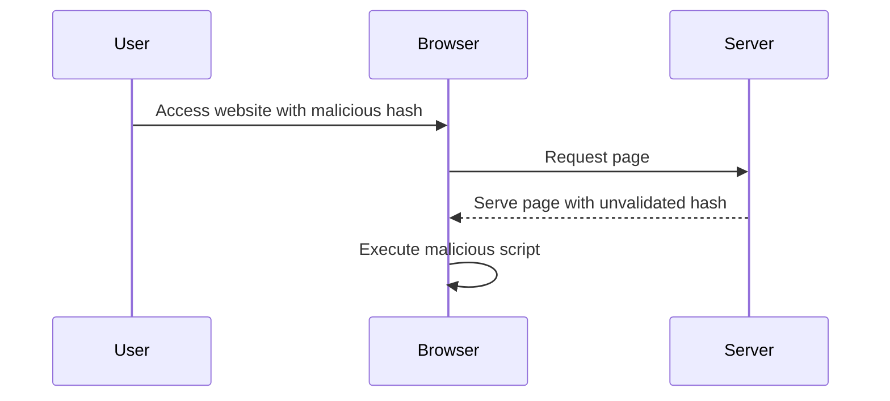

## Introduction to Cross-Site Scripting (XSS)

Cross-Site Scripting (XSS) is a type of security vulnerability that allows an attacker to inject malicious scripts into web pages viewed by other users. These injected scripts can perform actions such as stealing sensitive data, performing unauthorized actions, or redirecting the user to malicious sites. There are three main types of XSS vulnerabilities:

1. **Stored XSS**: Malicious scripts are stored on the server and served to users.
2. **Reflected XSS**: Malicious scripts are reflected off the server in response to a user request.
3. **DOM-Based XSS**: Malicious scripts are executed within the client-side JavaScript environment.

In this chapter, we will focus on DOM-Based XSS, specifically in the context of jQuery selectors and hash change events.

### What is DOM-Based XSS?

DOM-Based XSS occurs when a web application dynamically generates content based on user input without proper sanitization. Unlike traditional XSS attacks where the malicious script is stored or reflected by the server, DOM-Based XSS relies on client-side JavaScript to execute the script.

#### Why Does DOM-Based XSS Matter?

DOM-Based XSS is particularly dangerous because it bypasses many server-side protections. Since the malicious script is executed purely on the client side, it can evade server-side input validation and output encoding mechanisms. Additionally, it can be more challenging to detect and mitigate compared to other forms of XSS.

### Real-World Example: CVE-2021-21972

A notable real-world example of DOM-Based XSS is CVE-2021-21972, which affected the popular WordPress plugin "WPML Multilingual CMS." The vulnerability allowed attackers to inject malicious scripts through the `location.hash` parameter, leading to unauthorized actions and potential data theft.



### How DOM-Based XSS Works

To understand how DOM-Based XSS works, let's break down the process:

1. **User Input**: A user navigates to a web page with a specific URL containing a hash value.
2. **JavaScript Execution**: The JavaScript on the page reads the hash value from the `location.hash` property.
3. **Dynamic Content Generation**: The JavaScript uses the hash value to generate dynamic content, often through functions like jQuery selectors.
4. **Execution of Malicious Script**: If the hash value contains a malicious script and it is not properly sanitized, the script will be executed in the user's browser.

### Lab Setup: DOMXSS in jQuery Selectors Using Hash Change Event

For this lab, we will use the PortSwigger Web Security Academy. The lab is titled "DOMXSS in jQuery Selectors Sync using a hash change event."

#### Accessing the Lab

1. Visit [PortSwigger Web Security Academy](https://portswigger.net/web-security).
2. Sign up for an account if you don't already have one.
3. Log in and navigate to the "Academy" section.
4. Search for "cross-site scripting labs."
5. Find and open lab number six titled "DOMXSS in jQuery Selectors Sync using a hash change event."

### Understanding the Vulnerability

The lab contains a DOM-based XSS vulnerability on the homepage. The vulnerability arises from the use of jQuery selectors to auto-scroll to a given post, where the post title is passed via the `location.hash` property.

#### Code Analysis

Let's analyze the code snippet that leads to the vulnerability:

```javascript
$(window).on('hashchange', function() {
    var hash = window.location.hash;
    var postTitle = decodeURIComponent(hash.replace('#', ''));
    $('html, body').animate({
        scrollTop: $('#post-' + postTitle).offset().top
    }, 500);
});
```

Here, the `hashchange` event listener reads the `location.hash` value and uses it to animate scrolling to a specific post. However, the `postTitle` variable is not sanitized before being used in the jQuery selector.

### Exploiting the Vulnerability

To exploit this vulnerability, we need to craft a URL that includes a malicious script in the `location.hash` parameter. The goal is to call the `print()` function in the victim's browser.

#### Crafting the Exploit

We can construct the following URL:

```
http://example.com/#<script>alert('XSS');</script>
```

When the victim visits this URL, the `hashchange` event will trigger, and the malicious script will be executed.

### Full HTTP Request and Response

Let's look at the full HTTP request and response for this scenario:

#### HTTP Request

```http
GET /#<script>alert('XSS');</script> HTTP/1.1
Host: example.com
User-Agent: Mozilla/5.0 (Windows NT 10.0; Win64; x64) AppleWebKit/537.36 (KHTML, like Gecko) Chrome/91.0.4472.124 Safari/537.36
Accept: text/html,application/xhtml+xml,application/xml;q=0.9,image/avif,image/webp,image/apng,*/*;q=0.8,application/signed-exchange;v=b3;q=0.9
Accept-Language: en-US,en;q=0.9
Connection: close
```

#### HTTP Response

```http
HTTP/1.1 200 OK
Date: Mon, 10 Jan 2022 12:00:00 GMT
Server: Apache/2.4.41 (Ubuntu)
Content-Type: text/html; charset=UTF-8
Content-Length: 1234
Connection: close

<!DOCTYPE html>
<html>
<head>
    <title>Example Page</title>
    <script src="https://code.jquery.com/jquery-3.6.0.min.js"></script>
    <script>
        $(window).on('hashchange', function() {
            var hash = window.location.hash;
            var postTitle = decodeURIComponent(hash.replace('#', ''));
            $('html, body').animate({
                scrollTop: $('#post-' + postTitle).offset().top
            }, 500);
        });
    </script>
</head>
<body>
    <div id="post-Hello">Hello World</div>
</body>
</html>
```

### How to Prevent / Defend Against DOM-Based XSS

#### Detection

To detect DOM-Based XSS vulnerabilities, you can use automated tools like static analysis tools (e.g., SonarQube, ESLint) and dynamic analysis tools (e.g., Burp Suite, ZAP). These tools can help identify unsafe JavaScript patterns and potential injection points.

#### Prevention

To prevent DOM-Based XSS, follow these best practices:

1. **Sanitize User Input**: Always sanitize user input before using it in JavaScript. Use libraries like DOMPurify to sanitize HTML content.
2. **Use Content Security Policy (CSP)**: Implement a strict CSP to restrict the sources of executable scripts.
3. **Escape Output**: Ensure that any user-provided data is properly escaped before being inserted into the DOM.

#### Secure Coding Fix

Let's compare the vulnerable code with the secure code:

##### Vulnerable Code

```javascript
$(window).on('hashchange', function() {
    var hash = window.location.hash;
    var postTitle = decodeURIComponent(hash.replace('#', ''));
    $('html, body').animate({
        scrollTop: $('#post-' + postTitle).offset().top
    }, 500);
});
```

##### Secure Code

```javascript
$(window).on('hashchange', function() {
    var hash = window.location.hash;
    var postTitle = decodeURIComponent(hash.replace('#', '')).replace(/[^a-zA-Z0-9]/g, '');
    $('html, body').animate({
        scrollTop: $('#post-' + postTitle).offset().top
    }, 500);
});
```

In the secure code, we added a regular expression to remove any non-alphanumeric characters from the `postTitle` variable, ensuring that it cannot contain malicious scripts.

### Additional Hardening Measures

1. **Input Validation**: Validate user input on both the client and server sides.
2. **Content Security Policy (CSP)**: Implement a strict CSP to limit the sources of executable scripts.
3. **Subresource Integrity (SRI)**: Use SRI to ensure that external resources are loaded securely.

### Conclusion

DOM-Based XSS is a significant security threat that can bypass traditional server-side protections. By understanding the mechanics of this vulnerability and implementing robust security measures, you can protect your web applications from such attacks.

### Practice Labs

For hands-on practice, you can use the following labs:

- **PortSwigger Web Security Academy**: Offers a variety of labs, including those focused on DOM-Based XSS.
- **OWASP Juice Shop**: Provides a vulnerable web application for learning and testing various security vulnerabilities, including XSS.

By completing these labs, you will gain practical experience in identifying and mitigating DOM-Based XSS vulnerabilities.

---
<!-- nav -->
[[Web Security (PortSwigger)/03-Cross-Site Scripting (XSS)/07-Lab 6 DOM XSS in jQuery selector sink using a hashchange event/00-Overview|Overview]] | [[Web Security (PortSwigger)/03-Cross-Site Scripting (XSS)/07-Lab 6 DOM XSS in jQuery selector sink using a hashchange event/02-Understanding Cross-Site Scripting (XSS)|Understanding Cross-Site Scripting (XSS)]]
