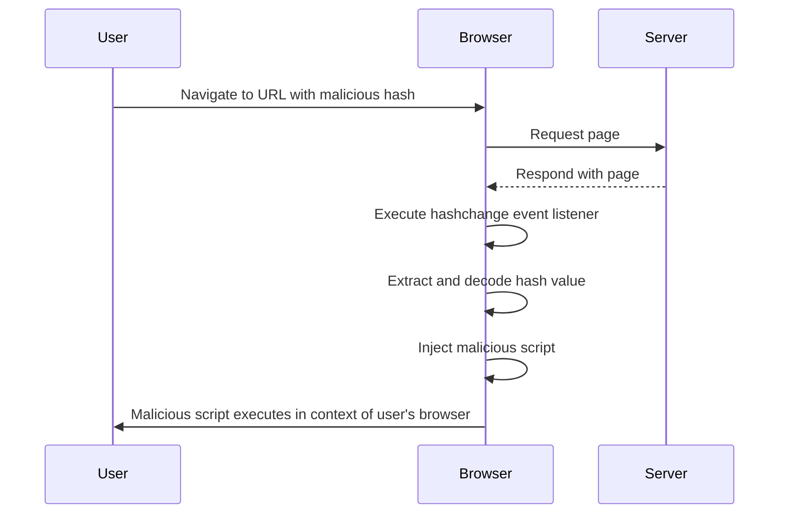

## Understanding Cross-Site Scripting (XSS)

Cross-Site Scripting (XSS) is a type of security vulnerability typically found in web applications. It occurs when an attacker injects malicious scripts into web pages viewed by other users. XSS attacks can lead to various security issues, including session hijacking, data theft, and defacement of websites. This chapter will focus on a specific type of XSS known as DOM-based XSS, particularly in the context of jQuery selectors and hashchange events.

### Background Theory

#### What is DOM-Based XSS?

DOM-Based XSS is a form of XSS where the attack vector is executed within the browser's Document Object Model (DOM). Unlike traditional XSS, which involves server-side injection, DOM-based XSS relies on client-side JavaScript to execute the malicious script. This makes it harder to detect and mitigate since the payload is not sent to the server.

#### How Does DOM-Based XSS Work?

In a typical scenario, a web application might dynamically update parts of the DOM based on user input or URL parameters. If this input is not properly sanitized, an attacker can inject malicious scripts that will be executed in the context of the victim's browser.

### Example Scenario: jQuery Selector Sink Using Hashchange Event

Let's consider the scenario described in the lecture transcript. The application uses jQuery to handle the `hashchange` event, which triggers when the URL fragment identifier changes. The application extracts the hash value from the URL and uses it to scroll to a specific section of the page.

#### Code Analysis

The following code snippet demonstrates the behavior described in the lecture:

```javascript
$(window).on('hashchange', function() {
    var post = decodeURIComponent(window.location.hash.slice(1));
    if (post !== '') {
        $('html, body').animate({
            scrollTop: $('h2:contains("' + post + '")').offset().top
        }, 500);
    }
});
```

This code listens for the `hashchange` event and performs the following steps:

1. **Extract the Hash Value**: The `decodeURIComponent(window.location.hash.slice(1))` line extracts the hash value from the URL and decodes it.
2. **Check if Post is Not Empty**: The `if (post !== '')` condition ensures that the extracted value is not empty.
3. **Scroll to the Specified Section**: The `$('h2:contains("' + post + '")')` selector finds the `<h2>` element containing the specified text and scrolls to it.

### Real-World Examples

#### Recent CVEs and Breaches

One notable example of DOM-based XSS is the CVE-2021-21972 vulnerability in the WordPress plugin "WP GDPR Compliance." This vulnerability allowed attackers to inject malicious scripts via the `hashchange` event, leading to potential data exfiltration and session hijacking.

Another example is the CVE-2020-14889 vulnerability in the popular web analytics service Matomo. This vulnerability allowed attackers to inject malicious scripts via the `hashchange` event, potentially compromising user sessions and stealing sensitive data.

### Detailed Explanation of the Vulnerability

#### Vulnerable Code

Let's break down the vulnerable code and understand why it poses a security risk:

```javascript
$(window).on('hashchange', function() {
    var post = decodeURIComponent(window.location.hash.slice(1));
    if (post !== '') {
        $('html, body').animate({
            scrollTop: $('h2:contains("' + post + '")').offset().top
        }, 500);
    }
});
```

1. **Extracting the Hash Value**: The `decodeURIComponent(window.location.hash.slice(1))` line extracts the hash value from the URL and decodes it. This value is directly used in the jQuery selector.
2. **jQuery Selector**: The `$('h2:contains("' + post + '")')` selector uses the extracted value to find the corresponding `<h2>` element. If the value contains malicious scripts, they will be executed in the context of the victim's browser.

### Attack Chain Diagram

To better understand the attack chain, let's visualize it using a mermaid diagram:



### Common Pitfalls

#### Unsanitized Input

The primary issue with the given code is the lack of proper sanitization of the input. The `decodeURIComponent` function is used to decode the hash value, but it does not sanitize the input. This allows an attacker to inject malicious scripts that will be executed in the context of the victim's browser.

#### Lack of Content Security Policy (CSP)

Content Security Policy (CSP) is a security feature that helps to detect and mitigate certain types of attacks, including XSS. Without a properly configured CSP, the application is more vulnerable to such attacks.

### How to Prevent / Defend

#### Secure Coding Practices

To prevent DOM-based XSS, it is crucial to follow secure coding practices. Here are some steps to ensure the code is secure:

1. **Sanitize Input**: Always sanitize user input before using it in the DOM. This includes decoding and validating the input to ensure it does not contain malicious scripts.
2. **Use Content Security Policy (CSP)**: Implement a strict CSP to restrict the sources of executable scripts. This helps to prevent the execution of malicious scripts even if they are injected into the DOM.

#### Secure Code Example

Here is the corrected version of the code with proper sanitization and CSP implementation:

```javascript
// Sanitize the input
function sanitizeInput(input) {
    return input.replace(/</g, '&lt;').replace(/>/g, '&gt;');
}

$(window).on('hashchange', function() {
    var post = decodeURIComponent(window.location.hash.slice(1));
    post = sanitizeInput(post); // Sanitize the input
    if (post !== '') {
        $('html, body').animate({
            scrollTop: $('h2:contains("' + post + '")').offset().top
        }, 500);
    }
});

// Set Content Security Policy (CSP)
document.addEventListener('DOMContentLoaded', function() {
    var csp = "default-src 'self'; script-src 'self' 'unsafe-inline'";
    document.querySelector('meta[name="csp"]').setAttribute('content', csp);
});
```

#### Detection and Prevention

To detect and prevent DOM-based XSS, you can use tools like:

- **Web Application Firewalls (WAFs)**: WAFs can help detect and block malicious requests before they reach the application.
- **Static Application Security Testing (SAST)**: SAST tools can analyze the codebase for potential vulnerabilities, including DOM-based XSS.
- **Dynamic Application Security Testing (DAST)**: DAST tools can simulate attacks and test the application's response to identify vulnerabilities.

### Complete Example

#### Full HTTP Request and Response

Here is a complete example of the HTTP request and response:

**HTTP Request:**

```http
GET /page#tracking%20your%20kids HTTP/1.1
Host: example.com
User-Agent: Mozilla/5.0 (Windows NT 10.0; Win64; x64) AppleWebKit/537.36 (KHTML, like Gecko) Chrome/91.0.4472.124 Safari/537.36
Accept: text/html,application/xhtml+xml,application/xml;q=0.9,image/avif,image/webp,image/apng,*/*;q=0.8,application/signed-exchange;v=b3;q=0.9
Accept-Language: en-US,en;q=0.9
Connection: keep-alive
Referer: https://example.com/
```

**HTTP Response:**

```http
HTTP/1.1 200 OK
Date: Mon, 20 Sep 2021 12:00:00 GMT
Server: Apache/2.4.41 (Ubuntu)
Content-Type: text/html; charset=UTF-8
Content-Length: 1234
Connection: keep-alive

<!DOCTYPE html>
<html lang="en">
<head>
    <meta charset="UTF-8">
    <title>Example Page</title>
    <script src="https://code.jquery.com/jquery-3.6.0.min.js"></script>
    <script>
        $(window).on('hashchange', function() {
            var post = decodeURIComponent(window.location.hash.slice(1));
            post = post.replace(/</g, '&lt;').replace(/>/g, '&gt;'); // Sanitize the input
            if (post !== '') {
                $('html, body').animate({
                    scrollTop: $('h2:contains("' + post + '")').offset().top
                }, 500);
            }
        });
    </script>
</head>
<body>
    <h2>Cool Parenting Tips</h2>
    <h2>Tracking Your Kids</h2>
    <h2>What Can 5G Do for You?</h2>
    <h2>Don't Believe Everything You Read</h2>
</body>
</html>
```

### Hands-On Labs

For hands-on practice with DOM-based XSS, consider the following labs:

- **PortSwigger Web Security Academy**: Offers a comprehensive set of labs covering various types of XSS, including DOM-based XSS.
- **OWASP Juice Shop**: A deliberately insecure web application for practicing web security skills, including XSS.
- **DVWA (Damn Vulnerable Web Application)**: A PHP/MySQL web application that is riddled with vulnerabilities, including XSS.

These labs provide a safe environment to practice and understand the concepts discussed in this chapter.

### Conclusion

DOM-based XSS is a serious security vulnerability that can have significant consequences if not properly mitigated. By understanding the underlying mechanisms and implementing secure coding practices, you can protect your web applications from such attacks. Always remember to sanitize user input and implement a strict Content Security Policy to minimize the risk of XSS vulnerabilities.

---
<!-- nav -->
[[Web Security (PortSwigger)/03-Cross-Site Scripting (XSS)/07-Lab 6 DOM XSS in jQuery selector sink using a hashchange event/01-Introduction to Cross-Site Scripting (XSS)|Introduction to Cross-Site Scripting (XSS)]] | [[Web Security (PortSwigger)/03-Cross-Site Scripting (XSS)/07-Lab 6 DOM XSS in jQuery selector sink using a hashchange event/00-Overview|Overview]] | [[Web Security (PortSwigger)/03-Cross-Site Scripting (XSS)/07-Lab 6 DOM XSS in jQuery selector sink using a hashchange event/03-Understanding DOM-based XSS|Understanding DOM-based XSS]]
