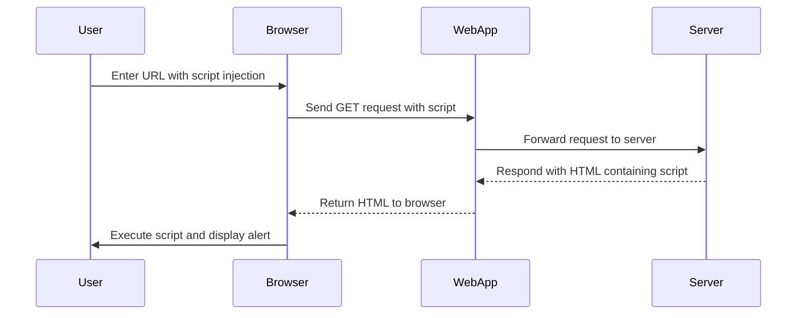

## Cross-Site Scripting (XSS)

Cross-Site Scripting (XSS) is a type of security vulnerability that allows an attacker to inject malicious scripts into web pages viewed by other users. This can lead to various security issues, including session hijacking, theft of sensitive data, and defacement of websites. In this lab, we will explore a specific type of XSS vulnerability known as **Reflected XSS**.

### What is Reflected XSS?

Reflected XSS occurs when an attacker injects a script into a web page that is immediately reflected back to the user. This type of XSS typically happens through URL parameters, search forms, or other input fields where user input is echoed back without proper sanitization.

#### How Does Reflected XSS Work?

1. **User Input**: A user submits input to a web application, which includes malicious JavaScript.
2. **Reflection**: The web application reflects this input back to the user in the form of a web page.
3. **Execution**: The browser executes the injected JavaScript, leading to potential security issues.

### Example Scenario

Consider a web application with a search feature. The search results page reflects the user's input in the URL:

```plaintext
http://example.com/search?q=<script>alert('XSS')</script>
```

When the user visits this URL, the browser executes the `<script>` tag, triggering an alert box.

### Real-World Examples

Recent real-world examples of Reflected XSS vulnerabilities include:

- **CVE-2021-21972**: A Reflected XSS vulnerability was found in the WordPress plugin "WP User Avatar." An attacker could inject malicious scripts via the `avatar_url` parameter.
- **CVE-2020-14882**: A Reflected XSS vulnerability was discovered in the Joomla! CMS. An attacker could inject malicious scripts via the `Itemid` parameter.

### Lab Setup

For this lab, we will use the PortSwigger Web Security Academy, which provides a controlled environment to practice and understand XSS vulnerabilities.

### Attack Scenario

Let's assume we have a web application with a search feature. The search results page reflects the user's input in the URL:

```plaintext
http://example.com/search?q=hello
```

If we inject a script into the `q` parameter:

```plaintext
http://example.com/search?q=<script>alert('XSS')</script>
```

The browser will execute the script, leading to an alert box.

### Full HTTP Request and Response

Here is the full HTTP request and response for the attack scenario:

```http
GET /search?q=%3Cscript%3Ealert(%27XSS%27)%3C%2Fscript%3E HTTP/1.1
Host: example.com
User-Agent: Mozilla/5.0 (Windows NT 10.0; Win64; x64) AppleWebKit/537.36 (KHTML, like Gecko) Chrome/91.0.4472.124 Safari/537.36
Accept: text/html,application/xhtml+xml,application/xml;q=0.9,image/avif,image/webp,image/apng,*/*;q=0.8,application/signed-exchange;v=b3;q=0.9
Accept-Language: en-US,en;q=0.9
Connection: close

HTTP/1.1 200 OK
Date: Mon, 01 Aug 2022 12:00:00 GMT
Server: Apache/2.4.41 (Ubuntu)
Content-Type: text/html; charset=UTF-8
Content-Length: 1234
Connection: close

<!DOCTYPE html>
<html>
<head>
    <title>Search Results</title>
</head>
<body>
    <h1>Search Results for "<script>alert('XSS')</script>"</h1>
</body>
</html>
```

### Diagram of Attack Flow



### How to Prevent / Defend Against Reflected XSS

#### Detection

To detect Reflected XSS vulnerabilities, you can use automated tools such as:

- **Burp Suite**: A popular tool for web application security testing.
- **OWASP ZAP**: Another widely used open-source tool for detecting XSS vulnerabilities.

#### Prevention

1. **Input Validation**: Ensure that user inputs are validated and sanitized before being reflected back to the user.
2. **Output Encoding**: Encode user inputs to prevent them from being interpreted as executable scripts. Use libraries like `OWASP Java Encoder` or `DOMPurify` for JavaScript.
3. **Content Security Policy (CSP)**: Implement CSP to restrict the sources from which scripts can be loaded.

##### Secure Coding Fixes

**Vulnerable Code:**

```php
<?php
$search = $_GET['q'];
echo "<h1>Search Results for \"$search\"</h1>";
?>
```

**Secure Code:**

```php
<?php
$search = htmlspecialchars($_GET['q'], ENT_QUOTES, 'UTF-8');
echo "<h1>Search Results for \"$search\"</h1>";
?>
```

**Explanation:**
- `htmlspecialchars()` function is used to convert special characters to their HTML entities, preventing them from being interpreted as executable scripts.

### Configuration Hardening

Ensure that your web server and application configurations are hardened against XSS attacks:

- **Disable Dangerous Headers**: Disable headers like `X-XSS-Protection` if they are not needed.
- **Enable Content Security Policy (CSP)**: Add a strict CSP to your web application to limit the sources from which scripts can be loaded.

### Conclusion

Reflected XSS is a serious security vulnerability that can lead to significant security risks. By understanding how it works and implementing proper defenses, you can protect your web applications from these types of attacks.

### Hands-On Practice

For hands-on practice, you can use the following labs:

- **PortSwigger Web Security Academy**: Offers a variety of labs to practice and understand XSS vulnerabilities.
- **OWASP Juice Shop**: A deliberately insecure web application for practicing web security.

By completing these labs, you will gain practical experience in identifying and mitigating Reflected XSS vulnerabilities.

---
<!-- nav -->
[[Web Security (PortSwigger)/03-Cross-Site Scripting (XSS)/08-Lab 7 Reflected XSS into attribute with angle brackets HTML encoded/01-Introduction to Cross-Site Scripting (XSS)|Introduction to Cross-Site Scripting (XSS)]] | [[Web Security (PortSwigger)/03-Cross-Site Scripting (XSS)/08-Lab 7 Reflected XSS into attribute with angle brackets HTML encoded/00-Overview|Overview]] | [[03-Detailed Analysis of the Vulnerability|Detailed Analysis of the Vulnerability]]
