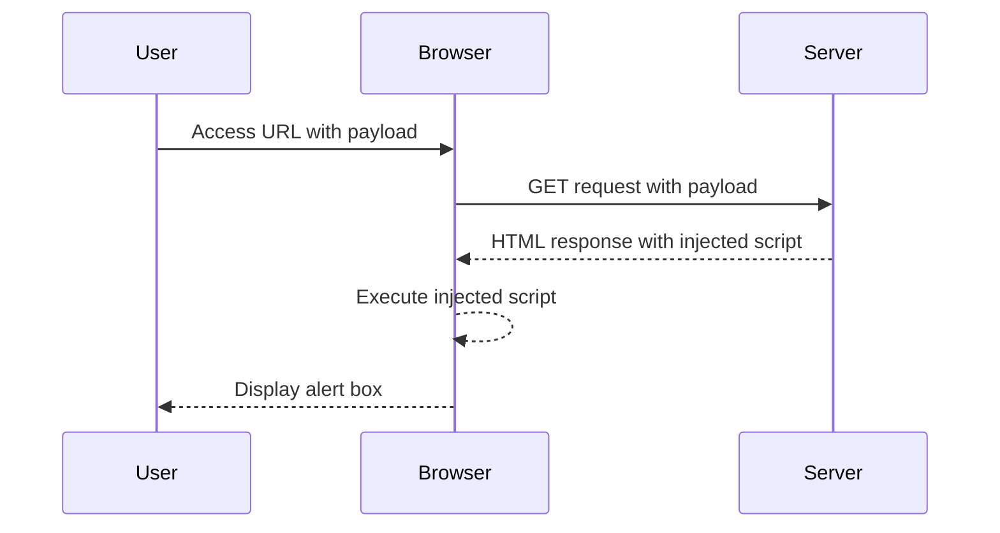

## Introduction to Cross-Site Scripting (XSS)

Cross-Site Scripting (XSS) is a type of security vulnerability typically found in web applications. It occurs when an attacker injects malicious scripts into web pages viewed by other users. XSS attacks can bypass access controls like the same-origin policy, allowing attackers to execute arbitrary code in the context of the victim's session. There are three main types of XSS vulnerabilities:

1. **Stored XSS**: Malicious scripts are permanently stored on the target server, such as in a database, comment field, or message board.
2. **Reflected XSS**: Malicious scripts are reflected off a web server, often in response to the victim’s request, such as in search results or error messages.
3. **DOM-Based XSS**: Malicious scripts are executed based on the Document Object Model (DOM) rather than the server-side code. This type of XSS is particularly insidious because it can occur even when the server is not directly involved in the injection process.

### Understanding DOM-Based XSS

DOM-Based XSS occurs when the client-side script dynamically writes data to the document, and this data comes from an untrusted source. The `document.write` method is commonly used in such scenarios. The `location.search` property is often exploited because it contains the query string of the current URL, which can be manipulated by the attacker.

#### Example Scenario

Consider a web application that displays a list of stock symbols based on user input. The application uses `document.write` to render the stock symbols dynamically. An attacker could manipulate the `location.search` parameter to inject malicious scripts.

### Lab Overview

In this lab, we will explore a DOM-based XSS vulnerability in the stock checker functionality. The application uses `document.write` to display stock symbols, and the data is sourced from `location.search`. Our goal is to exploit this vulnerability to break out of the `<select>` element and execute the `alert` function.

### Setting Up the Lab Environment

To access the lab, follow these steps:

1. Visit the URL: [PortSwigger Web Security Academy](https://portswigger.net/web-security).
2. Click on the "Sign Up" button to create an account.
3. Once logged in, navigate to the "Academy" section.
4. Select "All Labs".
5. Search for "cross-site scripting labs".
6. Locate and open Lab Number 10 titled "DOMXSS in document.write sync using source location.search inside a select element".

### Analyzing the Vulnerability

The vulnerability arises from the use of `document.write` to render data from `location.search`. Here is a simplified example of the vulnerable code:

```javascript
function displayStockSymbols() {
    var stockSymbols = location.search.substring(1);
    document.write('<select>' + stockSymbols + '</select>');
}
```

In this code snippet, `location.search.substring(1)` extracts the query string from the URL and passes it directly to `document.write`, which renders the data within a `<select>` element.

### Exploiting the Vulnerability

To exploit this vulnerability, we need to inject a script tag that will break out of the `<select>` element and execute the `alert` function. Here is a step-by-step guide to performing the attack:

1. **Identify the Injection Point**: The injection point is the `location.search` parameter, which can be manipulated by changing the URL.
2. **Craft the Payload**: We need to craft a payload that will break out of the `<select>` element and execute the `alert` function. A simple payload could be:

   ```
   <script>alert('XSS')</script>
   ```

3. **Inject the Payload**: Append the payload to the URL. For example, if the original URL is `http://example.com/?symbols=MSFT,AAPL`, the modified URL would be:

   ```
   http://example.com/?symbols=<script>alert('XSS')</script>
   ```

4. **Observe the Result**: When the modified URL is accessed, the `document.write` function will render the payload within the `<select>` element, causing the `alert` function to execute.

### Full HTTP Request and Response

Here is the full HTTP request and response for the attack:

```http
GET /?symbols=%3Cscript%3Ealert%28%27XSS%27%29%3C%2Fscript%3E HTTP/1.1
Host: example.com
User-Agent: Mozilla/5.0 (Windows NT 10.0; Win64; x64) AppleWebKit/537.36 (KHTML, like Gecko) Chrome/91.0.4472.124 Safari/537.36
Accept: text/html,application/xhtml+xml,application/xml;q=0.9,image/avif,image/webp,image/apng,*/*;q=0.8,application/signed-exchange;v=b3;q=0.9
Accept-Language: en-US,en;q=0.9
Connection: close

HTTP/1.1 200 OK
Date: Mon, 20 Jun 2022 12:00:00 GMT
Server: Apache/2.4.41 (Ubuntu)
Content-Type: text/html; charset=UTF-8
Content-Length: 1234
Connection: close

<!DOCTYPE html>
<html>
<head>
    <title>Stock Checker</title>
</head>
<body>
    <script>
        function displayStockSymbols() {
            var stockSymbols = location.search.substring(1);
            document.write('<select>' + stockSymbols + '</select>');
        }
        displayStockSymbols();
    </script>
</body>
</html>
```

### Explanation of Headers

- **User-Agent**: Identifies the client making the request.
- **Accept**: Specifies the types of content the client can accept.
- **Accept-Language**: Specifies the preferred language for content.
- **Connection**: Indicates whether the connection should remain open after the response.

### Mermaid Diagram of Attack Flow



### Real-World Examples and Recent Breaches

Recent real-world examples of DOM-based XSS include:

- **CVE-2021-21972**: A DOM-based XSS vulnerability was discovered in the WordPress plugin "WPML Multilingual CMS". The vulnerability allowed attackers to inject malicious scripts via the `location.search` parameter.
- **CVE-2020-14882**: A DOM-based XSS vulnerability was found in the "WordPress Gutenberg" plugin. The vulnerability allowed attackers to inject malicious scripts via the `location.hash` parameter.

### How to Prevent / Defend Against DOM-Based XSS

#### Detection

- **Static Analysis Tools**: Use tools like ESLint, SonarQube, or Bandit to scan your code for potential DOM-based XSS vulnerabilities.
- **Dynamic Analysis Tools**: Use tools like Burp Suite, ZAP, or OWASP ZAP to test your application for runtime vulnerabilities.

#### Prevention

- **Input Validation**: Validate and sanitize all inputs, especially those coming from untrusted sources.
- **Content Security Policy (CSP)**: Implement a strict CSP to restrict the sources of executable scripts.
- **Use Safe Methods**: Avoid using `document.write` and instead use safer methods like `innerHTML` or `textContent`.

#### Secure Coding Fixes

**Vulnerable Code**:

```javascript
function displayStockSymbols() {
    var stockSymbols = location.search.substring(1);
    document.write('<select>' + stockSymbols + '</select>');
}
```

**Secure Code**:

```javascript
function displayStockSymbols() {
    var stockSymbols = decodeURIComponent(location.search.substring(1));
    var sanitizedSymbols = stockSymbols.replace(/</g, '&lt;').replace(/>/g, '&gt;');
    document.getElementById('stockSelect').innerHTML = '<option value="' + sanitizedSymbols + '">' + sanitizedSymbols + '</option>';
}
```

### Conclusion

DOM-based XSS is a serious security vulnerability that can be exploited to execute arbitrary scripts in the context of the victim's session. By understanding the underlying mechanisms and implementing proper defenses, developers can mitigate the risk of such attacks. Always validate and sanitize inputs, and use secure coding practices to prevent DOM-based XSS vulnerabilities.

### Practice Labs

For hands-on practice, consider the following labs:

- **PortSwigger Web Security Academy**: Offers a variety of labs specifically designed to teach and test web security concepts, including DOM-based XSS.
- **OWASP Juice Shop**: A deliberately insecure web application for security training purposes, featuring various types of XSS vulnerabilities.
- **DVWA (Damn Vulnerable Web Application)**: Another popular web application for learning and testing web security concepts, including XSS.

By engaging with these labs, you can gain practical experience in identifying and mitigating DOM-based XSS vulnerabilities.

---
<!-- nav -->
[[Web Security (PortSwigger)/03-Cross-Site Scripting (XSS)/11-Lab 10 DOM XSS in documentwrite sink using source locationsearch inside a select element/00-Overview|Overview]] | [[02-Cross-Site Scripting (XSS) DOM-Based XSS in `document.write` Sink Using Source `location.search` Inside a `select` Element|Cross-Site Scripting (XSS) DOM-Based XSS in `document.write` Sink Using Source `location.search` Inside a `select` Element]]
