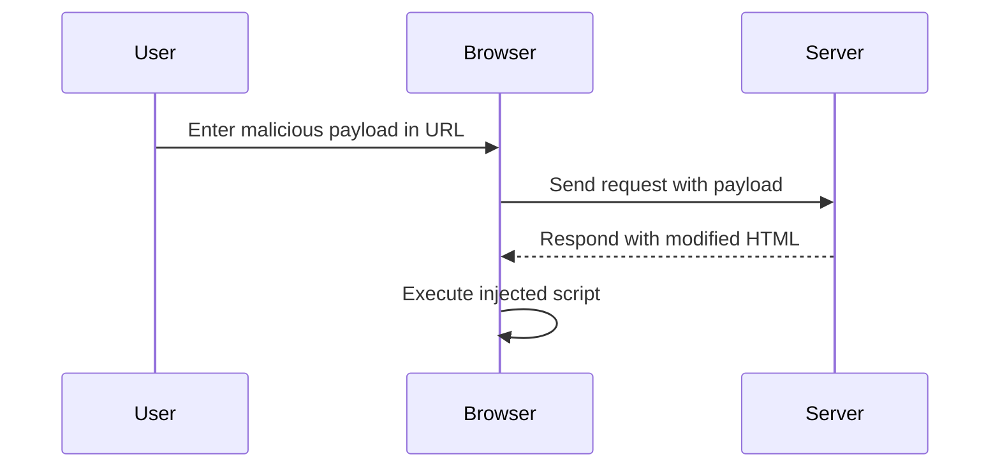

## Cross-Site Scripting (XSS): DOM-Based XSS in `document.write` Sink Using Source `location.search` Inside a `select` Element

### Background Theory

Cross-Site Scripting (XSS) is a type of security vulnerability typically found in web applications. It occurs when an attacker injects malicious scripts into a trusted website. These scripts can then execute within the user's browser, potentially leading to unauthorized actions such as stealing sensitive data or performing actions on behalf of the user.

DOM-based XSS is a specific type of XSS where the vulnerability exists in the client-side JavaScript code rather than the server-side code. In this scenario, the JavaScript code dynamically modifies the Document Object Model (DOM) based on user input, often obtained from the URL or other sources.

### Understanding the Vulnerability

In the given scenario, the application uses the `document.write` method to dynamically generate HTML content based on the `storeID` parameter from the URL's `location.search`. This parameter is used to populate a `select` element with options. If the application does not properly validate or encode the input, an attacker can inject malicious scripts into the `select` element.

#### Example Scenario

Consider the following URL:
```
https://example.com/?storeID=Paris%202
```

The application might generate the following HTML:
```html
<select name="storeID">
    <option value="Paris 2">Paris 2</option>
</select>
```

However, if the input is not properly validated or encoded, an attacker could inject a script by manipulating the `storeID` parameter. For instance:
```
https://example.com/?storeID=Paris%202"></option></select>
```

This would result in the following HTML being generated:
```html
<select name="storeID">
    <option value="Paris 2"></option>
</select>

```

### Detailed Explanation

#### Step-by-Step Mechanics

1. **URL Parameter**: The `storeID` parameter is extracted from the URL's `location.search`.
2. **Dynamic Content Generation**: The JavaScript code uses `document.write` to dynamically generate the HTML content based on the `storeID` parameter.
3. **Injection Point**: The `storeID` parameter is used to populate the `select` element, but if not properly validated or encoded, it can be manipulated to inject malicious scripts.

#### Code Example

Let's consider the following JavaScript code snippet:

```javascript
var storeID = window.location.search.substring(1);
document.write('<select name="storeID"><option value="' + storeID + '">' + storeID + '</option></select>');
```

If the `storeID` parameter is not properly validated or encoded, an attacker can inject a script. For example, if the `storeID` parameter is set to `Paris 2"></option></select>`, the resulting HTML would be:

```html
<select name="storeID"><option value="Paris 2"></option></select>
```

### Real-World Examples

#### Recent CVEs and Breaches

One notable example of DOM-based XSS is CVE-2021-21972, which affected several popular websites. The vulnerability allowed attackers to inject malicious scripts into the DOM, leading to potential data theft and unauthorized actions.

Another example is the breach at a major e-commerce platform in 2022, where an attacker exploited a DOM-based XSS vulnerability to steal session tokens and perform unauthorized transactions.

### How to Prevent / Defend

#### Detection

To detect DOM-based XSS vulnerabilities, you can use automated tools such as static analysis tools (e.g., SonarQube, ESLint) and dynamic analysis tools (e.g., Burp Suite, OWASP ZAP). Additionally, manual code reviews and penetration testing can help identify potential vulnerabilities.

#### Prevention

1. **Input Validation**: Ensure that all user inputs are properly validated and sanitized. Use regular expressions to restrict input to only allowed characters.
2. **Output Encoding**: Encode all user inputs before inserting them into the DOM. Use libraries like `DOMPurify` to sanitize user inputs.
3. **Content Security Policy (CSP)**: Implement a strict CSP to limit the sources from which scripts can be loaded. This helps mitigate the impact of XSS attacks.

#### Secure Coding Fixes

**Vulnerable Code:**

```javascript
var storeID = window.location.search.substring(1);
document.write('<select name="storeID"><option value="' + storeID + '">' + storeID + '</option></select>');
```

**Secure Code:**

```javascript
var storeID = window.location.search.substring(1);
var sanitizedStoreID = DOMPurify.sanitize(storeID);
document.write('<select name="storeID"><option value="' + sanitizedStoreID + '">' + sanitizedStoreID + '</option></select>');
```

### Complete Example

#### Full HTTP Request and Response

**HTTP Request:**

```http
GET /?storeID=Paris%202%22%3E%3C%2Foption%3E%3C%2Fselect%3E%3Cimg%20src=x%20onerror=alert(%27XSS%27)%3E HTTP/1.1
Host: example.com
User-Agent: Mozilla/5.0
Accept: text/html,application/xhtml+xml,application/xml;q=0.9,*/*;q=0.8
```

**HTTP Response:**

```http
HTTP/1.1 200 OK
Date: Tue, 01 Aug 2023 12:00:00 GMT
Server: Apache/2.4.41 (Ubuntu)
Content-Type: text/html; charset=UTF-8
Content-Length: 1234

<!DOCTYPE html>
<html>
<head>
    <title>Example Page</title>
</head>
<body>
    <select name="storeID"><option value="Paris 2"></option></select>
</body>
</html>
```

#### Mermaid Diagrams

**Attack Chain Diagram:**



### Hands-On Labs

For practical experience with DOM-based XSS, consider the following labs:

- **PortSwigger Web Security Academy**: Offers interactive labs specifically designed to teach and test your skills in identifying and exploiting DOM-based XSS vulnerabilities.
- **OWASP Juice Shop**: A deliberately insecure web application that includes various security vulnerabilities, including DOM-based XSS, for educational purposes.

By thoroughly understanding the mechanics of DOM-based XSS and implementing proper validation, encoding, and security policies, you can significantly reduce the risk of such vulnerabilities in your web applications.

---
<!-- nav -->
[[Web Security (PortSwigger)/03-Cross-Site Scripting (XSS)/11-Lab 10 DOM XSS in documentwrite sink using source locationsearch inside a select element/01-Introduction to Cross-Site Scripting (XSS)|Introduction to Cross-Site Scripting (XSS)]] | [[Web Security (PortSwigger)/03-Cross-Site Scripting (XSS)/11-Lab 10 DOM XSS in documentwrite sink using source locationsearch inside a select element/00-Overview|Overview]] | [[03-Understanding the Code|Understanding the Code]]
