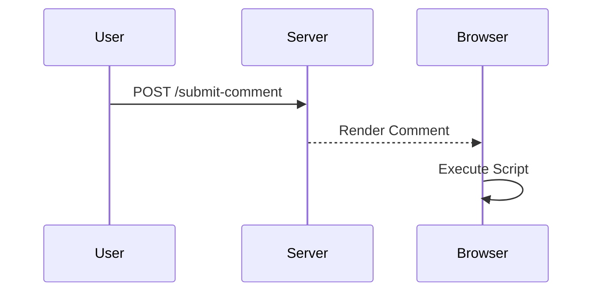
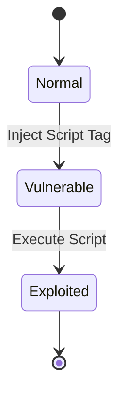

## Understanding Cross-Site Scripting (XSS)

Cross-Site Scripting (XSS) is a type of security vulnerability typically found in web applications where an attacker can inject malicious scripts into web pages viewed by other users. XSS attacks can bypass access controls and can be used to steal sensitive data, perform actions on behalf of the victim, or even take control of the victim's browser.

### Types of XSS

There are three main types of XSS:

1. **Stored XSS**: The malicious script is permanently stored on the target servers, such as in a database, in a message forum, visitor log, comment field, etc. Each time the victim visits the page containing the malicious script, the victim's browser executes the script.
   
2. **Reflected XSS**: The malicious script comes from the current HTTP request. Reflected XSS is delivered to the victim’s browser via a direct or indirect reflection of a request that the victim made to the server.
   
3. **DOM-based XSS**: The vulnerability lies in the client-side code rather than the server-side code. The script is executed based on the way the DOM is manipulated by the client-side code.

### Lab Scenario: Stored DOM XSS

In this lab scenario, we will focus on a specific type of XSS known as Stored DOM XSS. The lab involves a web application that allows users to submit comments. These comments are stored on the server and later displayed to other users. The application uses a custom script called `Loath Comments` with `Vulnerable EscapeHtml.js`.

#### Reviewing the Custom Script

The first step is to review the custom script that is responsible for displaying comments. Let's start by examining the script:

```javascript
// Loath Comments with Vulnerable EscapeHtml.js
function displayComments() {
    var comments = getCommentsFromServer();
    for (var i = 0; i < comments.length; i++) {
        var author = comments[i].author;
        var commentBody = comments[i].commentBody;

        // Create DOM elements
        var pElement = document.createElement('p');
        pElement.innerHTML = escapeHTML(author) + ": " + escapeHTML(commentBody);

        // Append to the document
        document.getElementById('comments').appendChild(pElement);
    }
}

function escapeHTML(str) {
    return str.replace(/</g, '&lt;')
              .replace(/>/g, '&gt;');
}
```

### Explanation of the Code

- **displayComments Function**:
  - Retrieves comments from the server using `getCommentsFromServer()`.
  - Iterates through each comment and extracts the `author` and `commentBody`.
  - Creates a `<p>` element and sets its `innerHTML` to the escaped `author` and `commentBody`.
  - Appends the `<p>` element to the document.

- **escapeHTML Function**:
  - Replaces `<` with `&lt;` and `>` with `&gt;` to prevent HTML injection.

### Potential Vulnerability

Despite the `escapeHTML` function, there is still a potential vulnerability due to the use of `innerHTML`. If an attacker can inject a script tag (`<script>`) into the comment, it will be executed by the browser.

### Real-World Example: CVE-2021-21972

A real-world example of a similar vulnerability is CVE-2021-21972, which affected the popular web application framework Django. An attacker could inject malicious JavaScript into a comment field, leading to a Stored XSS attack. This vulnerability was fixed by properly escaping user input and avoiding the use of `innerHTML`.

### How to Exploit

To exploit this vulnerability, an attacker would need to inject a script tag into the comment field. For example:

```html
<script>alert("XSS")</script>
```

When this comment is displayed, the browser will execute the script, leading to an alert box being shown to the user.

### Full HTTP Request and Response

Let's consider a full HTTP request and response for submitting a comment:

#### HTTP Request

```http
POST /submit-comment HTTP/1.1
Host: vulnerableapp.com
Content-Type: application/x-www-form-urlencoded
Content-Length: 37

author=attacker&commentBody=<script>alert("XSS")</script>
```

#### HTTP Response

```http
HTTP/1.1 200 OK
Date: Tue, 01 Aug 2023 12:00:00 GMT
Content-Type: text/html; charset=UTF-8
Content-Length: 157

<!DOCTYPE html>
<html>
<head><title>Comments</title></head>
<body>
<div id="comments">
<p>&lt;script&gt;alert(&quot;XSS&quot;)&lt;/script&gt;: &lt;script&gt;alert(&quot;XSS&quot;)&lt;/script&gt;</p>
</div>
</body>
</html>
```

### How to Prevent / Defend

#### Secure Coding Practices

1. **Use Safe Methods**: Instead of using `innerHTML`, use safe methods like `textContent` to set the content of elements.
   
2. **Proper Escaping**: Ensure that all user inputs are properly escaped before being inserted into the DOM.

#### Corrected Code

Here is the corrected version of the `displayComments` function:

```javascript
function displayComments() {
    var comments = getCommentsFromServer();
    for (var i = 0; i < comments.length; i++) {
        var author = comments[i].author;
        var commentBody = comments[i].commentBody;

        // Create DOM elements
        var pElement = document.createElement('p');
        pElement.textContent = escapeHTML(author) + ": " + escapeHTML(commentBody);

        // Append to the document
        document.getElementById('comments').appendChild(pElement);
    }
}
```

#### Detection and Prevention

1. **Static Analysis Tools**: Use static analysis tools like ESLint to detect potential vulnerabilities in the code.
   
2. **Dynamic Analysis Tools**: Use dynamic analysis tools like Burp Suite to test for XSS vulnerabilities during development.

3. **Security Headers**: Implement security headers like Content Security Policy (CSP) to mitigate the impact of XSS attacks.

### Mermaid Diagrams

#### Attack Chain Diagram



#### State Machine Diagram



### Practice Labs

For hands-on practice with Stored DOM XSS, consider the following labs:

- **PortSwigger Web Security Academy**: Offers detailed labs on various types of XSS, including Stored DOM XSS.
- **OWASP Juice Shop**: A deliberately insecure web application for practicing web security skills.
- **DVWA (Damn Vulnerable Web Application)**: Provides a variety of web application vulnerabilities, including XSS.

By thoroughly understanding and practicing the concepts covered in this chapter, you will be better equipped to identify and prevent XSS vulnerabilities in web applications.

---
<!-- nav -->
[[02-Identifying the Vulnerability|Identifying the Vulnerability]] | [[Web Security (PortSwigger)/03-Cross-Site Scripting (XSS)/14-Lab 13 Stored DOM XSS/00-Overview|Overview]] | [[Web Security (PortSwigger)/03-Cross-Site Scripting (XSS)/14-Lab 13 Stored DOM XSS/04-Understanding the Vulnerability|Understanding the Vulnerability]]
