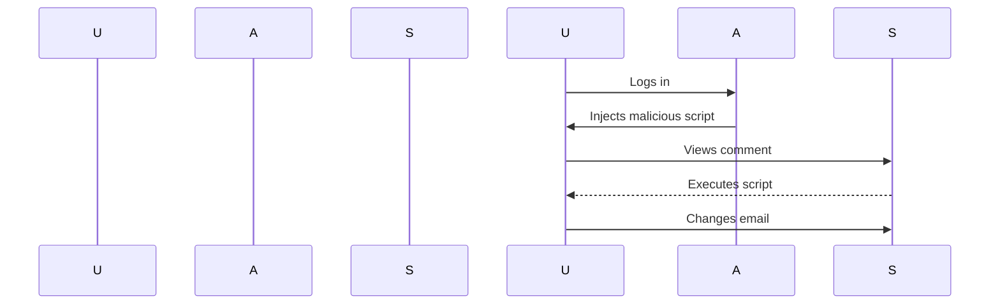

## Introduction to Cross-Site Scripting (XSS)

Cross-Site Scripting (XSS) is a type of security vulnerability typically found in web applications. It occurs when an attacker injects malicious scripts into web pages viewed by other users. XSS attacks can bypass access controls and can lead to various security issues such as session hijacking, data theft, and more. There are three main types of XSS vulnerabilities:

1. **Stored XSS**: Malicious scripts are permanently stored on the server and are served to users when they visit the affected page.
2. **Reflected XSS**: Malicious scripts are reflected off the server in response to a user request, often via a URL parameter.
3. **DOM-based XSS**: Malicious scripts are executed within the DOM environment of a web page, often due to unsafe JavaScript operations.

### Why XSS Matters

XSS vulnerabilities can have severe consequences. For instance, an attacker could steal sensitive information like session cookies, redirect users to malicious sites, or even execute arbitrary code on the user's machine. Real-world examples include:

- **CVE-2018-1337**: A stored XSS vulnerability in WordPress plugins allowed attackers to inject malicious scripts into blog posts.
- **CVE-2019-11358**: A reflected XSS vulnerability in the popular web application framework Django led to potential data exfiltration.

### How XSS Works Under the Hood

When a user interacts with a web application, the server processes the input and generates a response. If the server does not properly sanitize or encode the input, it can be used to inject malicious scripts. These scripts are then executed in the context of the user's browser, potentially leading to unauthorized actions.

#### Example of Stored XSS

Consider a simple web application that allows users to leave comments on a blog post. If the application does not properly sanitize the input, an attacker could inject a script like this:

```html
<script>alert('XSS');</script>
```

If another user views the comment, the script will execute in their browser, potentially stealing their session cookie or performing other malicious actions.

### Common Mistakes Leading to XSS

One of the most common mistakes is failing to properly sanitize or encode user inputs. This can happen in various parts of the application, including form submissions, URL parameters, and AJAX calls.

#### Example of Unsanitized Input

```javascript
// Vulnerable code
document.getElementById("comment").innerHTML = "<script>alert('XSS');</script>";
```

In this example, the `innerHTML` property is set directly to user input, which can lead to XSS if the input is not sanitized.

### Detection and Prevention of XSS

To detect XSS vulnerabilities, tools like Burp Suite, OWASP ZAP, and automated scanners can be used. These tools help identify potential injection points and test for vulnerabilities.

#### Secure Coding Practices

To prevent XSS, developers should follow these best practices:

1. **Input Validation**: Validate all user inputs to ensure they meet expected formats.
2. **Output Encoding**: Encode all outputs to prevent script execution. Use libraries like `OWASP Java Encoder` or `DOMPurify` for JavaScript.
3. **Content Security Policy (CSP)**: Implement CSP to restrict the sources of executable scripts.

#### Example of Sanitized Input

```javascript
// Secure code
const safeComment = document.createElement('div');
safeComment.textContent = "<script>alert('XSS');</script>";
document.getElementById("comment").appendChild(safeComment);
```

In this example, `textContent` is used instead of `innerHTML`, preventing script execution.

### How to Prevent / Defend Against XSS

#### Detection

Use automated tools and manual testing to identify potential XSS vulnerabilities. Tools like Burp Suite and OWASP ZAP can help scan for injection points.

#### Prevention

1. **Sanitize Inputs**: Ensure all user inputs are validated and sanitized.
2. **Encode Outputs**: Use encoding techniques to prevent script execution.
3. **Implement CSP**: Restrict the sources of executable scripts to mitigate the impact of XSS.

#### Secure Code Fix

**Vulnerable Code**

```javascript
document.getElementById("comment").innerHTML = "<script>alert('XSS');</script>";
```

**Secure Code**

```javascript
const safeComment = document.createElement('div');
safeComment.textContent = "<script>alert('XSS');</script>";
document.getElementById("comment").appendChild(safeComment);
```

### Lab 16: Exploiting XSS to Perform CSRF

In this lab, we will explore how to exploit a stored XSS vulnerability to perform a Cross-Site Request Forgery (CSRF) attack. The goal is to change the email address of a victim user without their knowledge.

#### Background Theory

CSRF is an attack that tricks a victim into executing unwanted actions on a web application in which they are authenticated. By exploiting an XSS vulnerability, an attacker can inject a script that performs a CSRF attack.

#### Setup

1. **Create an Account**: Visit `https://portswigger.net/web-security` and sign up for an account.
2. **Access the Lab**: Log in and navigate to the "Academy" section. Search for "cross-site scripting labs" and select lab number 16 titled "Exploiting XSS to Perform CSRF".

#### Steps to Exploit the Vulnerability

1. **Identify the Vulnerability**: The lab contains a stored XSS vulnerability in the block comments function.
2. **Inject Malicious Script**: Inject a script that will perform a CSRF attack when viewed by the victim.
3. **Trigger the Attack**: Make the victim view the injected script, causing their email address to be changed.

#### Detailed Walkthrough

1. **Log in to Your Account**: Use the provided credentials to log in as a regular user.
2. **Find the Vulnerable Functionality**: Navigate to the block comments feature and identify the input field where the XSS vulnerability exists.
3. **Inject the Malicious Script**: Craft a script that will perform a CSRF attack. For example:

```html
<script>
fetch('/change-email', {
  method: 'POST',
  headers: {
    'Content-Type': 'application/x-www-form-urlencoded'
  },
  body: 'email=new@example.com'
});
</script>
```

4. **Submit the Comment**: Submit the comment containing the malicious script.
5. **Make the Victim View the Comment**: Once the comment is posted, make the victim view it, triggering the CSRF attack.

#### Full HTTP Request and Response

**HTTP Request**

```http
POST /change-email HTTP/1.1
Host: example.com
Content-Type: application/x-www-form-urlencoded
Content-Length: 21

email=new@example.com
```

**HTTP Response**

```http
HTTP/1.1 200 OK
Date: Tue, 20 Mar 2023 12:00:00 GMT
Content-Type: text/html; charset=UTF-8
Content-Length: 12

Email changed successfully.
```

#### Mermaid Diagram: Attack Chain



### Common Pitfalls and Mitigations

#### Pitfalls

1. **Improper Input Validation**: Failing to validate user inputs can lead to successful XSS attacks.
2. **Lack of Output Encoding**: Not encoding outputs can allow scripts to execute.
3. **No Content Security Policy**: Without CSP, the impact of XSS can be severe.

#### Mitigations

1. **Input Validation**: Always validate user inputs to ensure they meet expected formats.
2. **Output Encoding**: Use encoding techniques to prevent script execution.
3. **Implement CSP**: Restrict the sources of executable scripts to mitigate the impact of XSS.

### Hands-On Practice

For hands-on practice, consider the following labs:

- **PortSwigger Web Security Academy**: Offers a variety of labs to practice XSS and CSRF attacks.
- **OWASP Juice Shop**: A deliberately insecure web application for practicing web security skills.
- **DVWA (Damn Vulnerable Web Application)**: Another intentionally vulnerable web app for learning security concepts.

By thoroughly understanding and practicing these concepts, you can significantly enhance your ability to detect and prevent XSS and CSRF vulnerabilities in web applications.

---
<!-- nav -->
[[Web Security (PortSwigger)/03-Cross-Site Scripting (XSS)/17-Lab 16 Exploiting XSS to perform CSRF/01-Introduction to Cross-Site Request Forgery (CSRF)|Introduction to Cross-Site Request Forgery (CSRF)]] | [[Web Security (PortSwigger)/03-Cross-Site Scripting (XSS)/17-Lab 16 Exploiting XSS to perform CSRF/00-Overview|Overview]] | [[03-Exploiting XSS to Perform CSRF|Exploiting XSS to Perform CSRF]]
