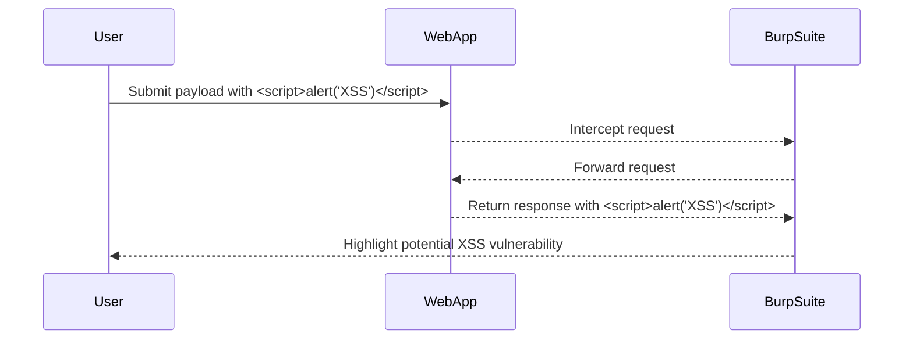

## Common Pitfalls and Detection

### Common Mistakes

- **Incomplete Tag Testing**: Failing to test all possible tags can result in missing allowed tags.
- **Incorrect Payload Formatting**: Incorrectly formatting the payload can prevent the script from executing.
- **Ignoring Custom Tags**: Overlooking custom tags can lead to missing potential vulnerabilities.

### Detection Techniques

To detect XSS vulnerabilities, we can use various tools and techniques:

- **Automated Scanners**: Tools like Burp Suite, OWASP ZAP, and Acunetix can automatically scan for XSS vulnerabilities.
- **Manual Testing**: Manually testing each input field with different payloads can help identify vulnerabilities.
- **Code Review**: Reviewing the source code for improper input sanitization can help identify potential vulnerabilities.

### Example of Detection

Using Burp Suite to detect XSS vulnerabilities:

1. **Intercept Traffic**: Set up Burp Suite to intercept traffic between the user and the web application.
2. **Inject Payloads**: Inject various payloads into the intercepted requests.
3. **Analyze Responses**: Analyze the responses to identify which payloads are executed.

### Full HTTP Request and Response for Detection

#### HTTP Request

```http
POST /search HTTP/1.1
Host: vulnerable-website.com
Content-Type: application/x-www-form-urlencoded

query=<script>alert('XSS')</script>
```

#### HTTP Response

```http
HTTP/1.1 200 OK
Content-Type: text/html

<!DOCTYPE html>
<html>
<head>
    <title>Search Results</title>
</head>
<body>
    <h1>Search Results for: <script>alert('XSS')</script></h1>
</body>
</html>
```

### Expected Result

Burp Suite will highlight the response containing the injected script, indicating a potential XSS vulnerability.

### Mermaid Diagram: Detection Process



---
<!-- nav -->
[[03-Bypassing Tag Blocking|Bypassing Tag Blocking]] | [[Web Security (PortSwigger)/03-Cross-Site Scripting (XSS)/19-Lab 18 Reflected XSS into HTML context with all tags blocked except custom ones/00-Overview|Overview]] | [[05-Common Pitfalls and Mistakes|Common Pitfalls and Mistakes]]
