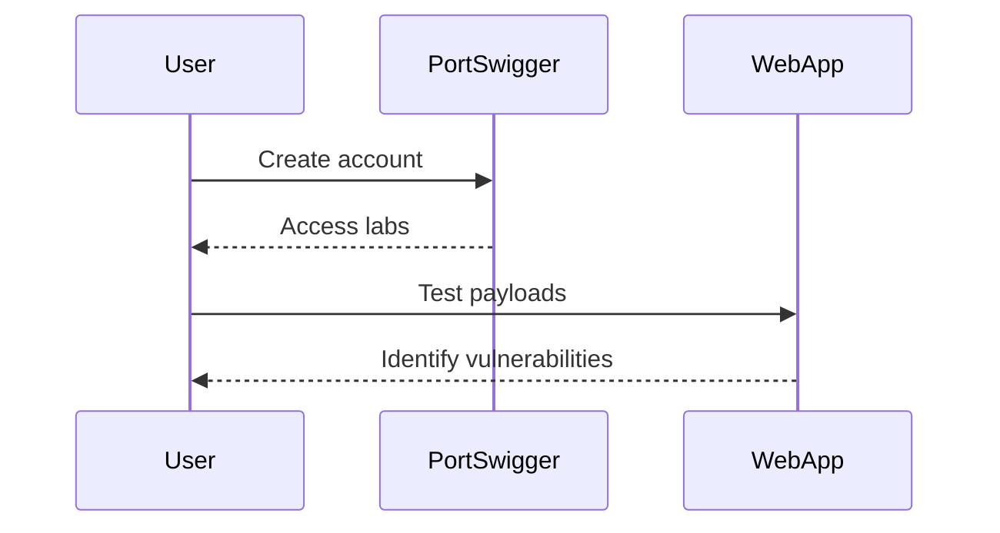

## Hands-On Labs

For hands-on practice with XSS vulnerabilities, consider the following labs:

- **PortSwigger Web Security Academy**: Offers interactive labs to practice detecting and exploiting XSS vulnerabilities.
- **OWASP Juice Shop**: A deliberately insecure web application for practicing web security skills.
- **DVWA (Damn Vulnerable Web Application)**: A PHP/MySQL web application with numerous security vulnerabilities for educational purposes.

### Example of Lab Setup

#### PortSwigger Web Security Academy

1. **Create Account**: Sign up for a free account on PortSwigger Web Security Academy.
2. **Access Labs**: Navigate to the XSS labs section and start practicing.
3. **Test Payloads**: Use the provided tools to test different payloads and identify vulnerabilities.

### Expected Result

By completing the labs, you will gain practical experience in identifying and exploiting XSS vulnerabilities.

### Mermaid Diagram: Lab Setup Process

---
<!-- nav -->
[[07-Exploiting Custom Tags|Exploiting Custom Tags]] | [[Web Security (PortSwigger)/03-Cross-Site Scripting (XSS)/19-Lab 18 Reflected XSS into HTML context with all tags blocked except custom ones/00-Overview|Overview]] | [[Web Security (PortSwigger)/03-Cross-Site Scripting (XSS)/19-Lab 18 Reflected XSS into HTML context with all tags blocked except custom ones/09-Hands-On Practice|Hands-On Practice]]
