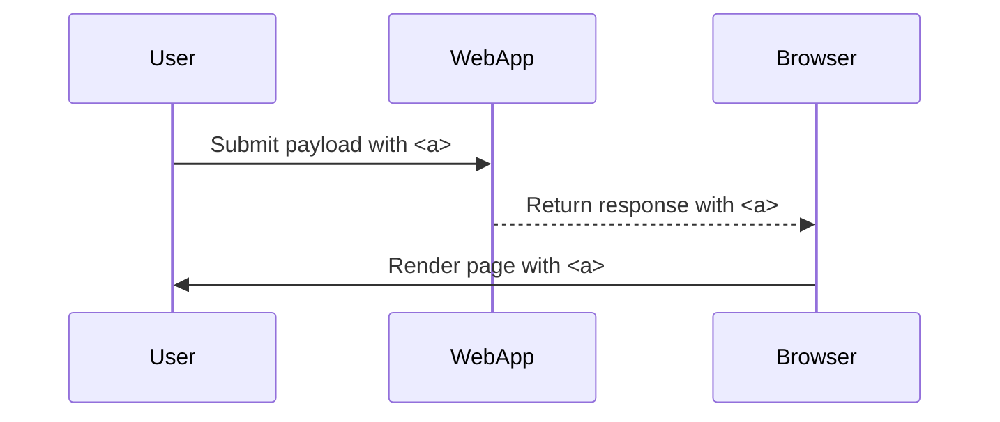

## Identifying Allowed Tags

### Using XSS Cheat Sheets

To identify which tags are allowed, we can use XSS cheat sheets available online. One such resource is the XSS cheat sheet provided by PortSwigger. This cheat sheet lists various HTML tags and attributes that can be used to test for XSS vulnerabilities.

#### Steps to Identify Allowed Tags

1. **Google XSS Cheat Sheet**: Search for "XSS cheat sheet" and visit the PortSwigger XSS cheat sheet.
2. **Copy Tags to Clipboard**: Copy the list of tags from the cheat sheet.
3. **Paste Tags into Payload**: Paste the copied tags into the payload field of the web application.
4. **Run Attack**: Submit the payload and observe the response.

### Analyzing the Response

When submitting the payload, the web application will respond with either a `200 OK` message or an error message indicating that the tag is not allowed. By systematically testing each tag, we can determine which tags are permitted.

#### Example of Testing Tags

Suppose we have the following tags copied from the XSS cheat sheet:

```plaintext
<a>, <b>, <i>, <div>, <span>, , <script>
```

We can submit these tags one by one and observe the response:

```http
POST /search HTTP/1.1
Host: vulnerable-website.com
Content-Type: application/x-www-form-urlencoded

query=<a>
```

Response:

```http
HTTP/1.1 200 OK
Content-Type: text/html

<!DOCTYPE html>
<html>
<head>
    <title>Search Results</title>
</head>
<body>
    <h1>Search Results for: <a></h1>
</body>
</html>
```

Since the response contains the `<a>` tag, it indicates that the tag is allowed.

### Mermaid Diagram: Tag Testing Process



---
<!-- nav -->
[[11-How to Prevent  Defend|How to Prevent  Defend]] | [[Web Security (PortSwigger)/03-Cross-Site Scripting (XSS)/19-Lab 18 Reflected XSS into HTML context with all tags blocked except custom ones/00-Overview|Overview]] | [[13-Identifying Client-Supplied Input|Identifying Client-Supplied Input]]
