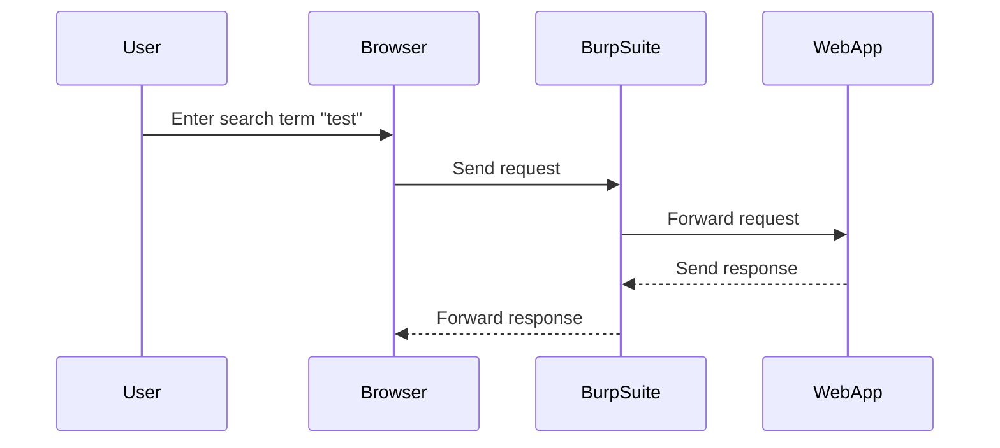

## Identifying Client-Supplied Input

The first step in testing for XSS vulnerabilities is to identify client-supplied inputs that are reflected back in the application. These inputs can come from various sources, such as form fields, URL parameters, cookies, and HTTP headers.

### Example: Search Functionality

Consider a search functionality in a web application. When a user enters a search term and submits the form, the application reflects the input back in the response. This reflection can be a potential vector for XSS attacks.

#### Steps to Identify Reflection

1. **Enter a Test Input**: Enter a simple string like "test" in the search field and submit the form.
2. **Inspect the Response**: Check the response to see if the input is reflected back in the HTML.

```html
<!-- Example of reflected input -->
<!DOCTYPE html>
<html>
<head>
    <title>Search Results</title>
</head>
<body>
    <h1>Search Results for "test"</h1>
</body>
</html>
```

### Detection Tools

Tools like Burp Suite can help automate the process of identifying reflected inputs. Burp Suite is a comprehensive platform for performing security testing of web applications.

#### Using Burp Suite

1. **Configure Proxy**: Set up Burp Suite as a proxy to intercept HTTP traffic.
2. **Intercept Request**: Send a request through Burp Suite and intercept it to inspect the input and response.



---
<!-- nav -->
[[12-Identifying Allowed Tags|Identifying Allowed Tags]] | [[Web Security (PortSwigger)/03-Cross-Site Scripting (XSS)/19-Lab 18 Reflected XSS into HTML context with all tags blocked except custom ones/00-Overview|Overview]] | [[14-Lab Setup and Environment|Lab Setup and Environment]]
