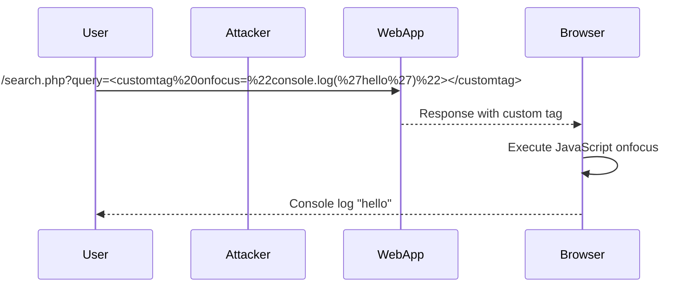

## Understanding Custom Tags in XSS

When standard HTML tags are blocked, attackers often turn to custom tags to bypass these restrictions. Custom tags are non-standard tags that can be defined and used within a web page. These tags can be leveraged to execute JavaScript or other malicious actions.

### Example Scenario

Consider a web application that allows user input to be reflected in the response. Suppose the application blocks all standard HTML tags but allows custom tags. An attacker can inject a custom tag that triggers JavaScript execution.

#### Vulnerable Code Example

```html
<!DOCTYPE html>
<html>
<head>
    <title>Search Results</title>
</head>
<body>
    <h1>Search Results</h1>
    <div id="results">
        <!-- User input is reflected here -->
        <?php echo htmlspecialchars($_GET['query']); ?>
    </div>
</body>
</html>
```

In this example, `htmlspecialchars` is used to encode special characters, but it does not block custom tags. An attacker can inject a custom tag like `<customtag>` to bypass this encoding.

### Exploiting Custom Tags

To exploit this vulnerability, the attacker needs to find a custom tag that can trigger JavaScript execution. One common approach is to use a custom tag that fires an event handler, such as `onfocus`.

#### Example Payload

```html
<customtag onfocus="console.log('hello')"></customtag>
```

This payload uses the `onfocus` event handler to execute JavaScript. When the custom tag gains focus, the JavaScript code is executed.

### Full HTTP Request and Response

Let's consider a full HTTP request and response for this scenario.

#### HTTP Request

```http
GET /search.php?query=<customtag%20onfocus=%22console.log(%27hello%27)%22></customtag> HTTP/1.1
Host: vulnerableapp.com
User-Agent: Mozilla/5.0 (Windows NT 10.0; Win64; x64) AppleWebKit/537.36 (KHTML, like Gecko) Chrome/91.0.4472.124 Safari/537.36
Accept: text/html,application/xhtml+xml,application/xml;q=0.9,image/webp,*/*;q=0.8
Accept-Language: en-US,en;q=0.5
Connection: keep-alive
Upgrade-Insecure-Requests: 1
```

#### HTTP Response

```http
HTTP/1.1 200 OK
Date: Tue, 14 Sep 2021 12:00:00 GMT
Server: Apache/2.4.41 (Ubuntu)
Content-Type: text/html; charset=UTF-8
Content-Length: 234
Connection: keep-alive

<!DOCTYPE html>
<html>
<head>
    <title>Search Results</title>
</head>
<body>
    <h1>Search Results</h1>
    <div id="results">
        <customtag onfocus="console.log('hello')"></customtag>
    </div>
</body>
</html>
```

### How to Detect the Exploit

To detect the exploit, the user should check the web console for any unexpected messages. In this case, the message "hello" should appear in the console if the exploit is successful.

### How to Prevent / Defend Against Custom Tag XSS

#### Secure Coding Practices

1. **Input Validation**: Validate all user inputs to ensure they do not contain malicious content.
2. **Output Encoding**: Use proper output encoding techniques to prevent the injection of malicious scripts.
3. **Content Security Policy (CSP)**: Implement a strict Content Security Policy to restrict the sources of executable scripts.

#### Example Secure Code

```php
<?php
$query = $_GET['query'];
$safeQuery = htmlspecialchars($query, ENT_QUOTES, 'UTF-8');
?>

<!DOCTYPE html>
<html>
<head>
    <title>Search Results</title>
</head>
<body>
    <h1>Search Results</h1>
    <div id="results">
        <?php echo $safeQuery; ?>
    </div>
</body>
</html>
```

#### Content Security Policy (CSP)

```http
Content-Security-Policy: default-src 'self'; script-src 'self'
```

This CSP directive restricts the sources of executable scripts to the same origin.

### Real-World Examples

#### CVE-2021-3116: WordPress Block Editor XSS

In 2021, a vulnerability was discovered in the WordPress Block Editor, allowing attackers to inject custom tags that could execute JavaScript. This vulnerability was patched, but it highlights the importance of proper input validation and output encoding.

### Mermaid Diagrams

#### Attack Chain Diagram



### Practice Labs

For hands-on practice with this topic, consider the following labs:

- **PortSwigger Web Security Academy**: Offers detailed labs on various types of XSS, including Reflected XSS.
- **OWASP Juice Shop**: A deliberately insecure web application for practicing web security skills.
- **DVWA (Damn Vulnerable Web Application)**: Provides a variety of vulnerabilities, including XSS, for educational purposes.

By thoroughly understanding and practicing these concepts, you can effectively identify and mitigate XSS vulnerabilities in web applications.

---
<!-- nav -->
[[17-Testing for Classic XSS Vulnerabilities|Testing for Classic XSS Vulnerabilities]] | [[Web Security (PortSwigger)/03-Cross-Site Scripting (XSS)/19-Lab 18 Reflected XSS into HTML context with all tags blocked except custom ones/00-Overview|Overview]] | [[19-Understanding the Vulnerability|Understanding the Vulnerability]]
