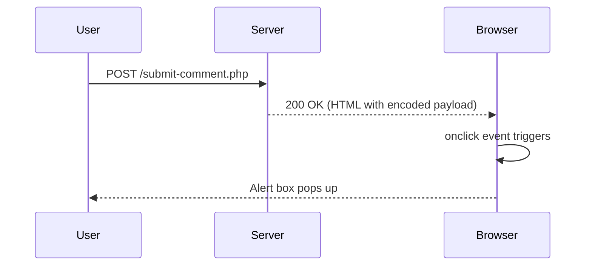

## Understanding Cross-Site Scripting (XSS)

Cross-Site Scripting (XSS) is a type of security vulnerability typically found in web applications. It allows attackers to inject malicious scripts into web pages viewed by other users. This can lead to various attacks, such as stealing sensitive data, session hijacking, and defacement of websites. XSS vulnerabilities arise due to the lack of proper input validation and output encoding.

### Types of XSS Vulnerabilities

There are three main types of XSS vulnerabilities:

1. **Stored XSS**: Malicious scripts are permanently stored on the target server, such as in a database, and are served to users when they visit the affected page.
2. **Reflected XSS**: Malicious scripts are reflected off a web server, typically via a search query or form submission, and are executed when the user visits the crafted URL.
3. **DOM-based XSS**: Malicious scripts are executed within the context of a web page's DOM (Document Object Model) without involving the server.

### Lab Scenario: Stored XSS into `onclick` Event

In this lab, we will explore a scenario where a stored XSS vulnerability exists within an `onclick` event handler. The payload is HTML-encoded and single-quoted, which adds complexity to the exploitation process.

#### Background Theory

To understand this scenario, let's break down the components involved:

1. **HTML Encoding**: Characters like `<`, `>`, `&`, `"`, and `'` are encoded using their respective HTML entities (`&lt;`, `&gt;`, `&amp;`, `&quot;`, `&#x27;`). This is often done to prevent script injection but can sometimes be bypassed.
2. **Event Handlers**: JavaScript event handlers like `onclick`, `onmouseover`, etc., are used to execute scripts when certain events occur. These can be exploited to inject malicious scripts.
3. **Single Quotes and Backslashes**: Single quotes (`'`) and backslashes (`\`) are often used to escape characters in strings, which can complicate the injection process.

### Real-World Example: CVE-2021-21972

A notable real-world example of a stored XSS vulnerability is CVE-2021-21972, which affected the WordPress plugin "WP GDPR Compliance." This vulnerability allowed attackers to inject arbitrary JavaScript code into comments, leading to potential data theft and other malicious activities.

#### Exploitation Process

Let's walk through the exploitation process step-by-step:

1. **Identify the Vulnerable Input Field**: Determine which input field is vulnerable to XSS. In our scenario, it is likely a comment or feedback form.
2. **Craft the Payload**: Create a payload that will be stored and later executed when the page is loaded. The payload should be designed to bypass HTML encoding and single-quote escaping.
3. **Inject the Payload**: Submit the payload through the vulnerable input field.
4. **Trigger the Payload**: Ensure that the payload is executed when the page is loaded. This might involve clicking a button or hovering over an element.

### Complete Example

Let's consider a specific example where a user can submit a comment on a blog post. The comment is stored in the database and displayed on the page with an `onclick` event handler.

#### Vulnerable Code

```php
<?php
$comment = $_POST['comment'];
// Simple HTML encoding
$encoded_comment = htmlspecialchars($comment);
echo "<button onclick='alert(\"$encoded_comment\")'>Show Comment</button>";
?>
```

#### Exploitation Steps

1. **Craft the Payload**: We need to craft a payload that will bypass the HTML encoding and single-quote escaping. A possible payload could be:
   ```html
   <script>alert('XSS')</script>
   ```

2. **Submit the Payload**: Submit the payload through the comment form.

3. **Trigger the Payload**: When the page is loaded, the button will display the comment with the `onclick` event handler. Clicking the button will trigger the alert box.

#### Full HTTP Request and Response

**HTTP Request:**

```http
POST /submit-comment.php HTTP/1.1
Host: example.com
Content-Type: application/x-www-form-urlencoded
Content-Length: 24

comment=%3Cscript%3Ealert(%27XSS%27)%3C%2Fscript%3E
```

**HTTP Response:**

```http
HTTP/1.1 200 OK
Date: Mon, 20 Mar 2023 12:00:00 GMT
Server: Apache/2.4.41 (Ubuntu)
Content-Length: 123
Content-Type: text/html

<!DOCTYPE html>
<html>
<head>
    <title>Comments</title>
</head>
<body>
    <button onclick="alert(&quot;&lt;script&gt;alert(&#x27;XSS&#x27;)&lt;/script&gt;&quot;)">Show Comment</button>
</body>
</html>
```

### Mermaid Diagram: Attack Chain



### Common Pitfalls

1. **Over-reliance on HTML Encoding**: While HTML encoding is important, it is not sufficient to prevent all XSS attacks. Additional measures like Content Security Policy (CSP) should be implemented.
2. **Improper Input Validation**: Failing to validate user inputs can lead to successful exploitation of XSS vulnerabilities.
3. **Complexity of Encoding**: The complexity of encoding can sometimes lead to bypasses, especially when dealing with multiple layers of encoding and escaping.

### How to Prevent / Defend

#### Detection

1. **Automated Scanning Tools**: Use tools like Burp Suite, OWASP ZAP, and Acunetix to scan for XSS vulnerabilities.
2. **Manual Testing**: Perform manual testing by injecting payloads and observing the behavior of the application.

#### Prevention

1. **Input Validation**: Validate all user inputs to ensure they meet expected formats and lengths.
2. **Output Encoding**: Properly encode all outputs to prevent script injection. Use libraries like OWASP Java Encoder or ESAPI for encoding.
3. **Content Security Policy (CSP)**: Implement CSP to restrict the sources from which scripts can be loaded. This can significantly reduce the impact of XSS attacks.

#### Secure Coding Fixes

**Vulnerable Code:**

```php
<?php
$comment = $_POST['comment'];
$encoded_comment = htmlspecialchars($comment);
echo "<button onclick='alert(\"$encoded_comment\")'>Show Comment</button>";
?>
```

**Secure Code:**

```php
<?php
$comment = $_POST['comment'];
$encoded_comment = htmlspecialchars($comment, ENT_QUOTES, 'UTF-8');
echo "<button onclick='alert(\"$encoded_comment\")'>Show Comment</button>";
?>
```

#### Configuration Hardening

1. **Enable CSP**: Add the following header to your HTTP responses:
   ```http
   Content-Security-Policy: default-src 'self'; script-src 'self' 'unsafe-inline';
   ```
2. **Disable Dangerous Features**: Disable features like `document.write` and `eval` that can be exploited in XSS attacks.

### Practice Labs

For hands-on practice with XSS vulnerabilities, you can use the following labs:

- **PortSwigger Web Security Academy**: Offers a comprehensive set of labs covering various types of XSS vulnerabilities.
- **OWASP Juice Shop**: A deliberately insecure web application for practicing web security skills.
- **DVWA (Damn Vulnerable Web Application)**: A PHP/MySQL web application that is riddled with vulnerabilities for educational purposes.

By thoroughly understanding and practicing these concepts, you can effectively identify and mitigate XSS vulnerabilities in web applications.

---
<!-- nav -->
[[Web Security (PortSwigger)/03-Cross-Site Scripting (XSS)/24-Lab 23 Stored XSS into onclick event with angle brackets and double quotes HTML encoded and single quotes and backslash escaped/02-Cross-Site Scripting (XSS)|Cross-Site Scripting (XSS)]] | [[Web Security (PortSwigger)/03-Cross-Site Scripting (XSS)/24-Lab 23 Stored XSS into onclick event with angle brackets and double quotes HTML encoded and single quotes and backslash escaped/00-Overview|Overview]] | [[Web Security (PortSwigger)/03-Cross-Site Scripting (XSS)/24-Lab 23 Stored XSS into onclick event with angle brackets and double quotes HTML encoded and single quotes and backslash escaped/04-Practice Questions & Answers|Practice Questions & Answers]]
