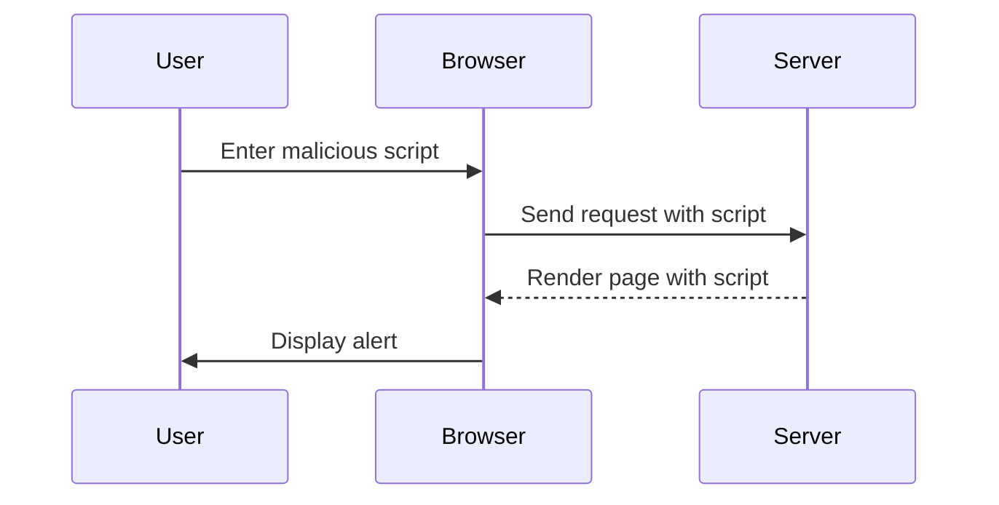

## Conclusion

Cross-Site Scripting (XSS) is a serious security vulnerability that can lead to various harmful outcomes. By understanding the underlying mechanisms and following secure coding practices, developers can prevent XSS attacks and protect their applications from malicious scripts. Regularly testing and auditing web applications using tools like OWASP ZAP and Burp Suite can help identify and mitigate XSS vulnerabilities.

This sequence diagram illustrates the flow of a reflected XSS attack, showing how the user input is sent to the server, rendered on the page, and executed in the browser.

By thoroughly understanding and practicing these concepts, you can become proficient in identifying and preventing XSS vulnerabilities in web applications.

---
<!-- nav -->
[[05-Understanding the Vulnerability|Understanding the Vulnerability]] | [[Web Security (PortSwigger)/03-Cross-Site Scripting (XSS)/25-Lab 24 Reflected XSS into a template literal with angle brackets single double quotes backslash and backticks Unicode escaped/00-Overview|Overview]] | [[Web Security (PortSwigger)/03-Cross-Site Scripting (XSS)/25-Lab 24 Reflected XSS into a template literal with angle brackets single double quotes backslash and backticks Unicode escaped/07-Practice Questions & Answers|Practice Questions & Answers]]
