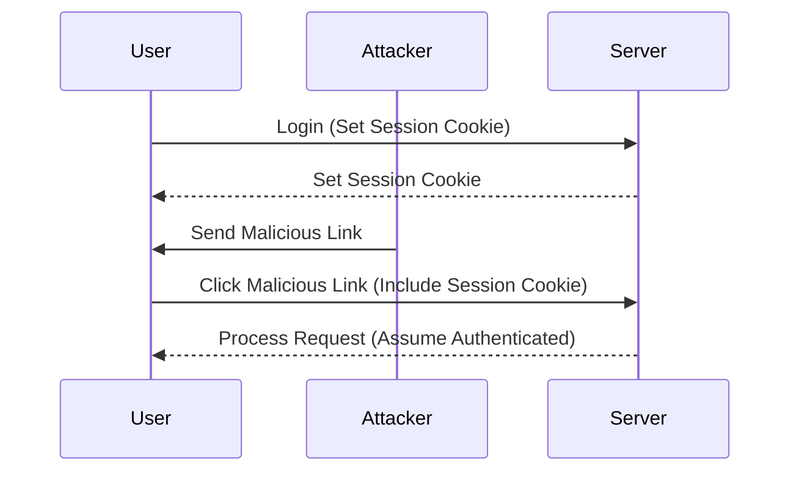
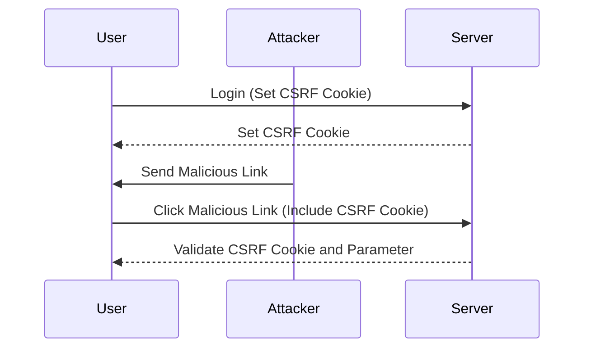

## CSRF Tokens and Cookies

### CSRF Tokens

A CSRF token is a unique, unpredictable value generated by the server and included in the form or request. The server validates this token to ensure that the request originated from the intended source and not from an attacker.

#### How CSRF Tokens Work

1. **Token Generation**: The server generates a unique CSRF token and stores it in the session.
2. **Token Inclusion**: The token is included in the form or request as a hidden field or parameter.
3. **Token Validation**: When the form is submitted, the server checks the token against the one stored in the session. If they match, the request is considered valid.

### Cookies and CSRF

Cookies are small pieces of data stored on the client-side that are sent with every request to the server. By default, cookies are automatically included in requests made by the browser.

#### Why Cookies Are Problematic for CSRF

If a CSRF token is stored as a cookie, an attacker can exploit this by crafting a malicious link. When the victim clicks the link, the browser automatically includes the CSRF cookie in the request, bypassing the need for the attacker to know the token upfront.

### Double Submit Cookie Defense

The double submit cookie defense is a technique used for stateless applications that do not store session information on the backend. This method involves using both a CSRF cookie and a CSRF token.

#### How Double Submit Cookie Works

1. **Cookie and Token Generation**: The server generates a CSRF token and sets it as a cookie.
2. **Token Inclusion**: The token is also included as a parameter in the form or request.
3. **Validation**: The server compares the token in the cookie with the token in the parameter. If they match, the request is considered valid.

### Pitfalls of Using Cookies for CSRF Tokens

Using cookies for CSRF tokens can lead to several issues:

- **Automatic Transmission**: Cookies are automatically included in requests, making it easier for attackers to exploit.
- **No Control Over Transmission**: The browser handles cookie transmission, and the developer has limited control over this process.

### Real-World Example: CVE-2020-14182

In 2020, a CSRF vulnerability was found in the Atlassian Jira application (CVE-2020-14182). Attackers could craft a malicious link that, when clicked by an authenticated user, would create new users with admin privileges. This highlights the importance of proper CSRF protection mechanisms.

---
<!-- nav -->
[[02-What is a CSRF Vulnerability|What is a CSRF Vulnerability]] | [[Web Security (PortSwigger)/04-Cross-Site Request Forgery (CSRF)/01-Cross Site Request Forgery CSRF Complete Guide/00-Overview|Overview]] | [[04-Conditions for a Successful CSRF Attack|Conditions for a Successful CSRF Attack]]
